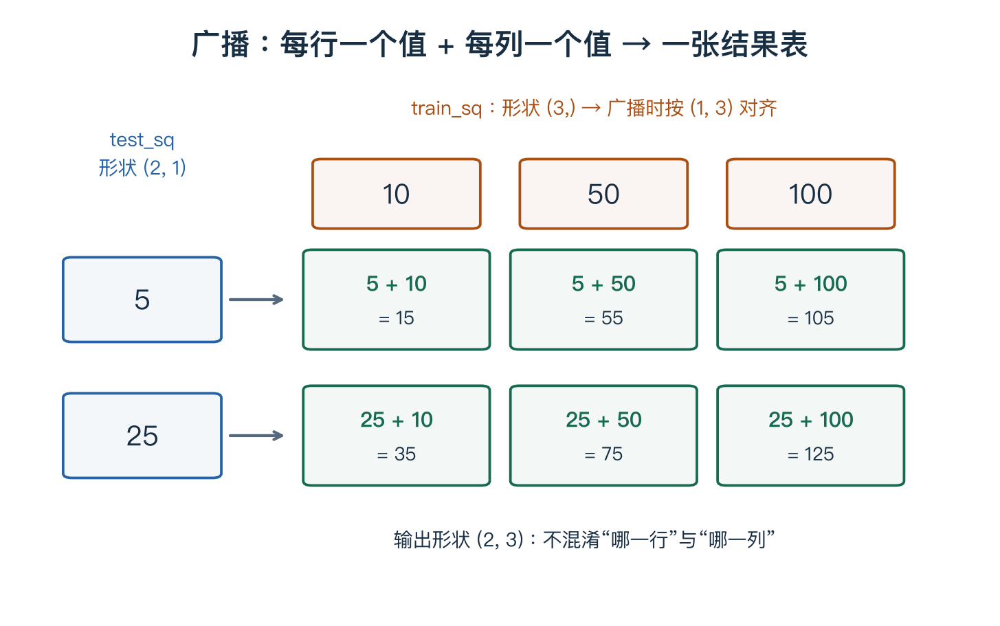

# 01 图像、分数与损失

> 本单元解决：图片怎样成为可计算的数字，模型怎样从这些数字得到预测，怎样评价一次预测。小例子均为教学构造。

## 1. 一张图片为什么是数组？

一张灰度图像可以存成数字表。以常见的 8 位表示为例，0 表示黑，255 表示白，中间数表示不同灰度：

$$
I=\begin{bmatrix}0&255\\128&64\end{bmatrix}.
$$

这里有两行、两列，因此图像高 2、宽 2。把它按固定顺序展平，可以得到 `[0, 255, 128, 64]`。展平只重新排列，不会自动提取有用特征。

RGB 彩色图像有红、绿、蓝三个通道，每个通道都是一张数字表。`3×32×32` 表示**同一张图像的三个通道**，不是三张独立照片。展平后共有 `3×32×32=3072` 个数字。神经网络通常先把这些值转换为浮点数并做适当预处理；并不是所有图像数据始终在 0～255 范围。

> **先记住**：通道数、高、宽描述不同的轴。看到形状时，先给每个轴起名字。

## 2. k-NN：先找相似例子，再参考它们的标签

假设已有带标签的训练图像。k-NN 的预测过程是：计算测试图像与训练图像的距离，选距离最近的 k 个，再根据其标签投票。

用两个短向量说明距离：

$$x=[1,2],\qquad z=[4,6].$$

L1 距离：对应位置相减、取绝对值、相加。

$$d_1(x,z)=|1-4|+|2-6|=3+4=7.$$

L2 距离：对应位置相减、平方、相加，最后开平方。

$$d_2(x,z)=\sqrt{(1-4)^2+(2-6)^2}=\sqrt{25}=5.$$

一般公式里的下标 m 表示“第几个特征”，不是第几张图片：

$$d_1(x,z)=\sum_{m=1}^{D}|x_m-z_m|.$$

这里 D 是向量长度。若用上标标记图片编号，上标只是编号，不是乘方。

像素距离小不保证语义相近：图像稍微移动，很多对应位置的像素都会改变。因此 k-NN 很适合理解分类流程，但原始像素距离有局限。

## 3. 距离矩阵里的一行、一列是什么？

约定距离矩阵 `dists` 的形状是 `(num_test, num_train)`：

- **第 i 行**：测试图像 i 与所有训练图像的距离。
- **第 j 列**：所有测试图像与训练图像 j 的距离。
- **一个元素**：一对测试、训练图像之间的距离。

若白色代表大距离，一条明显亮行说明**该测试图像与许多训练图像都相差较大**；亮列对应**某张训练图像与许多测试图像都相差较大**。整体亮度、颜色分布、背景和像素范数等差异都可能造成这种现象，不能仅凭热图断定一定是哪一个原因。需查看对应图片或统计量。

这里“热图上的亮”是距离数值大，不等于“原图一定很亮”。

不使用循环计算 L2 距离时，利用：

$$\|x-z\|_2^2=\|x\|_2^2+\|z\|_2^2-2x^Tz.$$

```python
import numpy as np

# 可独立运行的浮点教学数据；每行一个样本。
X = np.array([[1., 2.], [3., 4.]])
X_train = np.array([[4., 6.], [1., 2.], [0., 0.]])
test_sq = np.sum(X * X, axis=1, keepdims=True)  # (2, 1)
train_sq = np.sum(X_train * X_train, axis=1)    # (3,)
sq = test_sq + train_sq - 2 * (X @ X_train.T) # (2, 3)
dists = np.sqrt(np.maximum(sq, 0.0))
print(dists)
```

广播从最后一维对齐，`(3,)` 可以按 `(1,3)` 与 `(2,1)` 配合，形成 `(2,3)`。如果训练平方和保留成 `(3,1)`，通常反而不符合需要；可以转置成 `(1,3)` 后再相加。

`maximum` 避免浮点舍入把理论上为 0 的平方距离变成很小的负数。实际数据需先转换为合适的浮点类型，避免无符号整数相减或平方溢出。



图只展示“两组平方和怎样广播相加”；完整平方距离还要减去两倍点积，不能把图中相加结果直接当距离。

## 4. 线性分类器：不再逐张比较，而是学习一套打分规则

暂时用两个虚构特征 `x=[2,1]` 代替像素。设猫的权重为 `[2,-1]`，狗的权重为 `[-1,2]`，偏置都为 0：

$$s_{猫}=2\times2+1\times(-1)=3,$$
$$s_{狗}=2\times(-1)+1\times2=0.$$

猫分数较大，因此预测为猫。这些权重和特征只是帮助理解加权求和，不是真实可靠的动物判别规则。

按每行一个样本的约定，多个类别一起算：

$$S=XW+b.$$

| 数组 | 形状 | 意义 |
|---|---|---|
| X | N×D | N 个样本，每个 D 个特征 |
| W | D×C | 每一列是一类的打分权重 |
| b | C | 每一类的偏置，广播到所有样本 |
| S | N×C | 每个样本的每个类别分数 |

例如 X 为 `[[2,1],[1,3]]`，W 为 `[[2,-1],[-1,2]]`，b 为 `[0,1]`，计算得到 `S=[[3,1],[-1,6]]`。第一行预测猫，第二行预测狗。

> **易错提醒**：课程有时对单个样本使用列向量写法 `s=Wx+b`。转成行样本布局时，权重形状和乘法方向需要一起改变。

## 5. 分数不是概率：Softmax 做了什么？

分数可以为负，也不要求和为 1。Softmax 把一组分数转换成非负、总和为 1 的数：

$$p_c=\frac{e^{s_c}}{\sum_j e^{s_j}}.$$

c 表示当前类别，j 遍历所有类别。以分数 `[2,1]` 为例：

1. 取指数：约 `[7.389,2.718]`。
2. 求总和：约 `10.107`。
3. 各自除以总和：约 `[0.731,0.269]`。

Softmax 保持大小顺序，不会自动把错误预测变对。这些数作为模型的类别概率使用，但不保证与现实频率完全校准。

## 6. 损失：用真实标签评价预测

单标签分类常用交叉熵：

$$L=-\log p_{正确类别}.$$

这里 log 是自然对数。真实类别为猫时：

| 模型给猫的概率 | 损失约为 |
|---|---|
| 0.9 | 0.105 |
| 0.51 | 0.673 |
| 0.1 | 2.303 |

**取的是正确类别的概率，不是最大的那个概率。** 同一个预测 `[0.9,0.1]`，若真实标签由猫变成狗，损失就从约 0.105 变成 2.303。

批量损失常对样本取平均；正则化项可能另外加上。损失是优化目标，不是准确率，也不是概率。

## 7. 数值稳定：两步都要注意

先把同一样本的所有分数减去最大值 m：`shifted=scores-m`。Softmax 的分子、分母同时除以 `exp(m)`，比例不变，又能避免计算特别大的指数。

更稳健的交叉熵直接计算：

$$L=-\tilde s_y+\log\sum_j e^{\tilde s_j},\qquad \tilde s_j=s_j-m.$$

例如分数 `[1000,0]`，真实类别是第二类。概率计算中第二类可能下溢到 0，但上述对数损失仍约为 1000，而不是先计算 `log(0)`。

完整证明与代码见[数值稳定专题](../notes/02-softmax-numerical-stability.md)。

## 复习时记住

**数据 → 分数 → 概率 → 与真实标签比较得到损失。** 参数还没有自动变好；下一单元才开始解释怎样更新参数。

[下一单元：参数怎样学习](02-learning-and-gradients.md) · [详细课程笔记：第二章](../notes/02-image-classification.md) · [路线目录](README.md)
