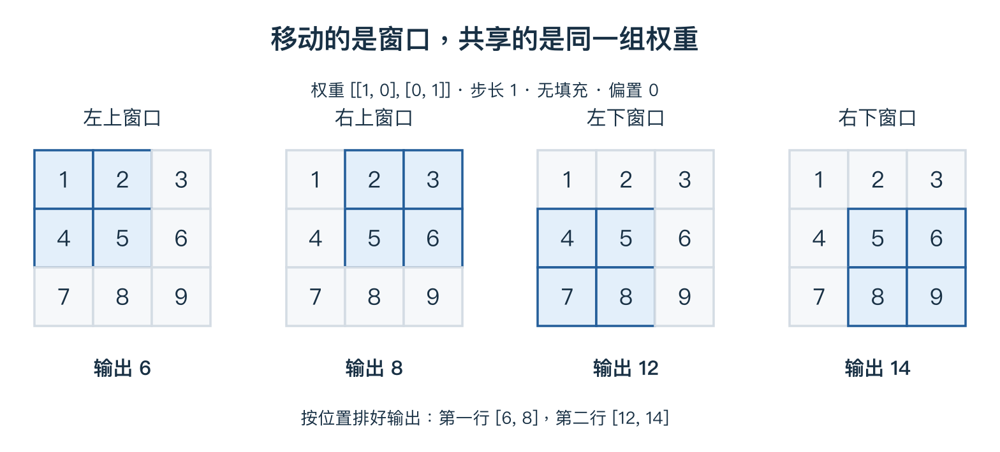

# 04 把卷积窗口算清楚

> 本单元只解决一个核心问题：为什么 `3×32×32` 经过 `3×3 Conv、16 通道、P=1`，会得到 `16×32×32`？默认步长 1、无膨胀、普通全通道卷积。

## 1. 卷积仍然是加权求和

看一个输入窗口和一组权重，偏置暂设为 0：

$$X_{patch}=\begin{bmatrix}1&2\\4&5\end{bmatrix},\qquad
K=\begin{bmatrix}1&0\\0&1\end{bmatrix}.$$

对应位置相乘，再把结果加起来：

$$1\times1+2\times0+4\times0+5\times1=6.$$

四个输入、四个权重，最终得到一个数。这里不是两个 2×2 矩阵直接做普通矩阵乘法。深度学习把这种不翻转权重的互相关运算通常也称作卷积，本单元沿用该习惯。

## 2. 移动窗口，同一套权重继续使用

完整输入是：

$$X=\begin{bmatrix}1&2&3\\4&5&6\\7&8&9\end{bmatrix}.$$

窗口向右移动一格，就读取 `[[2,3],[5,6]]`，仍使用原来的权重，得到 `2+6=8`。再移动到下一行，依次得到 12 和 14。

$$Y=\begin{bmatrix}6&8\\12&14\end{bmatrix}.$$



按左上、右上、左下、右下的顺序读四个窗口；高亮区域各对应输出表中的一个位置。权重一直是 `[[1,0],[0,1]]`，偏置为 0。课程第五章另有权重 `[[1,0],[0,-1]]` 的对比算例，因此输出不同，并非矛盾。

> **一个窗口位置产生一个数字；一个滤波器遍历各位置，产生一张特征图。** 特征图就是按位置排好的输出数字表。

## 3. 为什么所有位置共用权重？

这叫**权重共享**。若一种局部模式出现在不同位置，可以使用同一种计算规则响应它，而不必每个位置重新学习一套规则。

卷积的两个基本特点：局部连接限制每次读取的空间范围，权重共享让同一滤波器在多个空间位置重复使用。

滤波器的权重通过训练学习，不是必须人工指定的边缘模板；“能学习边缘”也不等于每个滤波器都对应一个清楚的人类概念。

## 4. RGB 三个通道怎样汇总？

对 RGB 输入，一个空间大小为 3×3 的普通滤波器，在同一位置读取：

```text
红通道的 3×3 区域 × 对应的 9 个权重 → 一项加权和
绿通道的 3×3 区域 × 对应的 9 个权重 → 一项加权和
蓝通道的 3×3 区域 × 对应的 9 个权重 → 一项加权和
                    三项相加，再加一次偏置 → 一个输出数字
```

所以一个滤波器有 `3×3×3=27` 个权重，另有一个偏置。若三项加权和为 2、3、−1，偏置为 0，最终输出为 4。

**所有输入通道的贡献汇总成一个数，不是各自产生一个输出通道。** 三个输入通道使用各自的权重切片，不要求它们的权重相同。

## 5. “16 个输出通道”从哪里来？

准备 16 套滤波器，每套都读取全部 RGB 通道，各自产生一张特征图：

$$\boxed{输出通道数=滤波器数量=16.}$$

完整权重数组按常见布局为 `16×3×3×3`：依次是输出通道、输入通道、窗口高、窗口宽。

16 是网络设计时指定的数量。训练更新这些滤波器里的数值，并不在普通训练中自动把数量改成 20。输出通道是学到的特征响应，不是 16 种颜色，也不一定一通道对应一类别。

## 6. 不填充时，32 为什么变成 30？

宽度为 32，窗口宽度为 3，步长为 1：第一次覆盖第 1–3 列，第二次第 2–4 列，最后一次第 30–32 列。一共有 30 个合法起点。

$$W_{out}=32-3+1=30.$$

高度同理。因此无填充时，输出为 `16×30×30`。

## 7. P=1 为什么让尺寸保持 32？

P=1 表示每侧补一圈，本例补 0。左、右各加 1，宽度从 32 变成 34；上、下各加 1，高度也变成 34。

$$W_{out}=34-3+1=32.$$

填充不改变输入通道数。只要还是 16 套滤波器，最终输出就是 `16×32×32`。

## 8. 步长与通用尺寸公式

步长 S 表示每次移动多少格。无膨胀时，一个方向的输出大小是：

$$H_{out}=\left\lfloor\frac{H_{in}+2P-K}{S}\right\rfloor+1.$$

H_in 为输入高度，K 为窗口高度，P 为每侧填充。先算填充后的范围，减掉窗口占用长度，再数能完整移动几步，最后加上初始位置。向下取整表示不能把不完整的一步算进去。

| 32×32 输入、3×3 窗口 | 输出空间大小 |
|---|---|
| P=0，S=1 | 30×30 |
| P=1，S=1 | 32×32 |
| P=1，S=2 | 16×16 |

**输出通道数和输出空间大小分别计算。** 改步长会改变输出尺寸，不直接改变滤波器参数量。

## 9. 参数量与输出数量不要混淆

每套滤波器 27 个权重加 1 个偏置，16 套共有：

$$16(27+1)=448个参数.$$

输出却有：

$$16\times32\times32=16384个数.$$

因为参数被反复使用。换一张图片，输出可以改变，而预测期间的模型参数不变。反向时，共享权重在各位置的梯度贡献需要累加。

若随后接 ReLU，负数变成 0，输出形状仍为 `16×32×32`。

## 复习时记住

**窗口决定一次看多大的区域；输入通道决定滤波器厚度；滤波器数量决定输出通道；填充与步长参与决定空间尺寸。**

[上一单元](03-networks-and-backprop.md) · [下一单元：完整 CNN](05-pooling-and-cnn.md) · [课程第五章](../notes/05-convolutional-networks.md) · [路线目录](README.md)
