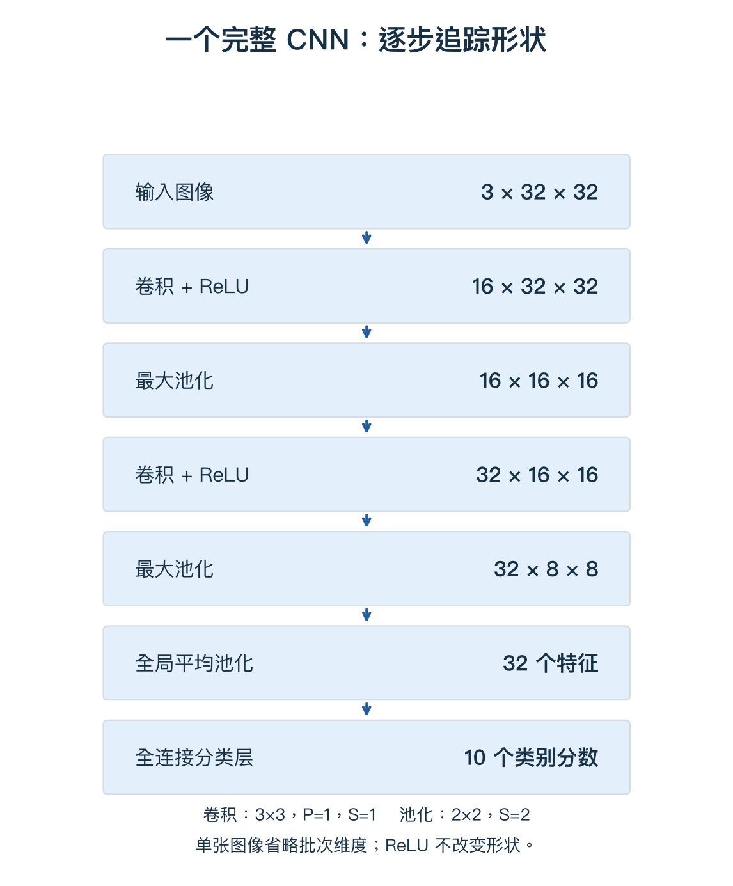

# 05 连接一个完整 CNN

> 上一单元把图像变成了特征图。本单元继续处理两个问题：怎样缩小特征图，怎样把它们转换为类别分数。

## 1. 池化：把一个区域汇总成一个数

最大池化 Max Pooling 在局部区域取最大值。比如 `[[1,3],[2,0]]` 得到 3。它不需要学习权重，也不是加权求和。

对下面的 4×4 特征图使用 2×2 窗口、步长 2、无填充：

$$X=\begin{bmatrix}1&2&3&4\\5&6&7&8\\9&10&11&12\\13&14&15&16\end{bmatrix}.$$

四个不重叠区域分别得到最大值 6、8、14、16：

$$Y=\begin{bmatrix}6&8\\14&16\end{bmatrix}.$$

高、宽各缩小一半，数字总量变成四分之一。此处输入可整齐分块；其他尺寸和步长需要按规则计算。

## 2. 池化通常不混合通道

16 个输入通道分别池化，每张图从 32×32 变成 16×16：

$$16\times32\times32\longrightarrow16\times16\times16.$$

右边三个 16 依次表示通道数、高度、宽度，只是数值恰好相同。

| 操作 | 怎样处理输入 | 有可学习参数吗 |
|---|---|---|
| 卷积 | 局部加权求和加偏置 | 有 |
| ReLU | 负值改为 0 | 无 |
| 最大池化 | 每个区域取最大值 | 无 |

## 3. 池化保存了什么，又丢了什么？

区域 `[[9,1],[2,3]]` 和 `[[1,2],[3,9]]` 都输出 9。保留了最强响应，却丢失了它的精确位置和其他值。

这有时能降低对局部位置变化的敏感性，但跨窗口边界的移动仍可能改变结果。**最大池化不是任意平移不变性的保证。** 网络也可以用带步长的卷积缩小特征图，并非都必须使用池化。

反向时，若最大值唯一，上游梯度传给该位置。例如 `[[1,3],[2,0]]` 收到梯度 5，则输入梯度为 `[[0,5],[0,0]]`。无参数不等于不参与反向传播；并列最大值时要看实现约定。

## 4. 第二次卷积在读取什么？

第一次卷积读取 RGB。第二次卷积读取前一层的 16 张特征图，它们仍然是数字数组，可以继续进行加权求和。

设第二层使用 32 个滤波器，空间窗口 3×3、P=1、S=1。每个滤波器的权重形状是 `16×3×3`，在一个位置读取 144 个输入数字，汇总成一个输出值。

$$16\times16\times16\longrightarrow32\times16\times16.$$

输入通道变化后，滤波器厚度也要跟着变化，不能一直使用第一层的 3 个输入通道。

## 5. 从头到尾追踪一个教学 CNN

本路线统一使用下面这个**含两次池化**的小网络。数字为教学设置，不冒充某个著名架构。

图按箭头顺序读。单样本省略批次维度，卷积都采用 3×3、P=1、S=1；池化均为 2×2、S=2、无填充。

| 操作 | 输出形状 | 为什么变化 |
|---|---|---|
| 输入 | 3×32×32 | RGB |
| 卷积 + ReLU | 16×32×32 | 16 套滤波器，空间尺寸保持 |
| 最大池化 | 16×16×16 | 高、宽减半 |
| 卷积 + ReLU | 32×16×16 | 32 套滤波器，空间尺寸保持 |
| 最大池化 | 32×8×8 | 再次缩小空间尺寸 |
| 全局平均池化 | 32 | 每个通道汇总成一个数 |
| 全连接到 10 类 | 10 | 每类一个分数 |

## 6. 全局平均池化：一张特征图变成一个数

Global Average Pooling，GAP，对每个通道的所有空间位置取平均。

例如 `[[1,3],[5,7]]` 变成 `(1+3+5+7)/4=4`。对于 `32×8×8`，每个通道分别平均 64 个数，共得到 32 个数。

$$v_c=\frac1{HW}\sum_{h=1}^{H}\sum_{w=1}^{W}A_{c,h,w}.$$

A 是输入特征图，c 指通道。这里 H=W=8。**不跨通道混在一起求平均。** 它保留每个通道的平均响应，但不保留详细空间分布。

Flatten（展平）则只是把全部数排成向量，不求平均：

| 操作 | 从 32×8×8 得到 |
|---|---|
| GAP | 32 个数 |
| Flatten | 2048 个数 |

两者都可以接分类层，但所需的输入维度不同。

## 7. 分类层又回到了矩阵乘法

把 v 按一行表示：`(1,32)`，W 为 `(32,10)`，b 为 `(10,)`：

$$s=vW+b,\qquad(1\times32)(32\times10)=1\times10.$$

每一类都用自己的权重组合这 32 个特征。**32 是特征数量，10 是类别数量。** 32 个通道不等于只能分 32 类。

预测类别可以直接取分数最大的类别。需要概率时用 Softmax；训练时结合真实标签计算交叉熵。梯度经过分类层、池化、激活和卷积层，更新可学习参数。

## 8. 用参数量再检查一次理解

假设两个卷积层和分类层都带偏置：

| 层 | 参数量 |
|---|---|
| 第一层卷积 | 16×(3×3×3+1)=448 |
| 第二层卷积 | 32×(16×3×3+1)=4640 |
| 分类层 | 32×10+10=330 |
| 总计 | 5418 |

本例没有 BN；ReLU、最大池化、GAP 没有可学习参数。这只是参数数量，不是显存需求，也不是计算次数。

## 复习时记住

**卷积产生特征，池化汇总局部信息，GAP 汇总每个通道，分类层组合特征给类别打分。** 所有可学习层共同受到最终损失的训练。

[上一单元](04-convolution.md) · [下一单元：稳定训练](06-training.md) · [课程第五章](../notes/05-convolutional-networks.md) · [路线目录](README.md)
