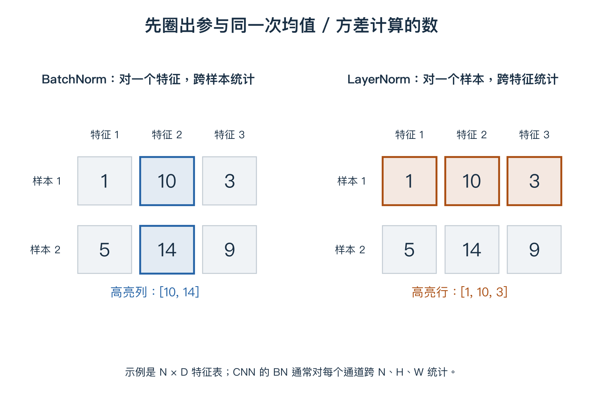

# 06 让网络训练得动，并适用于新数据

> 已经会搭网络，不等于能够训练好。本单元先区分“训练集也学不好”和“只在训练集上很好”，再看初始化、学习率、归一化与正则化。

## 1. 先判断是哪一类问题

| 示例现象 | 先关注什么 |
|---|---|
| 训练准确率 55%，验证 53% | 代码、标签、优化设置、训练时间、模型能力 |
| 训练准确率 99%，验证 72% | 过拟合、数据分布差异、模式与预处理差异 |

单凭两个数字不能唯一确定原因。先检查数据与实现，再比较优化和正则化方案。

## 2. 初始化：起点既要不同，也要有合适尺度

如果同层隐藏神经元的输入权重、偏置及后续连接完全对称，它们可能输出相同、收到相同梯度、始终学相同特征。因此通常使用随机权重打破对称性。

随机数也不能随意很大或很小。深层网络反复组合信号，尺度可能逐层失控或衰减；Sigmoid 等函数还可能进入导数很小的饱和区。

ReLU 网络常用 He 初始化，一种形式是：

$$W\sim\mathcal N\left(0,\frac{2}{n_{in}}\right),\qquad
\operatorname{std}(W)=\sqrt{\frac2{n_{in}}}.$$

这里正态分布的第二个参数写的是方差；n_in 是一个输出接收的输入数量。RGB 的 3×3 卷积中 n_in=27，因此标准差约 0.2722。

> **偏置设为 0 通常可以。** 问题不是任何参数都不能为 0，而是整组隐藏单元保持相同的对称关系。He 规则来自近似尺度分析，不保证任意网络都稳定。

## 3. 学习率：看趋势，不只看一步

更新公式为 `w ← w − ηg`，g 是梯度、η 是学习率。在 w=1、g=−4 时，η=0.001、0.1、1 分别得到 1.004、1.4、5。

过小可能下降很慢，过大可能震荡或发散。小批量损失会自然波动，不能把一次上升直接等同于训练错误。训练后期减小学习率是一种常用策略，不是所有任务必须采用相同日程。

## 4. 标准化不是把数限制到 0～1

对一组数减均值、除标准差：

$$\hat x=\frac{x-\mu}{\sqrt{\sigma^2+\varepsilon}}.$$

μ 表示均值，σ² 是方差，ε 是防止分母为 0 的小正数。先把中心移到 0 附近，再调整分散尺度。

对 `[1,2,3]`，均值为 2，按本例总体方差约定计算方差为 2/3。忽略 ε，结果约为 `[-1.225,0,1.225]`，可以为负，也可以大于 1。

输入标准化的统计量不能借用测试集来帮助训练；使用预训练模型时，需要遵循其输入处理约定。

## 5. BN：网络内部怎样归一化？

Batch Normalization（批归一化）在网络内部计算统计量，标准化后再做可学习的缩放和平移：

$$y=\gamma\hat x+\beta.$$

γ 调整尺度，β 调整中心。因为有这一步，BN 不要求最终输出始终均值为 0、方差为 1。

对卷积特征 `N×C×H×W`，常见 BN 对每个通道分别跨 N、H、W 统计，不把所有通道混成一个平均值。

图是简化的 N×D 特征表：BN 对一个特征跨样本统计，LN 对一个样本跨特征统计。Transformer 中常见 LN 对每个 token 的特征维度统计。

| 阶段 | 常见 BN 使用的均值和方差 |
|---|---|
| 训练 | 当前批次的统计量，并维护运行统计 |
| 推理 | 训练期间维护的运行统计 |

γ、β 通过梯度学习；运行均值、运行方差通常通过统计更新，不是梯度下降参数。小批次和统计不可靠等情况可能影响效果，BN 不是万能修复工具。

## 6. Dropout：随机关闭激活，不是永久删神经元

训练时临时把部分激活设为 0。设保留概率 q=0.5，输入 `[2,4,6,8]`，一次掩码为 `[1,0,1,0]`。

常见 inverted dropout 把保留值再除以 q：

$$\tilde h=\frac{m\odot h}{q}.$$

m 是由 0、1 组成的掩码，⊙ 表示逐元素乘法，本次输出为 `[4,0,12,0]`。下一次掩码会重新随机生成。

为什么除以 q？一个原值 h 以 0.5 概率输出 2h，以 0.5 概率输出 0，平均为 h。**保持的是单个激活的期望尺度，不保证后续整个非线性网络输出完全相同。**

推理时关闭这种 Dropout，使用完整激活，不再进行上述缩放。注意代码里的概率参数有时定义为“丢弃概率”，不要与这里的保留概率 q 混淆。

## 7. 过拟合：训练更好不等于验证更好

以下是说明趋势的构造数据，不是本仓库真实训练成绩：

| 轮数 | 训练损失 | 验证损失 |
|---|---|---|
| 1 | 1.20 | 1.25 |
| 5 | 0.60 | 0.70 |
| 10 | 0.25 | 0.45 |
| 20 | 0.08 | 0.60 |
| 30 | 0.02 | 0.85 |

后期训练持续改善而验证变差，是过拟合的典型迹象。按验证损失挑选时，第 10 轮优于第 30 轮；这帮助理解提前停止和保存最佳参数。

常见办法包括增加适当数据、标签保持的数据增强、合适的正则化、调整模型容量、提前停止。要先排查数据划分和实现问题，不是看到差距就机械加大 Dropout。

例如 L2 正则化可写为 `L_total=L_data+λΣw²`，则权重梯度额外增加 `2λw`。若目标写成 `λΣw²/2`，额外梯度就是 `λw`；系数要和实际定义一致。

## 8. 训练与推理模式对照

| 对象 | 训练阶段 | 常见推理阶段 |
|---|---|---|
| 模型权重 | 根据梯度更新 | 固定使用 |
| BN | 批次统计并维护运行统计 | 使用运行统计 |
| inverted Dropout | 随机置零并缩放 | 关闭 |
| 数据增强 | 可以随机变化 | 通常采用固定评估流程 |

模式切换与“是否计算梯度”也是不同概念：关闭梯度本身不等于自动改变 BN、Dropout 的行为。

## 复习时记住

**初始化管起点，学习率管步幅，归一化管数值处理，正则化与验证帮助模型适用于新数据。** 下一单元讨论结构上的改进：残差连接与注意力。

[上一单元](05-pooling-and-cnn.md) · [下一单元：残差与注意力](07-attention.md) · [课程第六章](../notes/06-cnn-architectures.md) · [路线目录](README.md)
