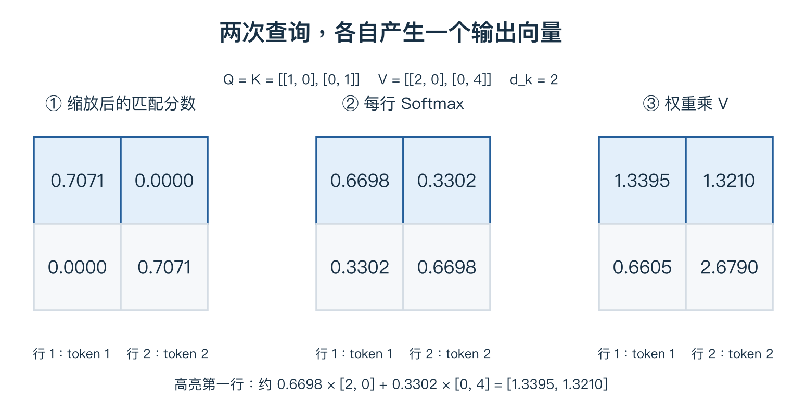

# 07 残差、注意力与 ViT

> 先用加法理解残差，再用一个完整数值例子理解注意力。本单元的两 token 算例与课程第八章的一查询三 key 算例是两组独立例子。

## 1. 残差连接：学习怎样修改已有信息

普通一段网络写作 `y=F(x)`，F 可以包含若干卷积、归一化和激活。残差形式是：

$$y=x+F(x).$$

若 x=`[2,5]`，F(x)=`[0.3,-0.2]`，输出就是 `[2.3,4.8]`。F(x) 是相对于输入的修正，不是损失值。

若某段暂时不需要修改输入，只要让 F(x) 接近 0，就能近似保留 x。


图中捷径把输入送到相加位置，残差分支计算修正。相加要求形状匹配；不能把逐元素相加误解为通道拼接。

标量形式求导得到 `dy/dx=1+F'(x)`，梯度因此存在直接传递的项，但仍可能出现抵消等情况，不保证永不消失。若分支尺寸不同，可以将捷径写为 `P(x)`，例如用适当步长的 1×1 卷积匹配尺寸。

## 2. 注意力想解决什么问题？

卷积通常读取局部区域。全局注意力允许一个位置直接读取其他位置，并根据当前内容决定组合比例。它仍然是**加权求和**，但权重随输入和查询动态计算。

token 在这里表示一个位置对应的特征向量。它可以来自一个词，也可以来自一个图像块，不一定是文字。

以两个 token 为例：

$$X=\begin{bmatrix}1&0\\0&1\end{bmatrix}.$$

每行一个 token，每个有两个特征；形状为 2×2。数字只是教学构造，不预先指定为耳朵、颜色等语义。

## 3. Q、K、V 是三种用途的向量

$$Q=XW_Q,\qquad K=XW_K,\qquad V=XW_V.$$

三组 W 是可学习参数。Q 用于发起匹配，K 用于参与匹配，V 是实际被加权读取的信息。

为了让数字好算，设 W_Q、W_K 为单位矩阵，W_V 为对角元素 2、4 的矩阵，得到：

| token | Query | Key | Value |
|---|---|---|---|
| 1 | [1,0] | [1,0] | [2,0] |
| 2 | [0,1] | [0,1] | [0,4] |

“查询”并不是网络里藏着一句自然语言问题，而是一组用于计算的数字。

## 4. 为 token 1 计算一次注意力

**第一步：点积打分。** q₁ 与 k₁ 点积为 1，与 k₂ 点积为 0。Query、Key 长度 d_k=2，因此除以 √2，得到 `[0.7071,0]`。

**第二步：Softmax 归一化。** 指数约为 `[2.0281,1]`，各自除以总和，得到约 `[0.6698,0.3302]`。

**第三步：读取 Value。**

$$o_1=0.6698[2,0]+0.3302[0,4]\approx[1.3395,1.3210].$$

若把权重只保留两位小数 0.67、0.33，结果约为 `[1.34,1.32]`。这只是舍入精度不同。



图从左到右：打分 → 每行 Softmax → 加权读取 V。高亮的第一行对应 token 1；第二个 token 会用自己的查询另算一行。输出仍然有两个 token。

> **Q 与 K 决定比例，V 提供内容。输出不是最大分数，也不是权重本身。**

## 5. 现在再看矩阵公式

$$O=\operatorname{softmax}\left(\frac{QK^T}{\sqrt{d_k}}\right)V.$$

| 量 | 自注意力中的形状 | 含义 |
|---|---|---|
| Q、K | N×d_k | N 个位置用于匹配的特征 |
| QKᵀ | N×N | 行是查询，列是被读取位置 |
| A | N×N | 每一行分别 Softmax 后的权重 |
| V | N×d_v | 每个位置提供的内容 |
| O=AV | N×d_v | 每个查询得到一个新向量 |

缩放项帮助控制随向量维度增长的点积尺度。标准方差解释依赖近似独立、零均值等假设，不是说所有真实向量都满足这些条件。

完整 NumPy 算例：

```python
import numpy as np

X = np.eye(2)
WQ = np.eye(2)
WK = np.eye(2)
WV = np.diag([2., 4.])
Q, K, V = X @ WQ, X @ WK, X @ WV
scores = (Q @ K.T) / np.sqrt(Q.shape[1])
shifted = scores - scores.max(axis=1, keepdims=True)
A = np.exp(shifted)
A /= A.sum(axis=1, keepdims=True)  # 对每个查询，沿 key 轴归一化
O = A @ V
print(A)
print(O)
```

## 6. 自注意力、交叉注意力与多头

- **自注意力**：Q、K、V 都来自同一组输入。不是只能看自己。
- **交叉注意力**：Q 与 K、V 来自不同组输入，例如文字查询图像表示。
- **多头注意力**：用多组不同投影分别计算，再拼接、线性变换。各头不是永久指定的颜色或形状专家。

若限制可访问位置，可在 Softmax 前加掩码。自回归预测需要防止看到未来答案；普通图像全局自注意力不必机械加同样的因果限制。

## 7. 图像怎样变成 token？

教学图像为 `3×32×32`，切成不重叠的 `8×8` 空间块：每边 4 块，共 16 块。

每块包含 `3×8×8=192` 个数，展平后通过共享的线性变换映射到 64 维：

$$(16\times192)(192\times64)=16\times64.$$

16 是块数，64 是每块特征长度。不是图像的高、宽。

再给每块加入同长度的位置向量：`zᵢ=eᵢ+pᵢ`，让模型获得原来位置的线索。逐元素相加后仍是 16×64，不会变成 16×128。

## 8. Transformer block 不只有注意力

一种常见的 Pre-Norm 结构为：

$$U=X+\operatorname{MHA}(\operatorname{LN}(X)),$$
$$Y=U+\operatorname{MLP}(\operatorname{LN}(U)).$$

| 组件 | 分工 |
|---|---|
| MHA，多头注意力 | 不同 token 交换信息 |
| MLP，小型前馈网络 | 每个 token 内部做非线性特征变换，各位置共享参数 |
| LN，层归一化 | 通常沿每个 token 的特征维度归一化 |
| 残差加法 | 保留直接路径，要求形状匹配 |

这里省略部分实现细节；其他结构可能把归一化放在不同位置。不要把此式当作所有 Transformer 唯一的排列。

## 9. ViT 的分类流程

```text
图像 3×32×32 → 16 个 patch → 映射为 16×64
→ 加位置表示 → Transformer blocks → 16×64
→ 对 token 平均 → 64 个特征 → 分类层 → 10 个分数
```

这是帮助理解的尺寸配置，不是原始 ViT 的标准设置。也可加入专门的分类 token 汇总；此时 token 数量会变化。

常规全注意力的分数表含 N² 个元素，token 数加倍时这张表的大小约变四倍。实际运行成本还包括投影、MLP 和实现方式，不能只看这一个矩阵。

## 复习时记住

**残差提供直接路径；注意力按内容组合信息；位置表示提供顺序；分类层仍把特征变成分数。** 接下来改变的，是任务要求的输出。

[上一单元](06-training.md) · [下一单元：检测与分割](08-visual-tasks.md) · [课程第八章](../notes/08-attention-transformers.md) · [路线目录](README.md)
