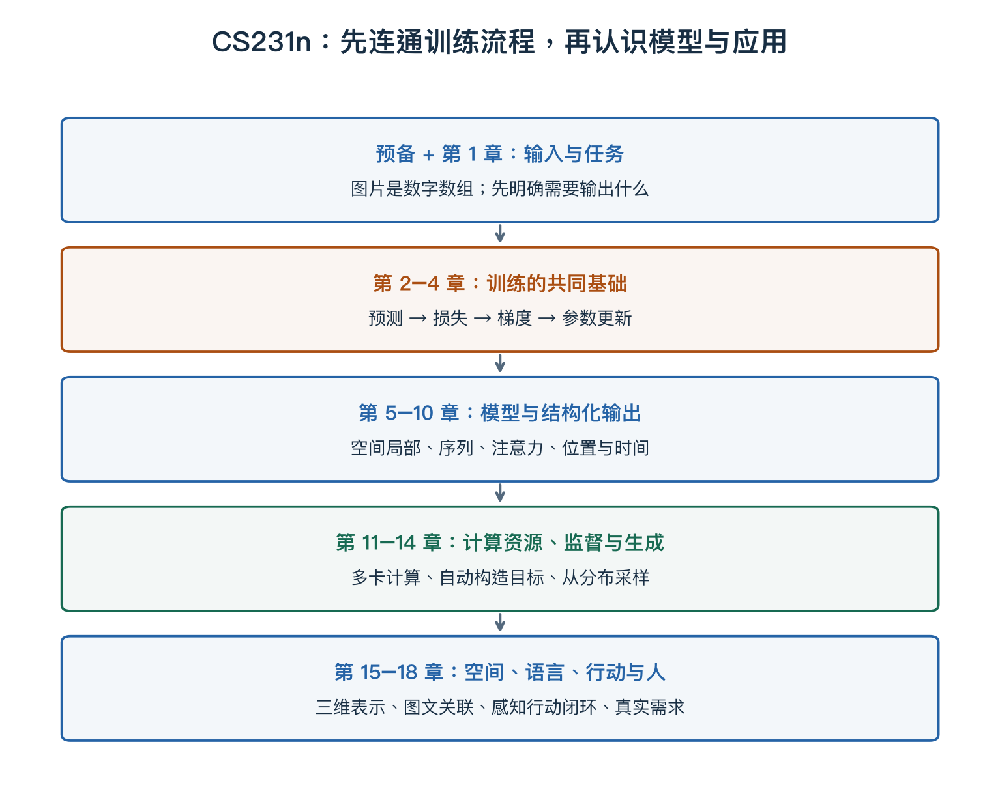

# 第一章：导论 — 计算机视觉与深度学习

> 课程：CS231n Spring 2025 Lecture 1。视频：[B 站 P1](https://www.bilibili.com/video/BV1aXhJ64EmW/?p=1)。
> 版本核对：上传标题标注“2026 最新”，但视频内课件署名、内容与课程目录对应 2025 版。本笔记按视频对应版本整理。
> **从零入口**：[图片、任务与预测：先认识输入和输出](../beginner/01-data-and-prediction.md)。

## 本章概览

> **核心问题：计算机视觉要解决什么，为什么这门课要同时研究数据、模型与训练？**

| 阅读安排 | 内容 |
|---|---|
| **基础内容** | 第 1、3–5 节：先分清任务、方法和数据，再看具体例子。 |
| **推导与扩展** | 第 2 节的历史脉络；第 6 节可用来回看视频，不必先背年份。 |
| 需要的基础 | [图片与像素](00-getting-started.md)，不需要先会求导。 |

> **本章重点**：任务规定要输出什么；模型规定怎样计算；训练决定怎样从数据调整参数。

**术语**

| 术语 | English | 在本章中的含义 |
|---|---|---|
| **任务** | Task | 例如给图片分类，或定位图片中的物体 |
| **模型** | Model | 把输入转换为输出的计算规则 |
| **泛化** | Generalization | 在没有用来训练的新样本上仍然有效 |

阅读标记说明见[初学者指南](../READING_GUIDE.md)。

## 阅读要点

本讲先建立后面所有计算的输入与任务约定：能解释“图像数组”和“图像含义”的差别，区分任务、模型、参数与训练，并在代码中正确处理颜色通道、批次和展平。第一次不需要先懂反向传播。

相关实现：[图像布局代码](../experiments/deep_review/lecture01_images.py)。

## 1. 本章的核心定位

本讲先建立课程地图：计算机视觉研究视觉问题，深度学习提供一类解决方法；CS231n 聚焦二者交叉处。随后介绍视觉研究和神经网络的发展，再说明课程覆盖的任务。这里还没有系统推导分类器、损失函数或反向传播。

视频定位：[02:00 的领域关系图](https://www.bilibili.com/video/BV1aXhJ64EmW/?p=1&t=120)。对应课件：[Part 1，第 5–13 页](https://cs231n.stanford.edu/slides/2025/lecture_1_part_1.pdf)。

### 领域 方法和训练分别回答什么

人工智能是更广的研究领域，机器学习研究如何从数据中形成计算规律，深度学习是一类使用多层可学习表示的方法。计算机视觉按问题对象划分，与这些方法相交，但不是所有视觉算法都是深度学习。例如几何投影、图像处理也属于视觉相关方法。

**任务决定输出要求，模型决定计算规则，训练决定参数如何从数据调整。** “目标检测”是任务名，“CNN”是结构名，“梯度下降”是更新方法名，不能当作同一个层次的三个选项。

### 用一张照片把三个词分开

以“桌上有两个杯子”的照片为例：想知道有没有杯子，是**任务**；用 CNN 把像素转换成特征，是**模型结构**；反复利用标注调整 CNN 权重，是**训练方法**。如果要进一步数清杯子、找到位置，就需要重新明确输出与评价，不能只把分类分数提高当成完成所有任务。



**读图提示**：图是本笔记的学习路线，不是精确的课程依赖树。上面的训练链条会在下面各类模型中反复使用，暂时不必理解每个缩写。

## 2. 视觉研究与深度学习的发展主线

课程从生物视觉与暗箱成像谈起，随后串起几条发展线索：

- 生物启发：Hubel 与 Wiesel 的研究展示了神经元对视觉刺激的选择性。
- 早期视觉：几何、边缘、部件、分组和特征匹配，用不同的表示方式处理图像。
- 神经网络：感知机及其局限，Neocognitron、反向传播和用于手写识别的 LeNet。
- 规模突破：ImageNet、AlexNet，以及之后广泛发展的视觉应用。

课件将进步归纳到算法、数据和计算三个方面，也提醒视觉技术可能造福人类或造成伤害。[Part 1，第 14–68 页](https://cs231n.stanford.edu/slides/2025/lecture_1_part_1.pdf)

**补充理解：**把这段历史理解为几种能力逐渐汇合，比背年份更有帮助：模型需要表达能力，需要有效的训练方法，需要合适的数据，也需要足够的计算资源。“结构看起来像神经网络”与“能够把它训练好”是两个不同的问题。

### 历史背后的技术问题

手工表示往往先设计边缘、关键点等特征，再交给后续算法；深度学习允许特征变换也通过数据训练。区别在于哪些计算由人预先设计、哪些参数由训练调整，不代表传统方法全部无参数，或深度网络完全不需要人为设计。

可以把历史看成几个问题逐渐得到更有效的回答：如何表达规律，如何计算梯度，如何获得覆盖丰富变化的数据，如何负担训练计算。ImageNet、AlexNet 等节点说明这些因素汇合的重要性；不需要通过背年份来证明理解。

## 3. 课程会处理哪些视觉任务？

第一讲后半部分介绍课程范围，并区分任务与模型。[Part 2，第 4–26 页](https://cs231n.stanford.edu/slides/2025/lecture_1_part_2.pdf)

| 任务 | 输出形式 | 补充例子：同一张街景照片 |
| --- | --- | --- |
| 图像分类 Classification | 图片的类别 | 判断它是一张街景 |
| 目标检测 Object Detection | 目标类别与边界框 | 框出汽车、行人 |
| 语义分割 Semantic Segmentation | 每个像素的类别 | 区分道路、汽车、天空 |
| 实例分割 Instance Segmentation | 每个物体各自的像素区域 | 分别标出第一辆、第二辆汽车 |

视频还介绍视频理解、CNN、RNN、注意力与 Transformer、大规模训练，以及自监督、生成模型、视觉语言、三维视觉和具身智能。它们在这里是课程预览，具体机制留待后续讲次。

**补充理解：**“任务”决定我们想得到什么，“模型”决定如何计算。CNN 是一种模型结构，目标检测是一种任务，二者不在同一个分类层次。

## 4. 为什么视觉理解不等于处理像素？

**以下是帮助理解本章的补充解释。**

相机能记录光线形成的图像，但得到数字数组，还不等于知道画面中的物体、关系与动作。

例如，桌上放着一个杯子：

- 杯子换到另一侧，像素位置变了，杯子的身份没有变。
- 手遮住一部分杯身，可见信息减少，人仍可能判断它是杯子。
- 杯子从桌边落下，仅识别“杯子”还不足以描述正在发生的事情。

这说明不同任务需要保留不同信息。分类通常希望忽略一些位置变化；检测却必须保留位置；理解动作还需要时间信息。不能笼统地说，所有视觉系统都应该忽略位置。

### 图像在代码里是什么

以常见 8 位 RGB 为例，一个像素有三个数。下面的 2×2 图像包含四个像素，却有 12 个通道数值：

```text
左上：红 [255, 0, 0]       右上：绿 [0, 255, 0]
左下：蓝 [0, 0, 255]       右下：白 [255, 255, 255]
```

它可以按 HWC 排列成 `(2,2,3)`，也可以按 CHW 排列成 `(3,2,2)`。H 是高、W 是宽、C 是通道，两种布局表示同一张图，只是每个轴的含义和排列不同。

真实输入不一定始终采用 8 位 RGB：可能有灰度、额外通道、不同颜色空间或浮点范围。这里先固定一个明确例子，后续代码不能默认所有数组都相同。

### 代码里的 reshape 和 transpose

下面代码可独立运行，需要 NumPy：

```python
import numpy as np

image_hwc = np.array([
    [[255, 0, 0], [0, 255, 0]],
    [[0, 0, 255], [255, 255, 255]],
], dtype=np.uint8)

image_chw = image_hwc.transpose(2, 0, 1)
wrong_chw = image_hwc.reshape(3, 2, 2)
print(image_hwc.shape)   # (2, 2, 3)：高、宽、颜色
print(image_chw.shape)   # (3, 2, 2)：颜色、高、宽
print(image_chw[0])      # 正确红通道：[[255, 0], [0, 255]]
print(wrong_chw[0])      # [[255, 0], [0, 0]]：没有正确交换轴

batch = np.stack([image_chw, image_chw], axis=0)
x = batch.astype(np.float32) / 255.0
flat = x.reshape(x.shape[0], -1)
print(batch.shape)       # (2, 3, 2, 2)：样本、颜色、高、宽
print(flat.shape)        # (2, 12)：每行一个样本
```

逐行理解：

| 代码 | 为什么这样写 |
|---|---|
| `dtype=np.uint8` | 为本例存储 0～255 的整数颜色值；它不适合直接做可能为负的差值计算 |
| `transpose(2,0,1)` | 把原来的通道轴放到第一位，再放高度、宽度，按轴含义重排 |
| `reshape(3,2,2)` | 按指定遍历顺序重新组织元素，不会自动理解 RGB 轴的含义 |
| `stack(...,axis=0)` | 新增样本轴；这里只重复图片演示形状，不构成实际训练数据 |
| `astype(np.float32)` | 转成适合后续数值计算的浮点表示 |
| `/255.0` | 本例把颜色值缩放到 0～1；不等于均值为 0、方差为 1 的标准化 |
| `reshape(N,-1)` | 保留样本轴，每张图展平；−1 表示根据元素总数推算这一维 |

**数组形状看起来正确，仍可能含义错误。** HWC 与 CHW 展平顺序不同；模型、训练和推理需要使用一致的数据布局。展平本身可在知道布局和形状时恢复原数组，但线性分类器不会因此自动得到图像的邻接关系。

完整脚本见[第一讲数据表示演示](../experiments/deep_review/lecture01_images.py)。其中额外检查了逆变换、展平恢复，以及一个图案平移前后的像素距离。

### 为什么像素距离不能直接代表语义距离

在 4×4 灰度图的某一行放两个相邻亮像素，再向右移动一格。一个位置由 255 变 0，另一个由 0 变 255，L1 距离为：

$$255+255=510.$$

图案仍然是同一条短横线，数组差异却很明显。这只是说明“对应位置的数值变化”和“对象含义变化”不是同一个量；不是说像素距离对所有任务都没有价值。

做差之前必须转换为合适类型。两个 `uint8` 值相减可能发生整数回绕，得到错误距离；先变成浮点再减，才能保留负差值。这会直接影响下一讲的 k-NN 实现。

## 5. 数据、算法与算力各自解决什么？

**补充解释，承接本讲的发展主线。**

| 要素 | 可以怎样理解 | 常见误解 |
| --- | --- | --- |
| 数据 | 让训练过程接触目标问题中的变化 | 样本越多就一定越好；还要看质量和覆盖范围 |
| 算法与模型 | 决定如何表示规律、怎样调整参数 | 只要把网络加深就能解决所有问题 |
| 算力 | 让大规模计算与实验在可接受时间内完成 | 更快的计算可以自动纠正错误标签或任务定义 |

假设训练照片中的猫总在沙发上、狗总在草地上，模型可能依赖背景作判断。增加更多具有相同偏差的照片，未必解决问题；计算更快也不会自动改变这种数据关联。

这个例子说明：评估视觉系统时，需要看它在新的场景下是否仍然可靠。

### 参数 超参数和泛化

模型可写为 `s=f_θ(x)`：x 是输入，θ 表示模型参数，s 是输出分数。参数通常由训练调整；学习率、层宽、近邻数量等控制选择通常由我们设置并参考验证表现选择，称为超参数。

训练目标上的表现，与新样本上的表现需要分别检查。训练集、验证集和测试集用途不同；分开文件并不自动保证独立，如果同一对象或重复样本跨两边，评价仍可能偏乐观。

猫狗背景例子还说明：相关性不保证符合任务意图。若训练猫都在沙发上，模型可能学到背景线索；需要有针对性的划分、数据覆盖和实验来检查，而不是仅凭“很高的准确率”断言学会了猫的本质。

## 6. 回看视频的定位点

下表是已核对的画面采样点，不是各段的精确起止时间。

| 时间 | 可回看的内容 |
| --- | --- |
| [02:00](https://www.bilibili.com/video/BV1aXhJ64EmW/?p=1&t=120) | AI、机器学习、深度学习与计算机视觉的关系 |
| [06:31.7](https://www.bilibili.com/video/BV1aXhJ64EmW/?p=1&t=391.7) | 暗箱成像 |
| [30:00](https://www.bilibili.com/video/BV1aXhJ64EmW/?p=1&t=1800) | LeNet 与手写识别 |
| [35:00](https://www.bilibili.com/video/BV1aXhJ64EmW/?p=1&t=2100) | AlexNet 与 Neocognitron 对比 |
| [55:00](https://www.bilibili.com/video/BV1aXhJ64EmW/?p=1&t=3300) | 大规模分布式训练 |
| [62:30](https://www.bilibili.com/video/BV1aXhJ64EmW/?p=1&t=3750) | 整门课程的结构 |

## 要点回顾

| 关键词 | 要连起来理解的关系 |
|---|---|
| **任务** | 先说明想输出标签、框、像素区域还是动作。 |
| **方法** | CNN、Transformer 等是计算结构，不等于任务名称。 |
| **数据** | 训练覆盖了什么变化，会影响模型对新场景的表现。 |

遇到符号问题可回到[工具箱](00-math-and-numpy.md)，遇到章节衔接可查[复习地图](../REVIEW_MAP.md)。

## 资料说明

- 视频：[B 站课程 P1](https://www.bilibili.com/video/BV1aXhJ64EmW/?p=1)
- 对应课程：[Stanford CS231n Spring 2025](https://cs231n.stanford.edu/2025/schedule.html)
- 官方课件：[Lecture 1 Part 1](https://cs231n.stanford.edu/slides/2025/lecture_1_part_1.pdf)、[Lecture 1 Part 2](https://cs231n.stanford.edu/slides/2025/lecture_1_part_2.pdf)
- 页码使用 PDF 文件的顺序页码，从 1 开始。
- 采用原创概括与补充例子；未将课程视频、整套课件或视频帧加入笔记仓库。
