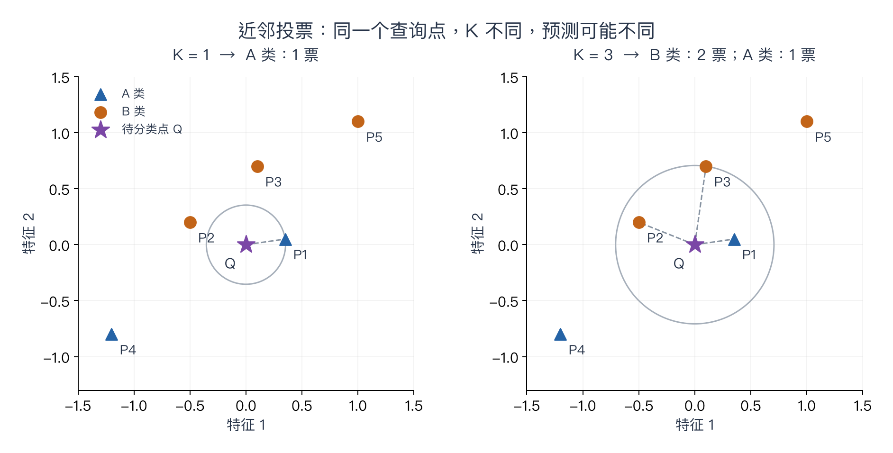
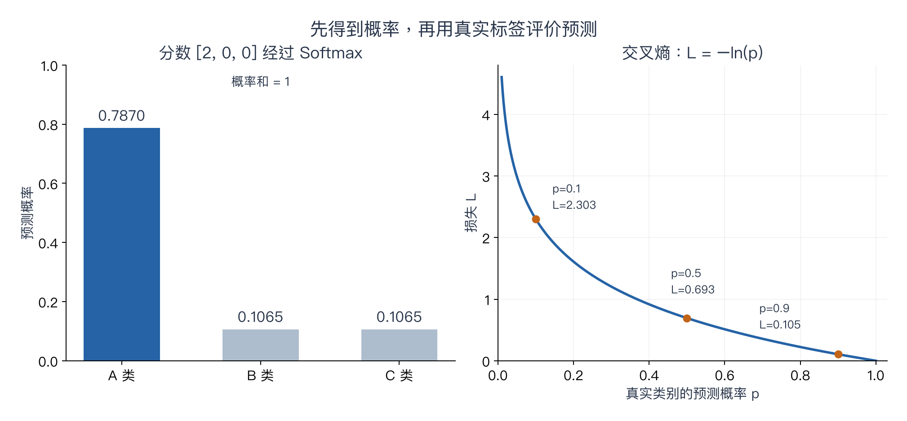

# 第二章：图像分类与线性分类器

> 对应课程：Stanford CS231n Spring 2025，Lecture 2，授课教师 Ehsan Adeli，2025-04-03。
> 参考：[课程视频 P2](https://www.bilibili.com/video/BV1aXhJ64EmW/?p=2)、官方课件与配套笔记。
> 本章主线：图像分类 → 最近邻 / K 近邻 → 超参数与验证集 → 线性分类器 → Softmax 与交叉熵。
> **从零入口**：[从像素、距离到 Softmax 与损失](../beginner/01-data-and-prediction.md)。

> **相关专题**：[k-NN 原理与完整实现](02-knn-implementation.md)、[线性分类器专题](02-linear-classifier-deep-review.md)、[Softmax 与稳定交叉熵](02-softmax-numerical-stability.md)。

## 本章概览

> **核心问题：怎样把一张图片变成一个类别，并用一个数评价这次预测？**

| 阅读安排 | 内容 |
|---|---|
| **基础内容** | 第 1–4 节理解近邻与验证；第 6、8–10 节连通分数、概率和损失。 |
| **推导与扩展** | 第 7 节的几何理解、复杂度、数值稳定专题与批量计算。 |
| 需要的基础 | [像素与展平](00-getting-started.md)；遇到 Σ、范数或形状可查[工具箱](00-math-and-numpy.md)。 |

> **本章重点**：先分清“预测类别”和“评价预测”：模型给分数，标签决定怎样计算损失。

阅读标记说明见[初学者指南](../READING_GUIDE.md)。

## 阅读导航：本章几种方法为什么接在一起？

这章看似有许多名称，其实是一条连续的思路。

1. **先定义任务**：输入图片，输出一个类别。
2. **先做一个容易理解的办法**：找相似的已知图片，借用它们的标签，这就是近邻方法。
3. **发现需要作选择**：怎样衡量相似？参考几个邻居？于是引入超参数和验证集。
4. **换一种表示经验的方式**：把训练经验存入参数 W、b，预测时直接计算类别分数。
5. **定义什么算好**：分数变成概率，再根据真实标签计算损失。

学习这章时，先连通“输入 → 分数 → 概率 → 损失”。时间复杂度、几何推导和数值稳定性可以第二遍再读。本章不要求先掌握求导。

### 阅读约定

- **课程主线**：按官方第二讲组织，并给出出处。
- **补充解释／算例**：为初学者补齐步骤，不是教授原话。
- 三张图均为本笔记原创，使用文中给定的小数据，能够重新计算；不是实际训练结果。
- “预测类别”和“真实类别”是两个不同概念。真实标签来自数据标注，不能由预测结果反过来决定。

## 1. 从像素到类别：图像分类的问题

给定一张图片，从预先定义的类别中选择一个标签。人的语义判断与机器接收到的像素数值之间存在“语义鸿沟”（Semantic Gap）。视角、光照、遮挡、背景、形变、类内差异及上下文都会影响识别。

课程采用数据驱动方法：收集图片和标签，用训练数据构建分类器，再在新数据上评价。[课件 PDF 第 6–19 页](https://cs231n.stanford.edu/slides/2025/lecture_2.pdf)

本章统一使用：

**先把几个基础词说清楚：**

- **样本（Sample）**：一次输入。在本章中通常就是一张图片。
- **标签（Label）**：样本对应的正确类别。它是监督信号，不是图片里的一个像素。
- **特征（Feature）**：用于描述输入的数值。这里先直接使用像素，后面课程会学习更好的表示。
- **向量（Vector）**：按顺序排列的一组数。
- **矩阵（Matrix）**：按行、列排列的一张数表。
- **张量（Tensor）**：可以有多个轴的数组。RGB 图片可用“高、宽、通道”三个轴表示。
- **维度（Dimension）**：这里说向量的 D 维，是指它包含 D 个数；不要与数组有几个轴混淆。

**补充例子：**2×2 灰度图

$$
\begin{bmatrix}0&255\\128&64\end{bmatrix}
\quad\longrightarrow\quad
x=\begin{bmatrix}0\\255\\128\\64\end{bmatrix}
$$

右边是按行展平得到的四维列向量。数字仍然都在，只是排列形式改变了。后续处理所有图片时必须采用一致顺序。

本章默认是**单标签多分类**：每张图片选一个类别。类别编号如 A=0、B=1、C=2 只是索引，不表示 C 比 A“大两倍”。这一点也帮助理解后面的 one-hot 标签。[参考：《动手学深度学习》的分类与标签表示](https://www.d2l.ai/chapter_linear-classification/softmax-regression.html)

| 符号 | 含义 |
| --- | --- |
| N | 训练样本数 |
| D | 每个样本的输入维度 |
| C | 类别数 |
| x_i | 第 i 张图片展平后的向量 |
| y_i | 第 i 张图片的真实类别编号 |
| K | K 近邻算法采用的邻居数 |

这里将 K 专门用于邻居数量，避免与类别数 C 混淆。

## 2. 最近邻：找到最相似的训练样本

最近邻（Nearest Neighbor，NN）保存训练数据。预测新图片时，计算它与训练图片的距离，把最近一张的标签作为预测。

常见距离：

$$
d_1(x,z)=\sum_{j=1}^{D}|x_j-z_j|
$$

$$
d_2(x,z)=\sqrt{\sum_{j=1}^{D}(x_j-z_j)^2}
$$

L1 是绝对差之和；L2 是欧几里得距离。[官方配套笔记：最近邻](https://cs231n.github.io/classification/)

**补充算例：**对 x=(1,2)、z=(4,6)，两个坐标的差分别为 3 和 4：

- L1 距离为 3+4=7。
- L2 距离为 √(3²+4²)=5。

距离只说明在指定表示和度量下有多接近，并不自动表示语义相同。

### 把求和符号展开

公式里的 j 表示“第几个特征”，Σ 表示“将这些项相加”。例如 D=3 时：

$$
d_1(x,z)=|x_1-z_1|+|x_2-z_2|+|x_3-z_3|
$$

绝对值保证相反方向的差不会抵消。例如差值 3 和 −3，直接相加是 0，但两个位置都存在差异；取绝对值后相加为 6。

L2 则先平方，将各维差异变成非负数，再求和、开方。如果只是按 L2 距离排序，可以暂时省去开方，因为对非负数开方不改变大小顺序。

**补充边界：**不同特征的量纲和尺度会影响距离。例如将“长度”从米改成毫米，该维的差值会放大 1000 倍，近邻结果可能随之改变。即使算法相同，输入表示也不能忽略。

### 从一个距离到“距离矩阵”

设有 N 个测试样本、M 个训练样本，记 D_ij 为“测试样本 i 与训练样本 j 的距离”。那么 D 的形状是 **N×M**，里面每个格子只有一个距离值。

|  | 训练 A | 训练 B | 训练 C |
|---|---|---|---|
| 测试 1 | 1 | 2 | 9 |
| 测试 2 | 8 | 9 | 10 |

若黑色代表小距离、白色代表大距离，第二行会整体较亮：**测试 2 与这些训练样本普遍不接近**。第三列较亮则说明：**训练 C 与这些测试样本普遍不接近**。

图像中的亮度、颜色、大面积背景、纹理或其他异常特征，都可能造成某张图在原始像素空间中离多数图较远。但**距离图中的亮线不等于原图一定更亮，也不能只凭热图确认具体原因**。应把对应行的测试图或对应列的训练图拿出来比较。

如果想把 N×M 次距离计算写成一次矩阵运算，接着看[工具箱的广播与 L2 展开式](00-math-and-numpy.md#6-广播一列加一行得到整张表)。

## 3. K 近邻：从一个邻居改为多个邻居投票

K-Nearest Neighbors（KNN）选出距离最近的 K 个训练样本，由类别票数决定预测结果。K=1 时退化为最近邻。

**补充例子：**最近的三个样本标签分别为“狗、猫、猫”。1-NN 预测“狗”，3-NN 预测“猫”。

K 增大通常能缓和单个异常样本的影响，但也可能混合不同类别的局部区域。因此 K 并非越大越好。多分类中，即使 K 是奇数也可能平票，需要约定处理方式。

### 完整算例：查距离、排序、再投票

为便于画图，用两个抽象特征表示样本。它们不是猫狗的真实图片特征。待分类点为 Q=(0,0)，距离采用 L2。

| 训练点 | 特征向量 | 已知类别 | 到 Q 的 L2 距离 |
| --- | --- | --- | --- |
| P1 | (0.35, 0.05) | A | √0.125 ≈ 0.354 |
| P2 | (−0.50, 0.20) | B | √0.29 ≈ 0.539 |
| P3 | (0.10, 0.70) | B | √0.50 ≈ 0.707 |
| P4 | (−1.20, −0.80) | A | √2.08 ≈ 1.442 |
| P5 | (1.00, 1.10) | B | √2.21 ≈ 1.487 |

表格已按距离排序。K=1 时，只取 P1，预测 A；K=3 时，取 P1、P2、P3，B 获得两票，预测 B。

**读图方法：**星形是未知标签的 Q；三角形和圆形是训练样本；虚线连到参与投票的近邻。圆周表示所选最远邻居的距离，**不是分类决策边界**。

这个例子只说明 K 会影响预测。由于没有给出 Q 的真实标签，不能判断哪一次预测更准确。实际效果应在有真实标签的验证集上比较。

本章使用等权投票；距离加权投票是另一种选择，不能悄悄混入同一个算例。[实现概念参考：scikit-learn 近邻分类](https://scikit-learn.org/stable/modules/neighbors.html)

### 训练与预测的开销

课件中“训练 O(1)、预测 O(N)”描述的是一个简化实现：训练时仅保存已有数组的引用，并将输入维度视为固定值。

**补充精确说明：**

- 保存数组引用可以是 O(1)，不意味着读取或存储整个数据集没有成本。
- 若显式考虑 D，单个样本的朴素距离扫描为 O(ND)。
- 训练数据本身的存储量为 O(ND)。
- KNN 还需要选择近邻；这里的 O(ND) 只描述距离计算。

这些复杂度针对本章的朴素实现，不是所有近邻检索算法的统一结论。

## 4. 怎样选择 K 和距离：验证集

K 与距离度量属于超参数（Hyperparameters）。使用验证集选择它们，测试集留作最终评价；数据较少时可采用交叉验证。[官方配套笔记：超参数选择](https://cs231n.github.io/classification/)

| 数据部分 | 本章中的作用 |
| --- | --- |
| 训练集 Training set | 构建模型；KNN 保存它，线性分类器利用它学习参数 |
| 验证集 Validation set | 比较 K、距离度量等选择 |
| 测试集 Test set | 配置确定后，评价最终模型 |

**补充理解：**如果每次看完测试集结果都调整 K，测试集就在参与决策，最终成绩可能过于乐观。

“训练集表现最好”也不够：1-NN 在查询允许匹配自身、且不存在冲突标签等问题时，可以靠记住样本获得完美训练成绩，但这不能保证它识别新图片的能力。

五折交叉验证把用于开发模型的数据分成五份，每次用四份训练、一份验证，轮换后平均结果。它不意味着把最终测试集也拿来轮换。

### 补充示例：一次正确的选择过程

假设有 100 张已标注图片，先按预定方案划分为 60 张训练、20 张验证、20 张测试。这个比例只用于说明流程，不是通用推荐值。

1. 训练部分固定，分别尝试 K=1、3、5。
2. 如果验证集分别答对 14、16、15 张，就得到 70%、80%、75% 的验证准确率。
3. 在这几个候选中选择 K=3，而不是宣布“K=3 永远最好”。
4. 配置确定后才评价最终测试集，不能因为测试成绩不好，又回去试几十个 K 并仍称它为独立测试。

上述数字是假设示例，并非模型实验结果。准确率的计算方法是：

$$
\mathrm{Accuracy}=\frac{\text{预测正确的样本数}}{\text{评价样本总数}}
$$

图片非常相似、来自同一原图的重复样本，不应随意散落到训练与测试两边，否则可能产生数据泄漏。

## 5. 为什么直接比较像素不够好？

视频约 45:00 展示了遮挡、平移、着色的图片比较，用来说明像素距离与人的视觉判断可能不一致。[视频定位](https://www.bilibili.com/video/BV1aXhJ64EmW/?p=2&t=2700)

**补充理解：**同一物体平移一点，逐位置比较的数值就可能大幅变化；两张类别不同的图片，也可能因为大面积背景相似而距离较近。

本章批评的是“原始像素距离用于图像分类”的局限，不应扩大成“近邻方法没有用途”。表示方式与距离选择会影响近邻结果。

### 从近邻过渡到线性分类器

近邻方法预测时，需要把新样本与保存的训练样本比较。接下来尝试另一条路径：通过训练得到固定数量的参数，以后将新图片代入一个计算公式。

| 对比项 | 本章的朴素 KNN | 线性分类器 |
| --- | --- | --- |
| 保存什么 | 训练样本和标签 | 学到的 W、b |
| 如何预测 | 计算距离，选择近邻，投票 | 计算 Wx+b，选择最高分 |
| 训练阶段主要做什么 | 保存数据 | 寻找合适的参数 |
| 输入维度和类别数固定后 | 数据增多会增加朴素扫描成本 | 参数量不随样本数直接增加 |

线性分类器不保证比所有 KNN 更准确。这里的转变是模型表示与计算方式的转变，优劣还要用合适的数据评价。

## 6. 线性分类器：用参数计算类别分数

课程随后转向参数化模型：

$$
s=f(x;W,b)=Wx+b
$$

对 C 个类别、D 维输入，采用列向量约定：

$$
x\in\mathbb{R}^{D\times1},\quad
W\in\mathbb{R}^{C\times D},\quad
b\in\mathbb{R}^{C\times1},\quad
s\in\mathbb{R}^{C\times1}
$$

每个类别得到一个分数，预测选择分数最大的类别：

$$
\hat y=\arg\max_c s_c
$$

其中 argmax 返回“最大值对应的类别索引”，不是最大分数本身。[官方配套笔记：线性分类](https://cs231n.github.io/linear-classify/)

**补充解释：**W 的第 c 行决定各输入维度如何影响类别 c；b_c 是该类别的偏置。含偏置的表达严格说是仿射变换，课程沿用“线性分类器”的名称。

### W 的一行、一列各代表什么？

将矩阵式拆成某一个类别的分数：

$$
s_c=w_{c1}x_1+w_{c2}x_2+\cdots+w_{cD}x_D+b_c
$$

- **第 c 行**：类别 c 的全部特征权重。
- **第 j 列**：第 j 个特征对各类别分数的影响。
- **w_cj 为正**：其他输入固定时，x_j 增大会提高类别 c 的分数。
- **w_cj 为负**：同样条件下，x_j 增大会降低类别 c 的分数。
- **b_c**：不依赖当前输入的类别偏置，让模型能够调整分数基准。

最后两条是关于该类的原始分数。最终概率还依赖其他类别，不能仅看一个权重就断言概率一定增大。

“训练 W、b”意味着利用数据调整这些数值。它们不是由矩阵乘法自动产生的；目前先假定给定参数，理解如何计算输出。怎样调整参数留给第三章。

### 维度实例

CIFAR-10 图片为 32×32×3，展平后 D=3072；类别数 C=10，所以：

- x：3072×1。
- W：10×3072。
- b 与 s：10×1。

展平是固定顺序的重新排列，本身不丢失数值；这个模型不会自动具备后续 CNN 那样的空间结构假设。

### 补充算例：逐行做加权求和

设两个输入数值、三个类别 A/B/C：

$$
x=\begin{bmatrix}2\\1\end{bmatrix},\quad
W=\begin{bmatrix}1&0\\-1&2\\0&-1\end{bmatrix},\quad
b=\begin{bmatrix}0\\0\\1\end{bmatrix}
$$

于是：

$$
s=
\begin{bmatrix}
1\times2+0\times1+0\\
-1\times2+2\times1+0\\
0\times2-1\times1+1
\end{bmatrix}
=
\begin{bmatrix}2\\0\\0\end{bmatrix}
$$

预测类别为 A。这里的 2、0、0 是分数，不是概率。

**读图方法：**用 W 的第一行与 x 对应相乘后相加，得到 A 的分数；第二、三行同理，再分别加上对应偏置。图中的蓝色色深只用于区分数值，不代表类别概率。

若将 B 类偏置从 0 改为 3，B 的分数便从 0 变为 3，预测会转成 B。这个改变说明偏置会影响判断，不说明这个参数更好；只有对照真实标签，才能评价它。

## 7. 线性分类器的三个理解角度

课件从代数、视觉和几何角度解释同一个模型，并展示线性模型难以处理的类别分布。[课件 PDF 第 57–62 页](https://cs231n.stanford.edu/slides/2025/lecture_2.pdf)

**以下为补充展开：**

- **代数角度**：每个分数是一组输入的加权和，再加偏置。
- **视觉角度**：对原始像素输入，可以把一行权重排回图片形状，视为某一类的权重模板。这个模板是学习出的权重，不等于该类图片的平均值。
- **几何角度**：比较类别 a 与 b 的分数，其相等位置满足：

$$
(w_a-w_b)^Tx+(b_a-b_b)=0
$$

在二维中它是一条直线，高维中是超平面。多分类模型有多个这样的分界面，不能把它理解为“整套分类器只有一条线”。

如果两个类别交错分布，例如 XOR 模式，原始输入上的简单线性边界就不够。这里限定的是当前表示；更换特征表示后，同一任务的可分性可能改变。

### “模板”为什么会遇到困难？

想象同一个类别中，物体既可能朝左，也可能朝右。一个对固定像素位置加权的模板，要同时给这些变化很大的外观打高分，就可能受到限制。这是帮助理解的直觉，不意味着所有权重都可直接解释为某个物体部件。

另一个容易误解的地方是：Softmax 虽然是非线性函数，但它不改变分数排序。因此，在当前模型中，它不会把最高分类别的线性决策边界变成任意曲线。

## 8. Softmax：把分数转换为概率分布

分数可以为负，也不必加起来等于 1。Softmax 将它们转换成归一化的类别概率：

$$
p_c=\frac{e^{s_c}}{\sum_{j=1}^{C}e^{s_j}}
$$

对于有限实数分数，p_c 大于 0，所有类别概率之和为 1。Softmax 不改变类别分数的排序。

**接上面的原创算例：**

$$
s=[2,0,0]\quad\Rightarrow\quad
p\approx[0.7870,\ 0.1065,\ 0.1065]
$$

A 仍然是预测类别。Softmax 给出了模型的概率估计，但“0.787”不保证在真实世界中具有同等程度的校准准确性。

### 分两步算，而不是直接记住公式

**第一步：取指数。**e≈2.718，exp(s) 就是 e 的 s 次方。

$$
[2,0,0]\ \longrightarrow\ [e^2,e^0,e^0]\approx[7.3891,1,1]
$$

指数函数的输出始终为正，并且输入越大，输出越大，适合把任意实数分数变成正数。

**第二步：除以总和。**

$$
Z=7.3891+1+1=9.3891
$$

$$
p_A=7.3891/9.3891\approx0.7870,\qquad
p_B=p_C=1/9.3891\approx0.1065
$$

Z 只是方便书写的归一化因子；不需要把它当成新的模型参数。

**为什么不直接将分数除以分数总和？**因为分数可能有负数，甚至总和为 0，不能保证得到合法概率。指数加归一化是一种解决方式。这并非唯一的概率建模方式。

### 共同平移与放大不是一回事

- [2,0,0] 和 [102,100,100] 的概率完全相同：各分数增加同一个常数，在分子分母中会相消。
- [2,0,0] 和 [4,0,0] 的概率不同：后者 A 的相对优势更大，概率约为 0.9647。

预测类别都可以是 A，但模型对不同类别分配的概率并不相同。

## 9. 交叉熵：评价正确类别获得了多少概率

如果样本 i 的真实类别为 y_i，则其损失为：

$$
L_i=-\log p_{y_i}
=-s_{y_i}+\log\sum_{j=1}^{C}e^{s_j}
$$

这里使用自然对数。数据集上的数据损失为：

$$
L_{\mathrm{data}}=\frac1N\sum_{i=1}^{N}L_i
$$

Softmax 负责概率转换，交叉熵负责衡量与标签的不一致。课程中的“Softmax loss”通常指两者组合。[官方配套笔记：Softmax](https://cs231n.github.io/linear-classify/)

**补充算例：**

| 真实类别的预测概率 | 单样本损失 −log(p) |
| --- | --- |
| 0.9 | 约 0.105 |
| 0.5 | 约 0.693 |
| 0.1 | 约 2.303 |

若上面的真实类别是 A，损失约为 0.2395。

### 为什么已经预测正确，还需要损失？

设真实类别为 A，两个预测概率分别是：

- 模型甲：[0.40, 0.35, 0.25]。
- 模型乙：[0.90, 0.05, 0.05]。

两者最高概率都对应 A，都算“预测正确”，但交叉熵分别约为 0.9163 与 0.1054。损失能表达硬分类准确率没有表现出来的区别。

反过来，如果模型给真实类别的概率只有 0.01，那么损失约为 4.6052；即使它对另一个类别十分确信，也不能降低这次错误的损失。

**读图方法：**左图是本文算例的三个概率；右图横轴只取“真实类别的概率”，纵轴是它对应的损失。真实类别概率接近 0 时，曲线快速上升；接近 1 时趋近 0。右图没有展示 p=0，因为 log(0) 没有有限值。

### 负对数从哪里来？

这个补充推导帮助理解损失的选择，不要求先学信息论。

设各样本标签在给定输入和参数后条件独立，模型给真实标签的概率分别为 p_1、p_2、…、p_N。我们希望这些真实标签同时出现的似然尽可能大：

$$
\mathcal{L}=\prod_{i=1}^{N}p_i
$$

对数是单调递增函数，最大化似然等价于最大化对数似然；对数还能把乘法变成加法：

$$
\log\mathcal{L}=\sum_{i=1}^{N}\log p_i
$$

再加负号，将“最大化”改写成“最小化”，就得到负对数似然。除以 N 得到平均损失。请区分这里表示似然的花体符号与本章表示损失的 L。

**注意：**交叉熵降低不保证测试准确率每一步都提高；训练目标与最终评价指标相关，但不是同一个量。

对于 one-hot 标签 q，交叉熵的一般形式为：

$$
-\sum_c q_c\log p_c
$$

只有真实类别的 q_c=1，其余为 0，所以简化为 −log(p_y)。这不是只用正确类别的分数：p_y 的分母仍包含所有类别的分数。

例如真实类别是 A，q=[1,0,0]：

$$
H(q,p)=-(1\log p_A+0\log p_B+0\log p_C)=-\log p_A
$$

这里 0 与 1 只是 one-hot 表示。实际程序也可以直接保存类别索引 y=0，无需手工构造 one-hot 数组。

**补充：一个小批次怎样取平均？**若两个样本的真实类别概率分别是 0.8 和 0.6，平均交叉熵为：

$$
\frac{-\log0.8-\log0.6}{2}\approx0.3670
$$

它不同于先平均概率再取负对数：−log(0.7)≈0.3567。应当先逐样本计算损失，再求平均。

### 本讲结尾的两个判断

- 正确类别概率趋近 1，损失趋近 0；趋近 0，损失无上界。对多类别、有限分数的 Softmax，0 是可趋近的下界。
- 如果 C 个分数完全相同，每类概率都是 1/C，损失为 log(C)。10 类时约为 2.303。

“约 2.303”对应的是十类近似均匀预测的情况，不是训练损失必须满足的固定标准。

### 补充实现细节：数值稳定

详细推导、上溢与下溢算例见：[Softmax 与交叉熵为什么要这样计算](02-softmax-numerical-stability.md)。

可先将全部分数减去最大值，再计算指数：

$$
\tilde s_c=s_c-\max_j s_j
$$

这个共同平移不会改变 Softmax 概率，但能防止指数值过大。更稳健地直接计算损失：

$$
L_i=-\tilde s_{y_i}+\log\sum_j e^{\tilde s_j}
$$

这样也避免先把极小概率算成 0，再取 log(0)。

## 10. 一次完整计算：把所有步骤串起来

仍使用上面的两个输入、三个类别的算例，并假设真实类别为 A：

| 步骤 | 当前已知／算得的量 | 作用 |
| --- | --- | --- |
| 输入 | x=[2,1] | 描述样本 |
| 参数 | 图中的 W、b | 决定怎样处理输入 |
| 分数 | s=[2,0,0] | 各类别的相对评分 |
| 预测 | A | 选择最高分类别 |
| 概率 | p≈[0.7870,0.1065,0.1065] | 对各类别分配归一化概率 |
| 真实标签 | y=0，即 A | 来自标注，不来自预测 |
| 损失 | L≈0.2395 | 评价这次预测 |

如果只把真实标签改为 B，输入、分数、预测与概率都不变，但损失变成约 2.2395。这说明**标签参与评价，而不是用于泄露答案的输入特征**。

配套的[可运行算例](../experiments/chapter02_forward.py)使用 Python 标准库，展示距离、矩阵乘法、稳定 Softmax 和交叉熵。运行命令为 python3 experiments/chapter02_forward.py。没有训练过程，也没有图片数据集，目的是核对数学步骤，不是报告模型性能。

### 从一张图片扩展到一批图片

读代码时，经常看到每张图片放在一行，而本章公式先把单张图片写成列向量。这两种约定都可以，关键是形状一致。

如果一批 B 张图片按行放入 X，保持本文 W 为 C×D，则：

$$
X:B\times D,\qquad S=XW^T+\mathbf{1}_B b^T:B\times C
$$

其中 W^T 表示转置，1_B 是 B×1 的全 1 列向量；偏置会加到每个样本上。Python 数组常通过广播完成这一步。

此处 B 是批次大小，与类别名称“B 类”无关。实现时对每行分别做 Softmax，即对类别轴归一化，而不是让不同图片的分数一起归一化。这一段是后续读代码的补充，可在第二遍阅读。

## 11. 本章内容边界与易混点

| 容易混淆的内容 | 正确区分 |
| --- | --- |
| 参数与超参数 | W、b 由训练学习；K 等配置通过验证选择 |
| 分数与概率 | Wx+b 给出分数，Softmax 再转换成概率 |
| Softmax 与交叉熵 | 前者是转换函数，后者是损失 |
| 数据损失与优化 | 损失定义“好坏”，优化负责寻找更好的参数 |
| 预测正确与损失很小 | 最高分是正确类别，并不保证正确类别概率接近 1 |

课件 PDF 第 83 页开始标为“Reading Assignment – SVM Loss”。因此 SVM 列为本章课后阅读。正则化与优化在[第三章](03-regularization-optimization.md)继续。

## 12. 视频回看定位

以下是已检查的画面采样点，不是段落精确起止时间。

| 位置 | 画面主题 |
| --- | --- |
| [05:00](https://www.bilibili.com/video/BV1aXhJ64EmW/?p=2&t=300) | 语义鸿沟 |
| [15:00](https://www.bilibili.com/video/BV1aXhJ64EmW/?p=2&t=900) | 数据驱动方法 |
| [25:00](https://www.bilibili.com/video/BV1aXhJ64EmW/?p=2&t=1500) | 最近邻实现与复杂度 |
| [35:00](https://www.bilibili.com/video/BV1aXhJ64EmW/?p=2&t=2100) | L1 / L2 距离 |
| [45:00](https://www.bilibili.com/video/BV1aXhJ64EmW/?p=2&t=2700) | 原始像素距离的局限 |
| [55:00](https://www.bilibili.com/video/BV1aXhJ64EmW/?p=2&t=3300) | 用损失评价权重 W |
| [66:50](https://www.bilibili.com/video/BV1aXhJ64EmW/?p=2&t=4010) | 均匀概率下的 Softmax 损失 |

## 要点回顾

| 关键词 | 要连起来理解的关系 |
|---|---|
| **近邻** | 在选定表示与距离下找相似样本，再投票。 |
| **线性分类** | W、b 把输入转换成类别分数。 |
| **损失** | Softmax 转概率，交叉熵利用真实标签评价；验证集用来选择配置。 |

遇到符号问题可回到[工具箱](00-math-and-numpy.md)，遇到章节衔接可查[复习地图](../REVIEW_MAP.md)。

## 13. 参考资料

来源：
- [2025 官方课程安排](https://cs231n.stanford.edu/2025/schedule.html)
- [第二讲官方课件](https://cs231n.stanford.edu/slides/2025/lecture_2.pdf)
- [官方图像分类笔记](https://cs231n.github.io/classification/)
- [官方线性分类笔记](https://cs231n.github.io/linear-classify/)
- [课程视频 P2](https://www.bilibili.com/video/BV1aXhJ64EmW/?p=2)

页码按 PDF 顺序，从 1 开始；与课件印刷页号可能不同。资料核对日期：2026-09-24。文中的原创数值例子已实际计算核验；没有训练模型，不报告实验准确率。

### 扩写参考与配图说明（2026-09-25）

- [CS231n 官方图像分类笔记](https://cs231n.github.io/classification/)：参考“任务—简单方法—局限—验证”的讲解顺序。
- [CS231n 官方线性分类笔记](https://cs231n.github.io/linear-classify/)：核对评分函数与 Softmax/交叉熵概念。
- [《动手学深度学习》Softmax Regression](https://www.d2l.ai/chapter_linear-classification/softmax-regression.html)：参考先解释标签与标量计算、再写矩阵公式的组织方式。本文自拟小算例，没有复制其例题。
- [scikit-learn Nearest Neighbors](https://scikit-learn.org/stable/modules/neighbors.html)：核对投票、K 的作用和实现边界。
- 原创图片位于 assets/chapter02，同时保存 PNG 与 SVG；可由 scripts/draw_chapter02.py 重新生成（需要 NumPy、Matplotlib 与可显示中文的字体）。本文不复制网络整篇笔记或第三方插图。
