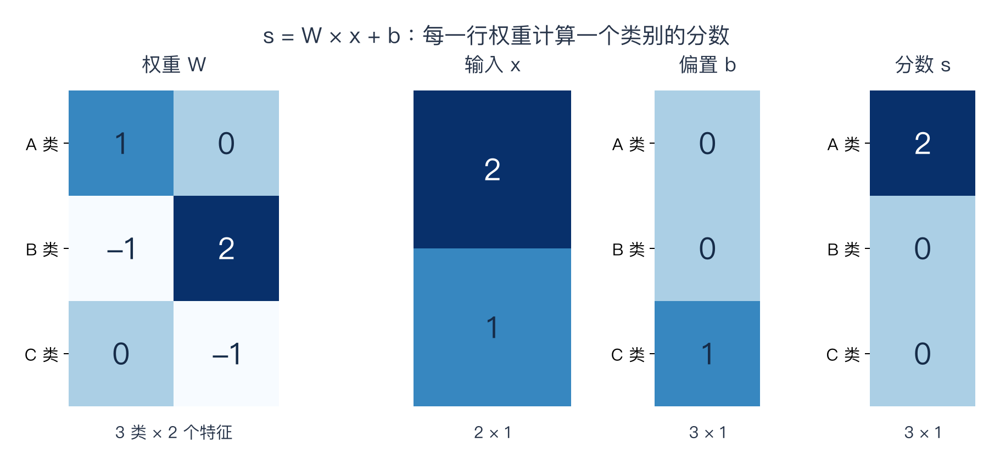

# 第二讲专题：线性分类器的分数、形状与边界

本节介绍线性分类器的分数计算、批量形状和决策边界。前置：[k-NN](02-knn-implementation.md)。算例参数为指定值。

## 1 从保存样本到保存参数

k-NN 查询训练数据；线性分类器用 W、b 计算分数。W、b 将在训练阶段由优化算法调整，本篇先理解给定参数怎样预测。计算矩阵乘法本身并不会学会合适的权重。

固定输入维度 D、类别数量 C，参数数量是 CD+C，与训练样本数量没有直接关系。每个样本的预测乘加成本约 O(CD)。这不等于训练时间与样本数无关，也不保证准确率更高。

## 2 从一个类别的分数到矩阵式

第 c 类的分数是各特征的加权和，再加该类偏置：

$$
s_c = \sum_{j=1}^{D} W_{cj}x_j + b_c
$$

用列向量表示一个输入，合在一起就是：

$$
s = Wx+b
$$

| 量 | 形状 | 含义 |
|---|---|---|
| x | `(D,1)` | 一个样本的 D 个特征 |
| W | `(C,D)` | 每行是一类的全部特征权重 |
| b | `(C,1)` | 每类一个偏置 |
| s | `(C,1)` | 每类一个原始分数 |

**纯文本对照：类别分数 = 对应特征乘权重后相加 + 该类偏置。**

W 的第 c 行是类别 c 的权重；第 j 列表示特征 j 对各类别分数的影响。正权重表示在其他输入不变时，该输入增加会提高对应的原始分数；负权重反之。这不是对最终概率的单独判断。

偏置不乘某个输入特征，它提供该类别的可学习基准。x 全为 0 时，s=b。含偏置严格说是仿射映射，沿用课程“线性分类器”的名称。

## 3 三个类别逐行手算

沿用主笔记算例，A=0、B=1、C=2：

```text
x = [2, 1]
W = [[ 1,  0],    A 类
     [-1,  2],    B 类
     [ 0, -1]]    C 类
b = [0, 0, 1]

A 分数 =  1×2 + 0×1 + 0 = 2
B 分数 = -1×2 + 2×1 + 0 = 0
C 分数 =  0×2 - 1×1 + 1 = 0
```

最高分属于 A，预测类别 A。**分数 [2,0,0] 不是概率，也不是已经计算出的损失。** 本例没有给真实标签，无法判定预测正确。



若将 B 的偏置从 0 改成 3，分数变成 [2,3,0]，预测变成 B。此处只演示参数的作用；不是根据单个样本随意改偏置就能得到好的分类器。

## 4 NumPy 单样本实现

```python
import numpy as np

x = np.array([2., 1.])
W = np.array([[1., 0.], [-1., 2.], [0., -1.]])
b = np.array([0., 0., 1.])
scores = W @ x + b
prediction = np.argmax(scores)
```

NumPy 此处 x、b 是一维数组，形状分别为 `(2,)`、`(3,)`，scores 为 `(3,)`。它们不是显式二维列向量；数学列向量约定与一维数组实现要分清。

`@` 完成矩阵乘法并对特征求和；`W*x` 是逐元素乘法，得到 `(3,2)`，不是三个类别分数。`argmax` 返回最大分数的位置，本例为 0；`max` 返回最大分数值，本例为 2。

## 5 批量输入为什么要 W 转置

训练与批量预测常用每行一个样本：X 为 `(N,D)`。继续使用 W 为 `(C,D)`，因此批量分数需要：

$$
S = XW^T + \mathbf{1}_N b^T
$$

这里 b 的数学约定为列向量，1_N 是 N×1 全一列向量。NumPy 以 b 为 `(C,)`，直接广播即可：

```python
X = np.array([[2., 1.], [0., 2.], [1., -1.]])
scores = X @ W.T + b
predictions = np.argmax(scores, axis=1)
```

| 步骤 | 形状 |
|---|---|
| X | `(3,2)`：三样本、二特征 |
| W.T | `(2,3)`：二特征、三类别 |
| X @ W.T | `(3,3)`：每样本有三类分数 |
| b | `(3,)`：同一组类别偏置加到每个样本 |
| predictions | `(3,)`：每样本一个类别编号 |

实际输出：

```text
[[ 2,  0,  0],
 [ 0,  4, -1],
 [ 1, -3,  2]]
预测：[0, 1, 2]
```

第 i 行、第 c 列的 S[i,c] 是样本 i 在类别 c 的分数。`axis=1` 沿类别找最大值；`axis=0` 会变成对每类寻找得分最高的样本。省略 axis 则在整个数组中找一个扁平索引，都不是批量类别预测。

其他代码也可能定义 W 为 `(D,C)`，于是用 `X@W+b`。两种存储约定都可以，不能不看形状就套用转置。

## 6 为什么称为线性：从分数差得到边界

仍用上面的参数：

```text
s_A = x1
s_B = -x1 + 2*x2
s_C = 1 - x2
```

A、B 分数相等时：

$$
x_1 = -x_1+2x_2 \quad\Longrightarrow\quad x_1=x_2
$$

二维坐标里这是一条直线。A、B 分数差为 2(x1-x2)，因此 x1>x2 时 A 分数高于 B。多分类中，**A 赢过 B 不等于最终预测 A，还必须赢过 C**。两类分数相等的整条直线，也不一定全是最终决策边界；其他类别可能在部分区域分数更高。

一般形式：

$$
(w_a-w_b)^Tx+(b_a-b_b)=0
$$

w_a、w_b 是两类的权重列向量，即 W 对应行转置。非退化的二维情形为直线，高维情形为超平面；若权重差为零，则需另看偏置差是否为零。

偏置差改变直线位置，权重差影响方向。多分类包含多组分数比较，不能理解为整套分类器只有一条直线。

## 7 一个线性模型做不到的例子

在原始二维输入中：A 类为 [0,0]、[1,1]；B 类为 [1,0]、[0,1]。这是 XOR 式的交错分布。

设 A、B 分数差为 g(x)=a*x1+b*x2+c。严格正确分类需要：

```text
A 的两点：c > 0，a+b+c > 0
B 的两点：a+c < 0，b+c < 0
```

A 两式相加要求 a+b+2c > 0；B 两式相加要求 a+b+2c < 0，产生矛盾。因此一个原始输入上的线性分数差无法严格分开这些点。

限制针对当前特征表示，不是断言整个任务无法解决。后面学习非线性特征和神经网络，就是为了表达更复杂的关系。

## 8 与后续内容的衔接

- **本篇**：给定 W、b，计算分数并选择预测类别。
- **Softmax 与交叉熵**：将分数转为概率，根据真实标签计算损失。
- **优化与反传**：计算参数怎样影响损失，再更新 W、b。

参数不是由 `argmax` 学出来的；真实标签不参与当前模型的前向分数计算，却用于训练损失和评价。

## 代码核验与来源

[完整代码](../experiments/deep_review/lecture02_linear.py)核对单样本、逐项加权求和与批量矩阵计算一致，偏置改动与 A/B 分数相等点符合推导。只做前向计算，没有训练成绩。

```bash
python3 experiments/deep_review/lecture02_linear.py
```

- [2025 官方第二讲课件](https://cs231n.stanford.edu/slides/2025/lecture_2.pdf)
- [B 站 P2 55:00](https://www.bilibili.com/video/BV1aXhJ64EmW/?p=2&t=3300)：此前核对的损失与权重画面点，不是精确段落起始时间。
- [第二讲主笔记](02-image-classification.md)：保留既有来源与课件页码。

[专题目录](00-deep-review-guide.md) · [实验索引](../PROGRESS.md)
