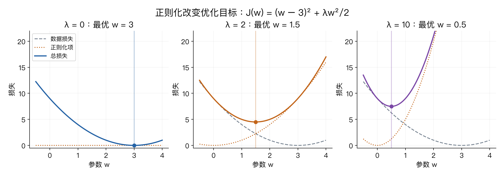
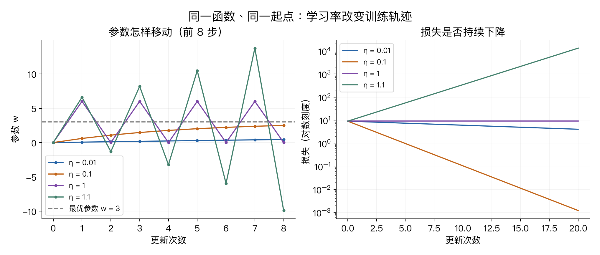
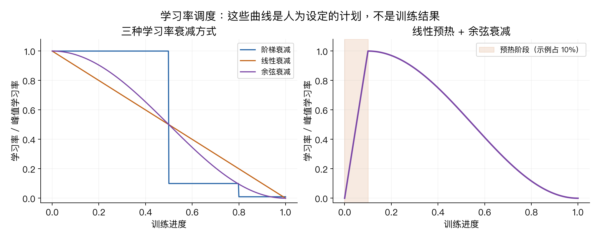

# 第三章：正则化与优化（Regularization and Optimization）

> 对应 CS231n Spring 2025 Lecture 3，2025-04-08。参考 B 站视频 P3 与官方课件。
> 前置：[第二章：图像分类与线性分类器](02-image-classification.md)。

> **从零入口**：[从一个权重手算梯度下降，再理解批次与验证](../beginner/02-learning-and-gradients.md)。

> **相关专题**：[梯度怎样指导参数更新](03-gradient-descent-deep-review.md)。

> **相关专题**：[批量梯度、L2 正则化与小批量 SGD](03-batch-regularization-deep-review.md)。

> **相关专题**：[Momentum、Adam 与优化器状态](03-optimizers-deep-review.md)。

## 本章概览

> **核心问题：已经会算损失，怎样让参数一步一步变得更合适？**

| 阅读安排 | 内容 |
|---|---|
| **基础内容** | 第 1–7 节：总目标、梯度、学习率、一次更新和小批量。 |
| **推导与扩展** | 第 9–13 节比较优化器；第 14 节二阶优化选读。首次可暂缓偏差修正的推导。 |
| 需要的基础 | [第二章的分数与损失](02-image-classification.md)；[偏导与梯度](00-math-and-numpy.md#8-导数偏导与梯度)。 |

> **本章重点**：正则化改变希望优化的目标；优化器决定怎样更新参数；学习率控制更新幅度。

阅读标记说明见[初学者指南](../READING_GUIDE.md)。

## 1. 从上一章走到这一章：会算损失，怎样训练？

上一章已经有了一个分类器：

$$s=Wx+b.$$

给它一张图片，它输出每个类别的分数。接着使用 Softmax 得到概率，使用交叉熵衡量预测与真实标签之间的差距。

但此前的计算隐含着一个条件：**已经给定了权重 W 和偏置 b。** 实际训练中，好的参数并不是别人告诉我们的。

这一章解决两个不同的问题：

| 问题 | 对应概念 | 实际作用 |
|---|---|---|
| 除了拟合训练样本，我们还希望参数具有什么性质？ | 正则化 | 定义优化目标中的偏好 |
| 怎样根据损失，逐步找到合适的参数？ | 优化 | 制定参数的更新方法 |

可以先记住整个训练过程：

**初始化参数 → 计算预测 → 计算损失 → 计算梯度 → 更新参数 → 重复。**

与上一章的 k-NN 相比，线性分类器需要在训练阶段主动调整参数。k-NN 的基础实现主要保存训练样本，预测时再计算距离与投票；两者的训练机制不同。

## 2. 先把本章的符号认清楚

| 符号 | 含义 | 形状或类型 |
|---|---|---|
| N | 训练样本总数 | 正整数 |
| D | 每个样本的特征数量 | 正整数 |
| C | 类别数 | 正整数 |
| x_i | 第 i 个样本，按列向量写 | D × 1 |
| y_i | 第 i 个样本的正确类别编号 | 整数 |
| W | 分类器权重 | C × D |
| b | 偏置 | C × 1 |
| s_i | 各类别的分数 | C × 1 |
| ℓ_i | 一个样本的数据损失 | 标量 |
| J | 总优化目标 | 标量 |
| λ | 正则化强度 | 非负超参数 |
| θ | 把需要学习的参数统称为 θ | 可视作长度为 P 的向量 |
| g_t | 第 t 次更新使用的梯度 | 与 θ 相同形状 |
| η_t | 学习率 | 正数，可随训练改变 |
| B | 一批样本的数量 | 正整数 |

这里将“每个样本的损失”记作 ℓ，将“总目标”记作 J，避免所有量都写成 L。不同教材用字母不同，并不表示算法不同。

## 3. 正则化：训练集上做得好，还不够

### 3.1 数据损失衡量什么？

以 Softmax 交叉熵为例，正确类别是 y_i：

$$
\ell_i=-\log p_{i,y_i},\qquad
J_{\mathrm{data}}(W,b)=\frac1N\sum_{i=1}^{N}\ell_i.
$$

正确类别的概率越大，单个样本的损失越小。对所有训练样本求平均，就得到数据损失。

但训练样本中可能含有噪声、偶然相关和标注错误。一个足够灵活的模型可能记住这些细节，导致训练表现很好、面对新样本却很差。这就是过拟合的一种表现。

注意：**训练损失低本身不是坏事。我们担心的是训练表现与新数据表现之间的落差。**

### 3.2 给目标增加一个参数偏好

总目标写成：

$$
\boxed{
J(W,b)=\frac1N\sum_{i=1}^{N}\ell_i(W,b)+\lambda R(W)
}
$$

- 第一项要求模型拟合训练数据。
- R(W) 衡量我们不希望出现的参数特性，例如权重过大。
- λ 控制这种偏好有多强。

这是把两种要求放在同一个目标里权衡。正则化不能保证测试准确率必然提高；它是否有帮助、强度是否合适，需要验证集来判断。

我们在这里通常不惩罚偏置 b；这是一个常见约定，不是数学上不能正则化偏置。

### 3.3 L2 正则化：惩罚权重平方和

本笔记统一采用：

$$
R_{L2}(W)=\frac12\sum_{c=1}^{C}\sum_{d=1}^{D}W_{cd}^{2}
=\frac12\|W\|_F^2.
$$

这里矩阵的 Frobenius 范数平方，就是把所有元素平方后求和。它相当于把矩阵展开成向量后计算 L2 范数的平方。

**名字容易误导：常说的“L2 正则化”通常使用平方和，而不是平方和再开根号。**

前面的 1/2 是为了求导方便：

$$
\frac{\partial}{\partial W_{cd}}
\left(\frac\lambda2 W_{cd}^2\right)=\lambda W_{cd}.
$$

因此：

$$
\nabla_W J=\nabla_W J_{\mathrm{data}}+\lambda W.
$$

如果课件或作业定义的是 R(W)=ΣW²，没有 1/2，那么正则化梯度就是 **2λW**。两种写法都正确，关键是损失和梯度要使用相同约定。

### 3.4 原创算例：相同分数，为什么偏好某组权重？

设输入 x=[1,1]，两组权重分别为：

$$w_A=[2,0],\qquad w_B=[1,1].$$

它们对这个输入的分数相同：

$$w_A^Tx=2,\qquad w_B^Tx=2.$$

L2 惩罚却不同：

$$R(w_A)=\frac12(2^2+0^2)=2,$$
$$R(w_B)=\frac12(1^2+1^2)=1.$$

在这个例子中，L2 更偏好把权重分散到两个分量上，而不是把大小集中在一个分量上。

不要把这个例子扩大解释为“所有权重都应该一样”。数据损失仍然会决定哪些特征有用，而且这两组权重只是在当前输入上给出相同分数。

### 3.5 λ 到底改变了什么？

使用一个可以手算的教学目标：

$$J_\lambda(w)=(w-3)^2+\frac\lambda2w^2.$$

第一项希望 w 靠近 3，第二项希望 w 靠近 0。对 w 求导：

$$J_\lambda'(w)=2(w-3)+\lambda w=(2+\lambda)w-6.$$

令导数为 0：

$$\boxed{w^*=\frac6{2+\lambda}.}$$

| λ | 最优参数 w* | 数据损失 (w*−3)² |
|---|---:|---:|
| 0 | 3 | 0 |
| 2 | 1.5 | 2.25 |
| 10 | 0.5 | 6.25 |



读图：灰色虚线是数据损失，橙色点线是正则化项，实线是两项之和。每幅图的圆点标出总目标的最小值；纵轴显示范围统一，超出范围的曲线部分省略。

随着 λ 增大，最优参数向 0 移动，但数据损失增加。这清楚展示了“权衡”，**没有证明新样本的表现变好**，因为这个教学例子没有定义验证集。

λ 过大时，模型可能无法充分拟合有用规律，出现欠拟合。实际用验证集选择 λ，不用测试集反复调参。

### 3.6 L1 和 Elastic Net

L1 惩罚为：

$$R_{L1}(W)=\sum_{c,d}|W_{cd}|.$$

它常用于鼓励稀疏解，也就是一部分权重恰好为 0。注意，普通梯度更新的有限步结果不一定自动产生精确的 0；优化方法也有影响。

在 w≠0 处，|w| 的导数是 sign(w)，在 w=0 处不可导，可以使用次梯度等方法处理。初学阶段记住它与 L2 的偏好不同即可。

上面的 [2,0] 和 [1,1]，L1 惩罚都是 2；所以 L1 在这个特定比较中并不区分二者。

Elastic Net 把两种惩罚结合，例如：

$$\lambda_1\sum|W_{cd}|+\frac{\lambda_2}{2}\sum W_{cd}^2.$$

课程还提到 Dropout 等其他方法作为后续内容提示，本章不展开。Batch Normalization 也可能产生正则化效果，但它的作用不能简单等同于给损失加一个惩罚项。

## 4. 梯度：告诉你当前参数应该怎样动

### 4.1 一个参数时，看导数

继续用更简单的函数：

$$J(w)=(w-3)^2,\qquad J'(w)=2(w-3).$$

- w=0 时，导数为 −6。增加一点 w，损失会下降。
- w=5 时，导数为 4。减少一点 w，损失会下降。
- w=3 时，导数为 0，这个函数在这里达到最小值。

导数的含义是：在当前位置附近，参数发生微小变化时，损失怎样变化。

### 4.2 多个参数时，把偏导数放在一起

如果参数是 θ=[θ₁,…,θ_P]，那么：

$$
\nabla_\theta J=
\begin{bmatrix}
\partial J/\partial\theta_1\\
\vdots\\
\partial J/\partial\theta_P
\end{bmatrix}.
$$

每个偏导数回答：“暂时固定其他参数，只改变这一个参数，损失怎么变？”

如果 W 的形状是 C×D，梯度 ∇_W J 的形状也必须是 C×D。每个权重都有自己的更新建议。

**这里求的是损失对模型参数的导数，不是损失对图片像素的导数。** 后者也可以求，但不是本章训练参数的更新目标。

### 4.3 为什么沿负梯度走？

对足够小的参数变化 Δθ，可用一阶近似：

$$J(\theta+\Delta\theta)\approx J(\theta)+\nabla J(\theta)^T\Delta\theta.$$

令 Δθ=−η∇J：

$$J(\theta-\eta\nabla J)\approx J(\theta)-\eta\|\nabla J\|_2^2.$$

只要 η>0 且梯度非零，近似式中的变化量就是负的。所以负梯度给出局部下降方向；在欧氏单位方向约束下，它是最陡下降方向。

关键限制是“局部”和“足够小”。走得太远，一阶近似就可能不准确，损失不一定下降。

## 5. 梯度从哪里来：数值梯度与解析梯度

### 5.1 数值梯度：动一下参数，再算损失

单个坐标的前向差分是：

$$\frac{\partial J}{\partial\theta_j}\approx
\frac{J(\theta+h e_j)-J(\theta)}{h}.$$

e_j 表示只在第 j 个位置为 1、其他位置为 0 的向量，所以 θ+h e_j 只改变一个参数。

例如 J(w)=(w−3)²，在 w=0 附近取 h=0.001：

$$\frac{J(0.001)-J(0)}{0.001}
=\frac{8.994001-9}{0.001}=-5.999.$$

真实导数是 −6，结果很接近。

常用于检查的中心差分是：

$$\frac{\partial J}{\partial\theta_j}\approx
\frac{J(\theta+h e_j)-J(\theta-h e_j)}{2h}.$$

在函数足够光滑的条件下，中心差分通常比前向差分精确。h 也不是越小越好：过大会带来近似误差，过小会让浮点数相减时的舍入误差变明显。

如果有 P 个参数，逐坐标中心差分需要大约 2P 次损失计算，因此不适合直接用于训练大型模型。

### 5.2 解析梯度：利用函数结构求导

J(w)=(w−3)² 可以直接推导出 J'(w)=2(w−3)。这就是解析求导的简单例子。

实际神经网络中通常借助自动微分与反向传播，按照链式法则计算梯度，不必为每个参数重新做一次完整前向计算。具体计算过程在下一章展开。

“解析梯度”没有差分近似带来的截断误差，但计算机执行时仍然存在浮点舍入误差，不能理解为无限精度。

实践上通常使用解析梯度或自动微分来训练，使用少量数值梯度来检查实现。遇到不可导点或带随机性的损失，需要特别处理，不能机械比较。

## 6. 梯度下降：把导数变成一次更新

公式是：

$$\boxed{\theta_{t+1}=\theta_t-\eta_t g_t.}$$

在全批量梯度下降中，g_t 就是当前完整目标的梯度。学习率 η 决定沿这个方向走多大一步。

### 6.1 手算三次更新

仍然取 J(w)=(w−3)²，从 w₀=0 出发，学习率 η=0.1。

第一次：

$$g_0=2(0-3)=-6,$$
$$w_1=0-0.1\times(-6)=0.6.$$

第二次：

$$g_1=2(0.6-3)=-4.8,$$
$$w_2=0.6-0.1\times(-4.8)=1.08.$$

第三次：

$$g_2=2(1.08-3)=-3.84,$$
$$w_3=1.08-0.1\times(-3.84)=1.464.$$

| 已完成更新次数 | 参数 w | 损失 J(w) |
|---:|---:|---:|
| 0 | 0 | 9 |
| 1 | 0.6 | 5.76 |
| 2 | 1.08 | 3.6864 |
| 3 | 1.464 | 2.359296 |

参数没有一口气到达 3，但损失持续下降。**梯度是方向与变化率的信息，不是最优参数本身。**

### 6.2 学习率过大为什么危险？

这个例子的更新可以化简为：

$$w_{t+1}-3=(1-2\eta)(w_t-3).$$

也就是说，每更新一次，与最优点的偏差就乘以 1−2η。

- η=0.01：偏差每次乘 0.98，靠近最优点较慢。
- η=0.1：偏差每次乘 0.8，稳定靠近最优点。
- η=1：偏差每次乘 −1，从 0 跳到 6，再跳回 0，损失不降。
- η=1.1：偏差每次乘 −1.2，一边振荡一边远离最优点。



左图看参数的移动，右图看损失变化；右图纵轴为对数刻度，便于同时显示快速下降与发散。

对这个特定函数，固定学习率满足 0<η<1 时会收敛。**这不是神经网络通用的学习率范围**，它取决于函数的曲率和尺度。

## 7. SGD：每次只看一部分训练数据

### 7.1 为什么不每次都看完整训练集？

完整目标的数据梯度是：

$$\nabla J_{\mathrm{data}}(\theta)=\frac1N\sum_{i=1}^{N}\nabla\ell_i(\theta).$$

如果 N 很大，每更新一次都计算所有样本，成本很高。可以选一小批样本，用它们的平均梯度估计整体方向。

设第 t 步的小批量样本索引集合为 ℬ_t，实际大小为 B_t：

$$g_t=\frac1{B_t}\sum_{i\in\mathcal B_t}\nabla\ell_i(\theta_t)
+\lambda\nabla R(\theta_t).$$

再更新 θ_{t+1}=θ_t−η_tg_t。正则化项按照总目标约定加入一次，不要无意中又除以 N 或 B_t。

### 7.2 三个名字怎么区分？

| 方法 | 每次更新使用的数据 | 特点 |
|---|---|---|
| 全批量梯度下降 | 全部训练样本 | 每步成本高，给定参数时梯度确定 |
| 单样本 SGD | 1 个样本 | 估计噪声较大，单步计算少 |
| Mini-batch SGD | 一小批样本 | 利用矩阵并行，兼顾效率和梯度估计 |

深度学习语境下，很多人直接用“SGD”指 mini-batch SGD，阅读时需要结合上下文。

在固定参数、均匀随机抽样等条件下，小批量平均梯度的期望等于完整数据梯度。但单个小批量不代表全部训练数据，所以某一步损失上升并不必然是代码错误。

### 7.3 Epoch 与 iteration

- **Iteration / step**：执行一次参数更新。
- **Epoch**：遍历一轮训练集。

例如 N=1000，batch size=128，不丢弃最后一批：

$$\text{每轮步数}=\lceil1000/128\rceil=8.$$

前 7 批各有 128 个样本，最后一批有 104 个。最后一批的数据损失要除以实际大小 104。

普通 mini-batch SGD 的过程可以写成：

```python
for epoch in range(num_epochs):
    shuffle_training_data()
    for X_batch, y_batch in batches:
        # 数据损失按当前批量取平均，再加一次正则化项。
        loss, grads = loss_and_grad(params, X_batch, y_batch, reg_strength)
        params = params - learning_rate * grads
```

这是训练结构的伪代码。真实实现中 params 往往是一组矩阵和向量，需要分别更新。

### 把“一个训练步骤”拆成四句话

假设当前一批数据已经选好：先用当前参数得到预测，再按标签计算损失；随后求出“每个参数变一点会怎样影响损失”的梯度，最后统一更新参数。**这一轮所有样本的贡献合并后，才进行一次更新。**

| 容易混淆的量 | 这一步怎样变化 |
|---|---|
| 样本与标签 | 计算中作为已知输入与目标 |
| 损失 | 当前参数对应的一个评价数值 |
| 梯度 | 当前参数位置的局部变化信息 |
| 学习率 | 把梯度变成实际更新量的缩放系数 |
| 参数 | 在更新语句执行时发生变化 |

算梯度不会自动改参数。这个区别会在[第四章的 NumPy 代码](04-numpy-network-walkthrough.md)里一行一行对应起来。

## 8. 普通 SGD 会遇到哪些困难？

**不同方向的曲率差别很大。** 可以想象一个狭长山谷：横向很陡，纵向很平缓。为了不在横向跳出山谷，学习率需要较小，但纵向的推进又变慢。

**小批量梯度带有噪声。** 连续两批样本的梯度方向可能有所不同，训练轨迹会抖动。

**深度网络可能有鞍点和平坦区域。** 梯度很小不一定意味着已经找到满意的解。鞍点可以在某些方向向上弯、另一些方向向下弯，即使梯度为 0 也不是局部最小值。

这里不要把线性分类器和深度网络混为一谈：固定特征下，线性 Softmax 分类器的交叉熵加 L2 正则化是凸目标；深度网络中的多层参数组合通常形成非凸目标。

接下来的优化器分别从“利用历史方向”和“调整不同坐标的步幅”入手。

## 9. Momentum：把过去的方向也考虑进来

本节使用以下约定，初始 v₀=0，第 t 步先计算当前参数 θ_{t−1} 的梯度 g_t：

$$v_t=\mu v_{t-1}+g_t,$$
$$\theta_t=\theta_{t-1}-\eta_t v_t.$$

- v 是带衰减的历史梯度累积量，与参数形状相同。
- μ 控制过去的信息保留多少，通常满足 0≤μ<1。
- μ=0 时退化为普通 SGD。

假设某一个方向连续三个梯度都是 2，μ=0.9：

$$v_1=2,\qquad v_2=0.9\times2+2=3.8,$$
$$v_3=0.9\times3.8+2=5.42.$$

如果某个方向持续有一致的梯度，累积会加强这个方向；如果梯度正负交替，累积中会出现部分抵消。由此可以缓解某些方向上的震荡，并加快持续方向的移动。

这个例子只是展示累积机制，没有假定实际损失函数的梯度永远不变。Momentum 仍然可能过冲，也需要合适的学习率。

有些实现使用 v_t=μv_{t−1}+(1−μ)g_t，有些把学习率放进 v 的定义。阅读时必须对照完整更新公式，不能把不同约定的一半拼起来使用。

## 10. 自适应步幅：AdaGrad 与 RMSProp

> AdaGrad 在本版课件附录中。这里先用它解释“梯度平方的累积”，再进入正文中的 RMSProp，属于为理解而调整的阅读顺序。

下面所有平方、开方与除法，都是**逐元素运算**。每个参数都有自己的历史记录。

### 10.1 AdaGrad：记录历次梯度平方和

$$r_t=r_{t-1}+g_t\odot g_t,$$
$$\theta_t=\theta_{t-1}-\eta\frac{g_t}{\sqrt{r_t}+\varepsilon}.$$

初始 r₀=0；⊙ 表示逐元素乘法，ε 是避免分母为零的小正数。

直觉是：如果某个参数过去的梯度经常很大，就适当缩小这个参数未来的更新倍率。不同参数不再共用完全相同的有效缩放。

假设一个坐标的梯度一直为 2，则 r₁=4、r₂=8、r₃=12。忽略 ε，更新量的大小依次为 η、η/√2、η/√3。

由于历史平方和只增不减，固定全局学习率下的有效倍率不会增加，长期训练可能变得很小；若累积量不发散，则不必趋于零。

### 10.2 RMSProp：让很久以前的历史逐渐淡出

$$r_t=\rho r_{t-1}+(1-\rho)g_t\odot g_t,$$
$$\theta_t=\theta_{t-1}-\eta_t\frac{g_t}{\sqrt{r_t}+\varepsilon}.$$

这里 ρ 控制历史保留程度。与 AdaGrad 不同，它记录的是梯度平方的指数移动平均，不是从训练开始的全部平方和。

因此，早期的巨大梯度对后续更新的影响会逐渐减弱。不要把 r_t 当成“最近固定 10 次的平均”；它对更早的记录仍有权重，只是权重逐渐衰减。

另一个常见误解是“除以梯度”。分母使用的是历史**梯度平方的平均再开方**，并不是直接除以当前 g_t。

## 11. Adam：同时记录方向与尺度

Adam 同时维护两个统计量，初始 m₀=v₀=0：

$$m_t=\beta_1m_{t-1}+(1-\beta_1)g_t,$$
$$v_t=\beta_2v_{t-1}+(1-\beta_2)g_t\odot g_t.$$

m 记录带衰减的梯度平均，v 记录带衰减的梯度平方平均。这里 v 的含义与上一节 Momentum 的 v 不同；变量名是约定，要看公式。

**v 是二阶原始矩的估计，不是方差，也不是 Hessian。**

### 11.1 为什么需要偏差修正？

m 和 v 都从 0 开始，早期平均值会偏向 0。假设第一步 g₁=2，β₁=0.9、β₂=0.999：

$$m_1=0.1\times2=0.2,$$
$$v_1=0.001\times2^2=0.004.$$

这两个值小，一部分原因只是初始记录为 0。于是使用：

$$\hat m_t=\frac{m_t}{1-\beta_1^t},\qquad
\hat v_t=\frac{v_t}{1-\beta_2^t}.$$

第一步修正后：

$$\hat m_1=2,\qquad \hat v_1=4.$$

指数移动平均在梯度统计平稳等假设下，会带上由零初始化导致的因子 1−βᵗ；除去该因子就是这个修正的由来。它不是消除所有采样噪声或其他统计偏差。

### 11.2 完整更新公式

$$\boxed{
\theta_t=\theta_{t-1}-\eta_t\frac{\hat m_t}{\sqrt{\hat v_t}+\varepsilon}
}.$$

在第一步的标量例子里，忽略 ε：

$$\Delta\theta=-\eta\frac2{\sqrt4}=-\eta.$$

β₁=0.9、β₂=0.999 是常见设置，但不是所有任务都最优。Adam 也需要选择学习率，不能理解为“完全自动、不必调参”。

## 12. AdamW：L2 正则化与权重衰减不是总等价

这是本版第三讲正文中的内容，值得单独理解。

### 12.1 普通 SGD 下可以改写为权重衰减

当目标包含 λ‖θ‖²/2，使用无动量的普通 SGD：

$$\theta_t=\theta_{t-1}-\eta_t(g_t^{\mathrm{data}}+\lambda\theta_{t-1}).$$

整理得到：

$$\boxed{
\theta_t=(1-\eta_t\lambda)\theta_{t-1}-\eta_tg_t^{\mathrm{data}}.
}$$

第一项把旧权重乘上一个衰减系数，所以在这个明确的设定下，L2 惩罚与这样的乘性权重衰减等价。

这里不要把 λ 与每一步的衰减量混淆：当前公式中的每步衰减量是 η_tλ。

### 12.2 为什么换成 Adam 就不一样了？

如果把 λθ 加到梯度中，再送进 Adam，它也会参与 m、v 的历史统计，并受到每个参数不同的自适应缩放。这与简单地把权重缩小一个比例并不是同一件事。

AdamW 将这两个过程解耦：

1. 用**数据损失的梯度**更新 Adam 的 m、v。
2. 计算自适应更新，同时单独施加权重衰减。

本笔记的公式约定为：

$$\boxed{
\theta_t=(1-\eta_t\lambda)\theta_{t-1}
-\eta_t\frac{\hat m_t}{\sqrt{\hat v_t}+\varepsilon}.
}$$

右侧两部分都使用当前更新前的状态。实践中也经常只对部分参数应用权重衰减，例如排除偏置或归一化层参数，具体取决于实现配置。

AdamW 的关键不是“Adam 加更大的 λ”，而是把衰减与自适应梯度统计分开处理。原始论文：[Decoupled Weight Decay Regularization](https://arxiv.org/abs/1711.05101)。

## 13. 学习率调度：η 不必从头到尾不变

优化器决定如何组合梯度信息，学习率调度决定训练不同阶段的全局步幅。两者可以组合使用。

常见方案有：

- **阶梯衰减**：在指定阶段把学习率乘一个小于 1 的系数。
- **线性衰减**：从初始值逐渐线性下降到目标值。
- **余弦衰减**：按余弦曲线平滑降低。
- **Warmup（预热）**：训练开始时先用较小学习率，再逐步升到预定值。

一个没有预热阶段的余弦调度是：

$$
\eta_t=\eta_{\min}+
\frac12(\eta_{\max}-\eta_{\min})
\left[1+\cos\left(\frac{\pi t}{T}\right)\right],\quad 0\le t\le T.
$$

T 是这段衰减过程的总步数：开始时 η=η_max，结束时 η=η_min。如果先预热，再做余弦衰减，需要把衰减阶段的时间重新从 0 计数。



右图的预热占比 10% 是画图示例，不是课程要求或通用推荐。图中的曲线只是人为设定的学习率计划，不能从图形外观判断哪一种一定得到最高准确率。

预热可以帮助某些训练设置缓解初始阶段的不稳定，但并非每个任务都必须使用。训练中应结合损失、验证表现、训练预算来判断。

## 14. 二阶优化：除了坡度，还看弯曲程度

一阶方法主要使用梯度。二阶方法还利用描述曲率的 Hessian 矩阵：

$$H_{ij}=\frac{\partial^2J}{\partial\theta_i\partial\theta_j}.$$

若参数总数为 P，H 是 P×P 矩阵。Newton 方法在适当条件下寻找方向 Δθ，使：

$$H\Delta\theta=-g.$$

然后更新 θ←θ+Δθ。理论上也常写成 Δθ=−H⁻¹g，但实际数值计算通常考虑解线性方程，不必显式构造逆矩阵。

曲率信息可以帮助按不同方向的弯曲程度调整步长。不过，存储完整的稠密 Hessian 需要 O(P²) 空间，通用稠密求解约需 O(P³) 运算，直接用于参数极多的网络成本很高。

此外，非凸目标的 Hessian 可能不正定，朴素 Newton 步不保证下降，需要阻尼等处理。这不意味着所有二阶方法都不可用；近似、结构化及拟 Newton 方法可以降低成本。课件附录中的 BFGS、L-BFGS 属于进一步阅读。

## 15. 把方法放在一起比较

| 方法 | 保存的信息 | 主要想解决的问题 | 仍需注意 |
|---|---|---|---|
| SGD | 当前梯度 | 用低成本更新推进训练 | 学习率、梯度噪声、曲率差异 |
| Momentum | 历史方向累积 | 减少某些震荡，利用一致方向 | 可能过冲；公式约定有差异 |
| AdaGrad | 全部历史梯度平方和 | 为不同参数调整倍率 | 倍率可能持续缩小 |
| RMSProp | 梯度平方的衰减平均 | 减弱久远历史的累积影响 | 仍需要全局学习率 |
| Adam | 梯度与梯度平方的衰减平均 | 结合方向平滑和坐标缩放 | 偏差修正、超参数仍重要 |
| AdamW | Adam 状态与独立衰减 | 分离权重衰减与自适应统计 | 衰减强度和作用参数需明确 |

这些方法不存在与任务无关的绝对排名；同一优化器在不同数据、模型、训练预算与调参条件下表现会不同。

## 16. 最容易混淆的地方

| 易混点 | 正确区分 |
|---|---|
| 学习率 η 与正则化系数 λ | η 控制更新步幅；λ 控制目标偏好或衰减强度 |
| 参数与超参数 | W、b 由训练更新；η、λ 等由配置和验证选择 |
| 低训练损失与好泛化 | 前者只说明训练目标表现，后者需要新数据验证 |
| 损失值与梯度 | 损失是标量评价；梯度给出各参数的局部变化率 |
| 梯度为 0 与全局最优 | 一般目标中，梯度为 0 也可能是鞍点或局部极值 |
| Epoch 与 step | 一轮数据通常包含很多次参数更新 |
| L2 梯度到底是 λW 还是 2λW | 取决于正则化定义有没有 1/2 |
| Adam 的二阶矩与二阶导数 | 前者来自梯度平方，后者是损失的曲率 |
| Adam 加 L2 与 AdamW | 是否让衰减项参与自适应梯度统计不同 |
| 更新前后的变量 | 同一次更新应一致使用旧参数计算梯度，不能随意边算边覆盖 |

本章可以用两行公式串起来：

$$\underbrace{J=J_{\mathrm{data}}+\lambda R}_{\text{决定希望得到什么参数}},$$
$$\underbrace{\theta\leftarrow\theta-\eta\,\text{优化器处理后的梯度}}_{\text{决定怎样逐步更新参数}}.$$

第二行是理解用的概括；AdamW 还包含单独的衰减项，实际实现以对应完整公式为准。

## 17. 可运行的复习实验

文件：[chapter03_optimization.py](../experiments/chapter03_optimization.py)。只用 Python 标准库，运行：

```bash
python3 experiments/chapter03_optimization.py
```

从仓库根目录执行。它复现本章的正则化最优点、三步梯度下降、数值梯度以及 Adam 第一步偏差修正；这些是标量教学计算，不是图像分类训练结果。

配图源代码：[draw_chapter03.py](../scripts/draw_chapter03.py)，需要 NumPy、Matplotlib，中文字体可用 PingFang 或按环境调整。所有图均为原创公式演示，可供个人复习使用。

## 要点回顾

| 关键词 | 要连起来理解的关系 |
|---|---|
| **目标** | 数据损失加正则化，说明要优化什么。 |
| **梯度** | 描述当前参数附近的变化方向和敏感程度。 |
| **更新** | 优化器结合梯度与学习率改参数；不保证每一步测试表现提高。 |

遇到符号问题可回到[工具箱](00-math-and-numpy.md)，遇到章节衔接可查[复习地图](../REVIEW_MAP.md)。

## 18. 对应来源与复习定位

正文的长篇推导、数值例子和图是独立编写的学习补充；下面标明课程主题所在位置，方便回到原材料核对。页码按 PDF 文件从 1 开始的页面顺序，和幻灯片印刷编号可能不同。

| 主题 | 2025 官方课件 PDF 页码 |
|---|---|
| 分类与损失回顾 | 5–10 |
| 正则化 | 11–25 |
| 数值梯度、解析梯度、梯度下降 | 26–47 |
| Mini-batch SGD 与优化困难 | 48–56 |
| Momentum | 57–61 |
| RMSProp | 62–66 |
| Adam | 67–71 |
| AdamW | 72–76 |
| 学习率调度与预热 | 77–85 |
| 二阶优化与实践讨论 | 86–91 |
| 下一讲预告 | 92–97 |
| 附录：Nesterov、AdaGrad、拟 Newton 等 | 98–119 |

- [2025 官方课程安排](https://cs231n.stanford.edu/2025/schedule.html)：确定课程版本与讲次。
- [Lecture 3 官方课件](https://cs231n.stanford.edu/slides/2025/lecture_3.pdf)：核对本章实际主题与顺序。
- [B 站视频 P3](https://www.bilibili.com/video/BV1aXhJ64EmW/?p=3)：抽查位置如下。
- [CS231n 官方笔记：Optimization](https://cs231n.github.io/optimization-1/)：关于梯度的直觉、数值检查与更新过程的配套阅读。
- [CS231n 官方笔记：Learning](https://cs231n.github.io/neural-networks-3/)：梯度检查、优化器与训练实践的进一步阅读；不是本版视频逐字稿。
- [Adam 原始论文](https://arxiv.org/abs/1412.6980)：算法与偏差修正的原始资料。
- [AdamW 原始论文](https://arxiv.org/abs/1711.05101)：权重衰减与 L2 正则化关系的原始资料。

视频抽查定位：10:00 为分类损失回顾，30:00 为直接对损失函数求梯度，45:00 为 Momentum，55:00 为引出偏差修正前的 Adam，65:00 为二阶优化。这些只是对应时间画面上的内容，不代表各主题从该秒开始。

下一章：[第四章：神经网络与反向传播](04-neural-networks-backprop.md)。
