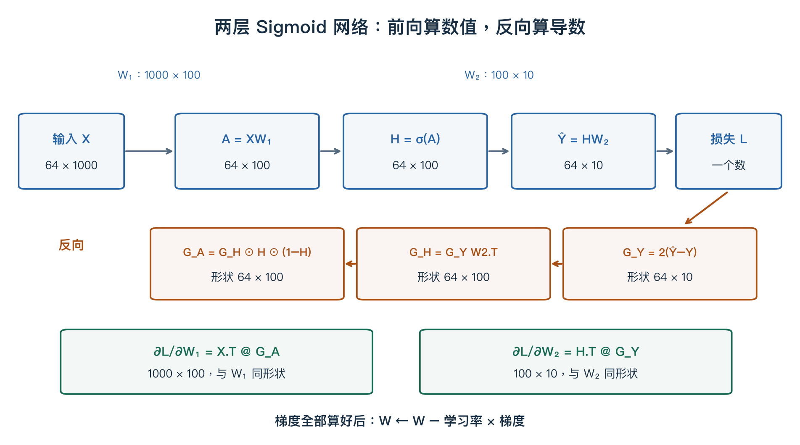

# 第四章配套：把两层 NumPy 网络逐行读懂

> **依据**：课程中的 NumPy 代码示例。此处逐行解释截图中的 **Sigmoid + 平方误差和** 网络；手算、推导和图是补充说明。[第四章正文](04-neural-networks-backprop.md)还展示了 ReLU + 交叉熵分类网络，阅读时注意两者的激活函数和损失不同。

> **先记住**：前向计算预测，损失评价预测，反向计算梯度，最后更新参数。截图红框是最后一步；它使用前面已经算好的梯度。

## 1. 先看完整流程



从左往右读蓝色前向路径，再看下方橙色反向路径。每个梯度与它对应的变量形状相同；图中 `G_Y` 简写的是损失对**预测 Ŷ** 的梯度，不是对目标 Y 的梯度。反向传播沿箭头传递的是导数，而不是把输入数据倒着送一遍。

网络的计算式是：

$$A=XW_1,\qquad H=\sigma(A),\qquad \hat Y=HW_2,$$
$$L=\sum_{i=1}^{N}\sum_{c=1}^{C}(\hat Y_{ic}-Y_{ic})^2.$$

**这是两个有权重的层，中间只有一个隐藏层。** 截图没有偏置，输出层也没有 Softmax。

## 2. 每一个数组装着什么？

```python
N, D_in, H, D_out = 64, 1000, 100, 10
x, y = randn(N, D_in), randn(N, D_out)
w1, w2 = randn(D_in, H), randn(H, D_out)
```

| 变量 | 形状 | 每一行 / 列的意义 |
|---|---|---|
| `x` | `(64, 1000)` | 每行是一个样本的 1000 个输入 |
| `y` | `(64, 10)` | 每行是该样本希望输出的 10 个数 |
| `w1` | `(1000, 100)` | 每列决定一个隐藏单元怎样组合输入 |
| `h` | `(64, 100)` | 每行是一个样本的 100 个隐藏特征 |
| `w2` | `(100, 10)` | 每列决定一个输出怎样组合隐藏特征 |
| `y_pred` | `(64, 10)` | 每行是网络实际预测的 10 个数 |

`randn` 从标准正态分布产生随机数。这里 x、y 都是随机生成的教学数据；**y 不是 0–9 的类别标签，输出 10 个数也不自动意味着十分类**。

截图用 `H` 表示隐藏层宽度；上面的数学公式用大写 H 表示整批隐藏激活。它们角色不同，代码中激活存放在小写 `h`。

## 3. 前向第一步：算隐藏特征

```python
a = x @ w1                       # (64, 100)
h = 1 / (1 + np.exp(-a))          # (64, 100)
```

原截图把这两行合成了一行。拆开后更容易理解：先线性组合，再逐元素经过 Sigmoid。

$$\sigma(a)=\frac1{1+e^{-a}}.$$

例如一个样本只有两个输入 [2,−1]，某个隐藏单元的权重为 [0.5,1]，则加权结果为 2×0.5+(−1)×1=0；Sigmoid(0)=0.5。

100 个隐藏单元各有一组权重，因此同一输入得到 100 个数。**隐藏特征可以帮助后续预测，但这些数不需要彼此加起来等于 1。**

## 4. 前向第二步：预测与损失

```python
y_pred = h @ w2
loss = np.square(y_pred - y).sum()
```

第一行把 100 个隐藏特征组合成 10 个输出；第二行逐元素做“预测减目标 → 平方 → 全部相加”。

例如一个样本的预测是 [2,−1]，目标是 [1,1]，损失为 (2−1)²+(−1−1)²=1+4=5。

**`.sum()` 是平方误差和；`.mean()` 才是对这里所有元素的平方误差取平均。** 若改成 `.mean()`，此网络的输出梯度也要除以 `N * D_out`。若定义为“每个样本先对输出求和，再按样本平均”，则只除 N。必须跟随具体损失定义。

## 5. 反向第一步：预测错在哪里？

对单个数，(ŷ−y)² 对 ŷ 的导数为 2(ŷ−y)，所以：

```python
grad_y_pred = 2.0 * (y_pred - y)  # (64, 10)
```

在刚才的 [2,−1] 与 [1,1] 例子中，梯度为 [2,−4]：第一项应往小调，第二项应往大调。这里描述的是直接调整输出的局部方向，真正训练会继续求出各权重怎样影响这些输出。

约定 `grad_变量` 表示 **损失对该变量的导数**。它不是两个相邻层之间的差值，也不是“这次把变量改了多少”。

## 6. 为什么 `grad_w2 = h.T @ grad_y_pred`？

先盯住第二层中的一个权重 `w2[r, c]`。对样本 i：

$$\hat Y_{ic}=\sum_r H_{ir}(W_2)_{rc}.$$

其他量固定时，这个权重改变一点，输出的变化倍率就是 H_ir。再乘上损失对输出的导数，得到该样本对这个权重的梯度贡献。

同一权重给所有样本共用，所以再把样本贡献相加：

$$\frac{\partial L}{\partial(W_2)_{rc}}=
\sum_i H_{ir}\frac{\partial L}{\partial\hat Y_{ic}}.$$

恰好就是：

```python
grad_w2 = h.T @ grad_y_pred       # (100, 64) @ (64, 10)
                                 # -> (100, 10)，与 w2 相同
```

**两样本、单隐藏特征、单输出手算：** 隐藏值为 [1,2]，输出梯度为 [3,4]，这个权重的梯度就是 1×3+2×4=11。转置后的矩阵乘法一次完成所有这些求和。

## 7. 为什么 `grad_h = grad_y_pred @ w2.T`？

同一个隐藏特征会影响多个输出，所以反过来求隐藏特征的梯度时，要汇总所有输出通道的贡献：

$$\frac{\partial L}{\partial H_{ir}}=
\sum_c\frac{\partial L}{\partial\hat Y_{ic}}(W_2)_{rc}.$$

```python
grad_h = grad_y_pred @ w2.T       # (64, 10) @ (10, 100)
                                 # -> (64, 100)
```

例如一个隐藏值分别用权重 2、−1 影响两个输出，两个输出梯度为 3、4，那么传回该隐藏值的梯度为 3×2+4×(−1)=2。

**`grad_w2` 沿样本求和，`grad_h` 沿输出特征求和。** 两者来自同一个线性层，但求导对象不同。

## 8. `h * (1-h)` 从哪里来？

因为 h=σ(a)，而：

$$\sigma'(a)=\frac{e^{-a}}{(1+e^{-a})^2}
=\sigma(a)(1-\sigma(a))=h(1-h).$$

利用链式法则：

```python
grad_a = grad_h * h * (1 - h)    # 都是 (64, 100)，逐元素乘
grad_w1 = x.T @ grad_a           # (1000, 64) @ (64, 100)
                                 # -> (1000, 100)
```

截图把这两步写成 `x.T.dot(grad_h * h * (1-h))`。**先穿过 Sigmoid，再穿过第一层矩阵乘法**，不能把两个步骤的乘法混在一起。

例如某个位置 h=0.5、grad_h=2，则 grad_a=2×0.5×0.5=0.5。若 h 接近 0 或 1，h(1−h) 就很小，这解释了 Sigmoid 饱和时梯度为何变小。

## 9. 红框：梯度下降真正更新权重

```python
w1 -= 1e-4 * grad_w1
w2 -= 1e-4 * grad_w2
```

`1e-4 = 0.0001` 是学习率。`w -= a` 表示把 w 更新为 w−a。

| 当前权重 | 梯度 | 学习率 | 新权重 |
|---|---|---|---|
| 0.5 | 3 | 0.0001 | 0.4997 |
| 0.5 | −3 | 0.0001 | 0.5003 |

**减去梯度不等于让所有参数都减小。** 梯度为负时，参数会增大。选择负梯度是为了在足够小的局部步长下让损失降低；步长过大仍可能使损失升高。

所有梯度应先用同一组旧权重计算，再统一更新。若先更新 w2 再用新 w2 计算 grad_h，就混入了两套参数，已经不是当前前向计算对应的梯度。

## 10. 对照原图的完整代码

下面保留截图的教学结构，拆出中间量并加固定随机种子，便于重复。可运行文件见[对应实验](../experiments/sigmoid_network.py)。文件默认还会先用小网络检查梯度。

```python
import numpy as np

rng = np.random.default_rng(231)
N, D_in, H, D_out = 64, 1000, 100, 10
x = rng.standard_normal((N, D_in))
y = rng.standard_normal((N, D_out))
w1 = rng.standard_normal((D_in, H))
w2 = rng.standard_normal((H, D_out))
learning_rate = 1e-4

for t in range(2000):
    # 前向：参数固定时计算预测与损失
    a = x @ w1
    h = 1 / (1 + np.exp(-a))
    y_pred = h @ w2
    loss = ((y_pred - y) ** 2).sum()

    # 反向：这里还没有改变权重
    grad_y_pred = 2 * (y_pred - y)
    grad_w2 = h.T @ grad_y_pred
    grad_h = grad_y_pred @ w2.T
    grad_a = grad_h * h * (1 - h)
    grad_w1 = x.T @ grad_a

    # 更新：两层使用同一轮前向得到的梯度
    w1 -= learning_rate * grad_w1
    w2 -= learning_rate * grad_w2

    if t % 200 == 0:
        print(t, loss)  # 本轮更新之前的损失
```

本例每一轮都使用全部 64 个固定样本，执行 2000 次更新。**它没有重新生成训练数据，也没有每轮随机抽取小批次。**

这组固定随机数据的实际运行中，平方误差和从约 **32666.41** 降到 **3.57**。配套脚本的小网络数值梯度检查最大绝对误差约 **4.85×10⁻¹¹**。前者说明本例能拟合这些训练目标，后者用独立差分方法核验反传；都不代表真实图片上的泛化成绩。

## 11. 从教学演示走向实际网络

这段代码适合观察链式法则，但不是直接用于真实图片分类的完整方案。数据和目标随机生成，没有训练/验证划分，没有偏置，标准正态权重还可能让 Sigmoid 进入饱和区。真实模型通常需要按任务选择损失、初始化和数据处理，见[第六章](06-cnn-architectures.md)。

如果 `a` 极端为负，直接计算 `exp(-a)` 还可能溢出；对应实验文件采用分段等价的稳定 Sigmoid。这个实现细节不改变导数 `h*(1-h)`。教学代码里的直写形式用于与截图一一对应。

> **复习卡**：`h.T @ grad_y_pred` 汇总样本对 w2 的贡献；`grad_y_pred @ w2.T` 把导数传回隐藏层；`* h * (1-h)` 穿过 Sigmoid；`x.T @ grad_a` 求 w1 的梯度；最后 `w -= lr * grad_w` 更新权重。

[返回第四章](04-neural-networks-backprop.md) · [数学与 NumPy 工具箱](00-math-and-numpy.md) · [全课程目录](../README.md)
