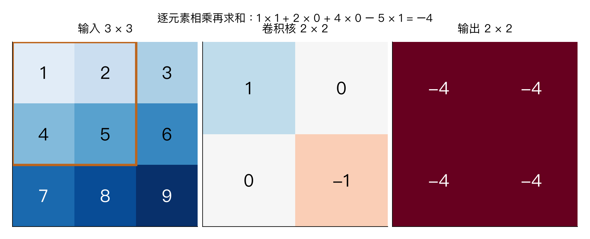

# 第五章：卷积神经网络与图像分类

> CS231n 2025 Lecture 5，2025-04-15，Justin Johnson。基于官方课件整理，所有算例和示意图为原创补充。前置：[第四章](04-neural-networks-backprop.md)。

> **从零入口**：[先把 3×32×32 → 16×32×32 算清楚](../beginner/04-convolution.md)。

> **2026-10-01 补充推导**：[卷积的一次计算、通道与形状](05-convolution-forward-deep-review.md)，补齐窗口手算、跨通道融合、输出尺寸、参数量与 NCHW 前向代码；反传、池化、感受野和完整 CNN 接着专题。

> **相关专题**：[卷积反传、池化、感受野与完整 CNN](05-backward-pooling-deep-review.md)。

## 本章概览

> **核心问题：怎样利用图像的空间结构，以较少参数提取局部特征？**

| 阅读安排 | 内容 |
|---|---|
| **基础内容** | 第 1–4 节看窗口计算与输出形状，第 6、9 节看池化与完整分类流程。 |
| **推导与扩展** | 第 5、7、8、10 节区分计算量、感受野、1×1 卷积和等变性。 |
| 需要的基础 | [第四章](04-neural-networks-backprop.md)的层与激活；认识图像的高、宽、通道。 |

> **本章重点**：一个滤波器产生一个输出通道；同一滤波器在各空间位置重复使用。

**术语**

| 术语 | English | 在本章中的含义 |
|---|---|---|
| **通道** | Channel | 同一空间位置上的不同特征分量 |
| **特征图** | Feature map | 某个特征在各个空间位置的响应 |
| **感受野** | Receptive field | 一个输出单元可能依赖的输入区域 |

阅读标记说明见[初学者指南](../READING_GUIDE.md)。

## 1. 从全连接层出发理解 CNN

一张 224×224 的 RGB 图像有 150528 个数。若直接连接到 1000 个隐藏单元，仅权重就有 150528000 个，而且全连接层没有显式利用“邻近像素往往相关”这一结构。

课程先回顾人工图像特征，再引入卷积。两者都在提取有用表示，但 CNN 的滤波器参数由训练学习，可以和分类损失共同优化。

卷积层利用两种结构：

- **局部连接**：一个输出位置只查看输入中的小区域。
- **权重共享**：同一个滤波器在不同空间位置重复使用。

这带来了适合图像的归纳偏置：一个局部模式移动到别处后，仍可以使用相同检测规则。

## 2. 单通道卷积：先看一个窗口

深度学习中常说的“卷积”在实现上通常是互相关：不翻转卷积核，直接逐元素相乘求和。本章按这一惯例计算。

设输入窗口与滤波器分别为：

$$X_{\rm patch}=\begin{bmatrix}1&2\\4&5\end{bmatrix},\qquad
K=\begin{bmatrix}1&0\\0&-1\end{bmatrix}.$$

无偏置时，该位置输出：

$$1\times1+2\times0+4\times0+5\times(-1)=-4.$$

移动窗口后重复同样计算，就得到一个二维特征图。负数也是正常输出，之后是否经过 ReLU 由网络结构决定。

图中输入为 1 到 9 组成的 3×3 矩阵，使用上述 2×2 核、步长 1、无填充，输出为 2×2，四个位置都是 −4。这是刻意选择的算例，不代表卷积输出通常相同。

## 3. 多通道时，核到底有多厚？

使用 NCHW 约定，输入 X 的形状是 N×C_in×H×W。

一个普通卷积滤波器覆盖全部输入通道，形状为 C_in×K_h×K_w。对于每个输出位置，它对所有输入通道与窗口元素求和，产生一个标量。

有 C_out 个滤波器，就得到 C_out 个输出通道。完整权重形状为：

$$W_{\rm conv}\in\mathbb R^{C_{out}\times C_{in}\times K_h\times K_w}.$$

包含每个输出通道一个偏置时，参数量为：

$$\boxed{C_{out}(C_{in}K_hK_w+1).}$$

RGB 输入并不意味着输出也只有 3 通道。输出通道数由滤波器数量决定，是模型设计选择。

### 用 RGB 输入数清一次计算

一个 3×3 空间滤波器用于 RGB 输入时，实际有 **3×3×3=27 个权重**：每个输入通道一片 3×3。某个输出位置先做 27 次对应相乘，再全部相加，最后加一个偏置，得到一个数。

同一套 27 个权重移动到下一个位置，继续得到下一个数，整张扫描结果组成**一个输出通道**。如果需要 16 个输出通道，就需要 16 套滤波器；它们都读取 RGB 三通道，但参数各不相同。

> **易错提醒**：输入通道数决定每套滤波器要读多厚，输出通道数决定有多少套滤波器。图像的宽高决定扫描位置数量，不直接决定这层有多少可学习权重。

## 4. 输出尺寸：逐项理解公式

对一个空间方向，输入长度 H，核大小 K，左右各填充 P，步长 S，无膨胀时：

$$\boxed{H_{out}=\left\lfloor\frac{H+2P-K}{S}\right\rfloor+1.}$$

含义是：先扣除窗口占用的长度，再看能够完整移动多少个步长，最后加上最初的位置。

- **Stride（步长）**：窗口每次移动几个位置。
- **Padding（填充）**：在边缘补值，常见为补 0。
- **Kernel（卷积核）**：局部计算的窗口及权重。
- **Dilation（膨胀率）**：核采样位置之间的间隔。

有膨胀率 d 时，有效核宽为 d(K−1)+1，用它替换公式中的 K。高度与宽度要分别算。

### 完整数值例子

输入 N×3×32×32，使用 16 个 3×3 滤波器，S=1、P=1：

$$H_{out}=W_{out}=\frac{32+2-3}{1}+1=32.$$

输出 N×16×32×32，参数量：

$$16(3\times3\times3+1)=448.$$

若改成 S=2、P=1，输出空间大小为 floor(31/2)+1=16。**空间分辨率减小不意味着参数量减少**：滤波器数量和形状没变，参数仍是 448。

“Same padding”是某种输出尺寸约定，不总是固定左右对称补一个数；偶数核或步长大于 1 时要看具体实现。

## 5. 参数量、激活量与计算量不是一回事

上例一个样本有 16×32×32=16384 个输出激活值，参数只有 448 个。共享参数在很多位置被使用，因此输出多不代表参数一定多。

忽略偏置，乘加次数近似为：

$$H_{out}W_{out}C_{out}C_{in}K_hK_w.$$

上例为 32×32×16×3×3×3=442368 次乘加。统计 FLOPs 时，有的资料把一次乘加算 2 次浮点运算，需要说明约定。

训练还需要存储激活和梯度。只有参数量，不能准确推断显存和速度。

## 6. 池化：压缩空间信息

最大池化在窗口里取最大值，平均池化取平均值。通常分别对每个通道处理，不混合通道，也没有可学习参数。

对窗口：

$$\begin{bmatrix}1&3\\2&0\end{bmatrix},$$

最大池化输出 3，平均池化输出 1.5。

2×2、步长 2 的池化通常使高度和宽度各减半。通道数保持不变。

最大池化反向传播把梯度传给前向选中的最大位置；平均池化则按比例分配。若最大值并列，具体分配约定取决于实现。

池化有助于对小幅位移保持一定鲁棒性，但不是严格的任意平移不变性保证。

## 7. 感受野：深层单元看到了多少输入？

感受野是一个输出单元可能依赖的输入区域。叠加卷积后，虽然单层只看小窗口，深层可以聚合更大范围。

若连续 3 个 3×3、步长 1 的卷积，中间无下采样，理论感受野从 1 变成 3，再变 5，最后变 7。

一般递推可写成：

$$j_l=j_{l-1}s_l,\qquad r_l=r_{l-1}+(k_l-1)j_{l-1},$$

其中 r 是感受野大小，j 是相邻输出中心在原输入中的间距；起始 r₀=j₀=1。若存在膨胀，用有效核大小代替 k。

例如 3×3 卷积、2×2 步长 2 池化、再接 3×3 卷积：r 从 1→3→4→8，j 从 1→1→2→2。

理论感受野说明依赖范围，实际训练后各位置的影响强度通常不均匀。

## 8. 1×1 卷积有什么用？

虽然空间窗口只有 1×1，它仍覆盖全部输入通道。例如输入某位置有 64 个通道，32 个 1×1 滤波器会把这 64 个数线性组合成 32 个数。

因此它可以改变通道数、融合通道信息、降低后续卷积成本。它自身不会扩大空间感受野，也不能单独读取相邻位置。

3D 卷积则让核在额外一个轴上移动。在视频中，第三个轴通常是时间；在体数据中可能是空间深度。不要与 RGB 的三通道混淆。

## 9. 从卷积堆叠到分类

下面统一使用入门路线中“两次卷积、两次池化”的教学模型。卷积均为 S=1、无膨胀；池化无填充：

| 层 | 单样本输出形状 |
|---|---|
| 输入 | 3×32×32 |
| 3×3 Conv，16 通道，P=1 | 16×32×32 |
| ReLU | 16×32×32 |
| 2×2 MaxPool，S=2 | 16×16×16 |
| 3×3 Conv，32 通道，P=1 | 32×16×16 |
| ReLU | 32×16×16 |
| 2×2 MaxPool，S=2 | 32×8×8 |
| 全局平均池化 | 32 |
| 全连接到 10 类 | 10 个分数 |

全局平均池化把每个通道的 8×8=64 个位置取平均，共得到 32 个特征。若改成 Flatten，仅重新排列数字，会得到 32×8×8=2048 个特征，后续分类层的输入维度也必须改变。

含偏置时，两次卷积参数分别是 448、4640，32→10 分类层有 330 个参数，总计 5418。ReLU、最大池化和全局平均池化没有可学习参数。逐步计算与图解见[完整 CNN](../beginner/05-pooling-and-cnn.md)。

全局平均池化对每个通道的空间位置取平均，得到一个通道描述量。之后可以用线性层输出类别分数，再计算交叉熵。

所有可学习卷积核仍通过第四章的反向传播训练。因为参数在空间重复使用，卷积核梯度要把所有位置的贡献相加。

## 10. 复习时抓住的区别

卷积的平移等变性指“输入移动，输出相应移动”，而不变性指“输入移动，输出不变”。边界填充、步长与池化会使严格的等变关系受到限制。

卷积核的通道维度用于汇总特征，空间维度用于扫描局部区域。卷积学习的是局部模板，分类器再把这些局部信息组合起来；不是给每一类只固定一个卷积核。

## 要点回顾

| 关键词 | 要连起来理解的关系 |
|---|---|
| **计算** | 窗口内对应相乘后求和，一个位置得到一个输出值。 |
| **形状** | 核大小、填充、步长决定空间尺寸；滤波器数量决定输出通道。 |
| **参数** | 在多个空间位置共享，因此不能把激活量当作参数量。 |

遇到符号问题可回到[工具箱](00-math-and-numpy.md)，遇到章节衔接可查[复习地图](../REVIEW_MAP.md)。

## 来源与定位

- [官方第五讲课件](https://cs231n.stanford.edu/slides/2025/lecture_5.pdf)：PDF 19–42 页为特征与历史脉络，43–99 页为卷积，100–108 页为池化与总结；109 页起是历年附录。
- [官方 CNN 配套笔记](https://cs231n.github.io/convolutional-networks/)。
- [对应视频 P5](https://www.bilibili.com/video/BV1aXhJ64EmW/?p=5)。

下一章：[训练 CNN 与经典架构](06-cnn-architectures.md)。

配套复习：[数值例子脚本](../experiments/remaining_examples.py) · [全课程复习索引](../REVIEW_MAP.md)。脚本仅复现教学算例，不代表真实模型训练。
