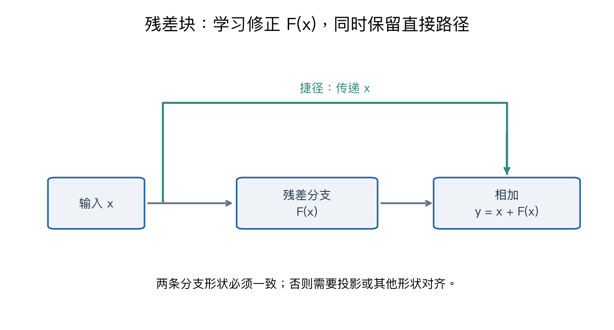

# 第六讲专题：残差架构与迁移学习

解释残差连接的梯度路径，以及固定特征提取器与微调的区别。前置：[归一化与 Dropout](06-normalization-dropout-deep-review.md)。

## 1 深度增加不自动使训练更容易

更多层增加可表达的组合，也增加优化和信号传递的困难。若更深网络连训练表现都变差，不能直接当作“过拟合”；过拟合主要指训练与新数据表现的差异。

若新增层能实现恒等映射，理论上可保留较浅网络的功能；但优化算法不保证容易找到这种参数。残差设计为近恒等行为提供直接表示途径，不保证每个深网络都优于浅网络。

## 2 残差学的是相对输入的修正

$$
y=x+F(x)
$$

F 是可学习残差分支，x 经捷径直接参与输出。如果希望输出接近输入，则 F 接近零即可。这里的残差不是监督标签减预测的误差；它是网络中一个可学习的变换分支。

```text
输入 x ───────────────────┐
    └→ 若干层得到 F(x) ─── 相加 → y
```

图形与公式表示相加处的输出；实际某些 ResNet 块还会在相加后接 ReLU，此时须继续通过该激活的导数，不能漏掉。



## 3 梯度两路相加，不是只通过 F

标量：dy/dx=1+F'(x)，输入梯度=上游梯度*(1+F'(x))。例如 x=2、F(x)=0.1x、L=y²/2，y=2.2、上游为 2.2，捷径贡献 2.2、残差分支贡献 0.22，总输入梯度为 2.42。

如果 F=0 且局部导数为零，直接路径保留输入和上游梯度；若 F'(x)=-1，贡献也可能抵消。因此残差不是梯度绝对不消失的保证。

对于行样本教学分支 F(X)=ReLU(XW+b)：

```python
a = X @ W + b
Y = X + np.maximum(a, 0)
da = upstream * (a > 0)
dX = upstream + da @ W.T
dW = X.T @ da
db = da.sum(axis=0)
```

这段是便于推导的一层残差分支，不冒充完整 ResNet 基本块。W 与旧 X 等都在同一次前向中使用，梯度核验避开 ReLU 零点。

## 4 相加要求形状一致

例如 x 为 N×64×32×32，F(x) 同形状，才可按对应元素相加。若主分支变成 N×128×16×16，可用 1×1、步长 2 的投影捷径 P(x) 将输入映射到该形状，再算 y=P(x)+F(x)。投影也是有参数的分支，需要其参数及输入梯度。

相加不是通道拼接；concat 会增加相应轴长度。空间尺寸和通道数不能只匹配其中一个。前向中偶然广播成功也不一定实现设计要求。

## 5 经典架构阅读重点

| 架构 | 主要设计线索 | 相关内容 |
|---|---|---|
| AlexNet | 大规模图像 CNN 的历史训练实践 | 连接卷积、激活、池化和训练配置 |
| VGG | 重复小核堆叠 | 感受野、参数和非线性组合 |
| Inception | 多分支与通道降维 | 历史脉络补充，非本版正文重点 |
| ResNet | 残差分支和捷径 | 深层表示与优化路径 |

同通道 C、步长 1、无偏置时，一个 5×5 核有 25C² 权重，两个 3×3 核有 18C²，理论感受野同为 5×5；中间非线性使功能不等价，参数少也不自动说明硬件运行更快。

这些不是所有任务上的固定性能排名，也不要求只背网络深度名称。实际计算、显存、数据和训练协议影响使用效果。

## 6 迁移学习的骨干与分类头

骨干 backbone 把输入转为特征，分类头 head 将特征映射为任务分数。例如骨干输出 512 维特征，原分类头输出 1000 类，新任务五类可替换为 512→5 的新头，参数 512*5+5=2565。

特征宽度由骨干结构决定，类别数由新任务决定，不必一样。预训练不是直接搬来原 1000 个类别名称；主要复用训练得到的表示。

两种设置：固定骨干，只训练新头；或从预训练参数开始微调部分或全部骨干。后者可给旧骨干较小学习率、新头较大学习率，是可验证的实践策略，不是通用定理。数据量、源目标差异和预算共同决定方案。

## 7 冻结参数与固定状态仍要分开

设置 requires_grad=False 不等于设置 eval：BN 运行统计在训练模式下仍可变化，Dropout 也可能继续随机。若目标是稳定固定的特征提取，需明确骨干评估模式、冻结参数、头部训练模式和优化器参数范围。

以下片段展示固定骨干方案，假定 backbone、head、optimizer、loss_fn、inputs、labels 已定义；PyTorch 片段用于说明接口，实验采用 NumPy：

```python
for p in backbone.parameters():
    p.requires_grad = False
backbone.eval()
head.train()
optimizer.zero_grad()
with torch.no_grad():
    features = backbone(inputs)
scores = head(features)
loss = loss_fn(scores, labels)
loss.backward()
optimizer.step()  # optimizer 仅包含头部参数
```

不要将 head 前向也放在 no_grad 中，否则正常的头部参数反传图没有建立。若统一 model.train() 改变子模块状态，需在之后按目标再次设置 backbone.eval()。微调骨干时不能把其前向放在 no_grad 中。

也可以选择有意识地更新目标域 BN 统计；那是不同设置，不应声称“冻结后所有状态绝对不变”。

## 8 预处理、增强与特征缓存

预训练权重搭配其通道顺序、输入范围、尺寸及标准化。随意换预处理可能改变表示分布。变换需保持任务标签语义，检测分割还需同步变换标注。

固定确定性骨干、固定预处理下可缓存特征以重复训练头；若使用随机增强或改变骨干/BN 状态，同一图片特征会变化，一次缓存不能代表每次随机训练视图。

调整微调层、学习率和正则化用验证集，最终测试集不参与反复选择。预训练可能产生负迁移，特别是源目标差异较大时，仍需基线与独立评价。

## 9 代码与实验结果

[代码](../experiments/deep_review/lecture06_residual_transfer.py)核对残差的输入、权重和偏置梯度，中心差分最大绝对误差约 6.26×10⁻¹¹；检查零残差分支保持输入与上游梯度。

另一段用人为构造的 ReLU 特征提取器和六个二维训练点演示：200 次只更新头部，训练损失约 0.683626 → 0.045381，骨干权重和偏置逐元素不变；再做一次分组学习率微调，骨干权重改变。不是加载真实预训练权重，没有验证测试集，不证明迁移提升了性能。

脚本复用完整两层梯度实现，计算了未使用的骨干梯度，只是不执行其更新；它验证的是更新范围，不是自动微分冻结节省资源的真实测量。

```bash
python3 experiments/deep_review/lecture06_residual_transfer.py
```

## 参考资料

- [第六讲主笔记](06-cnn-architectures.md)：沿用官方课件范围。
- [ResNet 原始论文](https://arxiv.org/abs/1512.03385)
- [PyTorch 迁移学习教程](https://docs.pytorch.org/tutorials/beginner/transfer_learning_tutorial.html)

第六讲主线在此覆盖。下一步进入第七讲序列模型：隐藏状态、时间共享、RNN 与 BPTT，再讲 LSTM。

[专题目录](00-deep-review-guide.md) · [实验索引](../PROGRESS.md)
