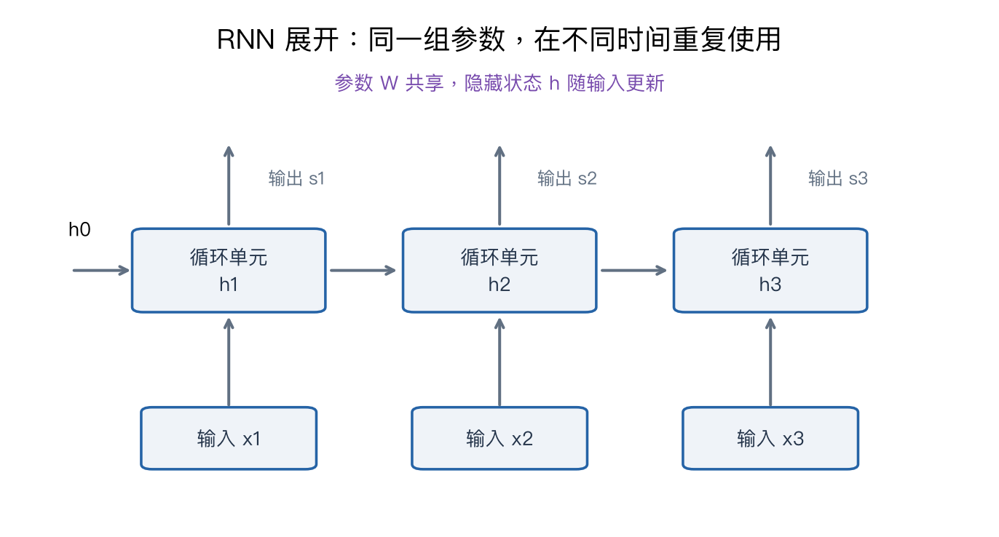

# 第七章：循环神经网络与序列建模

> CS231n 2025 Lecture 7，2025-04-22，Zane Durante。依据课件正文，重点是 vanilla RNN、序列生成、图像描述、时间反向传播与 LSTM；GRU 在此作为明确标注的配套补充，不把课表标题当作详细授课证据。

> **从零入口**：[先理解时间顺序和历史状态](../beginner/10-bigger-picture.md)。

> **相关专题**：[隐藏状态、时间共享与 BPTT](07-rnn-bptt-deep-review.md)、[LSTM 门、反传与生成流程](07-lstm-generation-deep-review.md)。

## 本章概览

> **核心问题：怎样让当前预测利用之前出现的信息？**

| 阅读安排 | 内容 |
|---|---|
| **基础内容** | 第 1–4 节看状态如何更新与生成序列，第 7 节先读门的含义和记忆手算。 |
| **推导与扩展** | 第 5、6 节看时间反传与梯度问题；第 8 节 GRU 是补充。 |
| 需要的基础 | [第四章](04-neural-networks-backprop.md)的参数共享与链式法则。 |

> **本章重点**：RNN 共享的是参数，随时间变化的是隐藏状态；LSTM 用门调节记忆的保留与写入。

**术语**

| 术语 | English | 在本章中的含义 |
|---|---|---|
| **时间步** | Time step | 序列中一次读取和状态更新的位置 |
| **隐藏状态** | Hidden state | 由模型维护的历史摘要，不是人工标签 |
| **token** | Token | 序列的处理单位，可以是字符、子词或其他片段 |

阅读标记说明见[初学者指南](../READING_GUIDE.md)。

## 1. 为什么要处理序列？

图片分类把固定大小的输入映射到一个标签，但语言、视频和时间信号有顺序，长度也可能变化。“狗追人”和“人追狗”有相同词汇，却有不同含义。

RNN 的基本办法是：每读取一个输入，就更新一个隐藏状态，把之前的信息带到下一步。

| 形式 | 输入与输出 | 例子 |
|---|---|---|
| 多对一 | 一串输入，一个结果 | 句子情感分类 |
| 一对多 | 一个条件，一串输出 | 根据图片生成描述 |
| 对齐多对多 | 每步输入对应每步输出 | 视频逐帧标注 |
| 非对齐多对多 | 输入与输出长度不同 | 翻译、序列到序列建模 |

这些结构差异主要在输入输出怎样安排，不一定意味着每种都使用完全不同的循环单元。

## 2. Vanilla RNN 的计算

列向量约定：输入 x_t∈Rᴰ，隐藏状态 h_t∈Rᴴ，输出分数 s_t∈Rᶜ：

$$h_t=\tanh(W_{xh}x_t+W_{hh}h_{t-1}+b_h),$$
$$s_t=W_{hy}h_t+b_y.$$

W_xh 是 H×D，W_hh 是 H×H，W_hy 是 C×H。初始 h₀ 可设零或采用其他约定。

同一组 W 在所有时间步重复使用，参数数量不随序列长度线性增长。但需要执行的计算、训练时保存的中间状态通常会随长度增加。

图中三个方框表示同一个循环单元在三个时刻的使用，而不是三个互不相关、各有一套参数的网络。

### 标量算例

设 h_t=tanh(x_t+0.5h_{t−1})，h₀=0，输入 [1,0,−1]。

- h₁=tanh(1)≈0.7616。
- h₂=tanh(0.3808)≈0.3634，即使 x₂=0，也保留了历史影响。
- h₃=tanh(−1+0.5h₂)≈−0.6741。

同样的当前输入，在不同历史状态下可以产生不同输出，这正是循环结构与独立逐项处理的区别。

## 3. 语言建模：预测下一个 token

设序列为 x₁,…,x_T，根据概率链式法则：

$$p(x_1,\ldots,x_T)=\prod_{t=1}^{T}p(x_t\mid x_{<t}).$$

模型读取当前 token，更新状态，预测下一个 token 的分布。token 可以是字符、子词等单位，不一定等于一个汉字或英文单词。

例如字符序列 “hello”，训练输入可为 h,e,l,l，目标为 e,l,l,o。每步都有一次交叉熵，整体损失按有效位置求和或平均。

训练时常把真实上一个 token 送入网络，称为 teacher forcing；生成时没有真实答案，通常把自己刚生成的 token 再送入。两者造成的输入分布差异称为 exposure bias，是理解错误累积的一个角度。

### 采样温度

若分数为 s，温度 τ>0 时：

$$p_j=\frac{\exp(s_j/\tau)}{\sum_k\exp(s_k/\tau)}.$$

较小温度使分布更集中，较大温度使分布更平坦。温度改变随机性，不保证语义正确性。贪心选择每一步概率最大的 token，也不保证找到全序列概率最大的结果。

## 4. 图像描述：CNN 怎样接到 RNN？

CNN 先把图片转换为特征向量 v，然后用它初始化隐藏状态、作为额外输入或以其他方式为生成提供条件。

目标是：

$$p(w_1,\ldots,w_T\mid I)=\prod_t p(w_t\mid w_{<t},I).$$

模型需要把视觉信息与已经生成的词结合起来。仅得到流畅语句不代表它忠实于图片；语言先验可能让模型“补出”实际上没有出现的物体。

一个固定长度向量要保存整段输入的全部信息，可能成为瓶颈。这也是下一章引入注意力，让模型在不同时间查看不同输入位置的动机。

## 5. BPTT：沿时间展开后的普通反向传播

Backpropagation Through Time 并不是另一套求导法则。先把循环展开成计算图，再按第四章的链式法则反向计算。

如果总损失 L=Σ_t ℓ_t，同一个 W_hh 在多个时间步出现，其梯度必须把每处贡献相加：

$$\frac{\partial L}{\partial W_{hh}}=\sum_t
\left.\frac{\partial L}{\partial W_{hh}}\right|_{\text{第 }t\text{ 次使用}}.$$

每一步隐藏状态影响当前输出，也通过未来状态影响后面的损失，因此不能只对当前时间步求局部梯度。

训练很长的序列时，可以在某些时间边界截断反向路径，称为 truncated BPTT。它节省资源，但也限制梯度直接学习跨越截断边界的依赖。传递数值状态不等于保留整个历史的梯度图。

## 6. 为什么梯度会消失或爆炸？

对 tanh RNN：

$$\frac{\partial h_t}{\partial h_{t-1}}
=\operatorname{diag}(1-h_t^2)W_{hh}.$$

跨越多步后，梯度要乘很多这样的矩阵。简化到标量，每步倍率若为 0.5，20 步后约为 9.54×10⁻⁷；若为 1.5，20 步后约为 3325。

真实矩阵情形由多个方向、非线性状态及矩阵乘积共同决定，不能只看一个权重就精确判断所有梯度。

**梯度裁剪**通常用于控制爆炸。例如梯度范数超过阈值 c 时：

$$g\leftarrow g\frac{c}{\|g\|_2}.$$

裁剪把过大梯度缩小，但无法让已经消失的梯度重新出现。

> **把“共享参数”想清楚**：读句子的第一、第二、第三个词时，模型使用同一套更新规则，但规则接收到的当前词和历史状态不同。重复的是计算规则，不是每一步的计算结果。

## 7. LSTM：显式维护一个记忆状态

LSTM 除隐藏输出 h_t 外，还维护 cell state c_t。先把它理解为一张会更新的记忆表：**保留多少旧内容、写入多少新内容、把多少内容送给输出**，分别由门来调节。

“门”在数值上就是 0 到 1 的系数。例如旧记忆为 2，遗忘门为 0.9，则旧内容保留 1.8；候选新内容为 −0.5，输入门为 0.2，则写入 −0.1；两部分相加得到 1.7。后面的公式只是把这个过程同时应用到所有记忆分量。

先读最中间的 `c_t = 旧记忆保留项 + 新内容写入项`，再看这些门由输入怎样算出来。记号 `[x_t;h_{t-1}]` 是把两组特征拼接，`⊙` 是逐元素相乘。常用定义：

$$i_t=\sigma(W_i[x_t;h_{t-1}]+b_i),\quad
f_t=\sigma(W_f[x_t;h_{t-1}]+b_f),$$
$$o_t=\sigma(W_o[x_t;h_{t-1}]+b_o),\quad
\tilde c_t=\tanh(W_c[x_t;h_{t-1}]+b_c),$$
$$\boxed{c_t=f_t\odot c_{t-1}+i_t\odot\tilde c_t},$$
$$h_t=o_t\odot\tanh(c_t).$$

| 量 | 初学者可以怎样理解 |
|---|---|
| f_t | 旧记忆保留多少 |
| i_t | 新候选内容写入多少 |
| c̃_t | 当前准备写入的内容 |
| o_t | 记忆中多少信息暴露给输出 |

门值由网络学习，通常位于 0 到 1；不是人工写死的开关，也不必恰好为 0 或 1。

### 手算一次记忆更新

假设某维 c_{t−1}=2，f_t=0.9，i_t=0.2，c̃_t=−0.5，o_t=0.8：

$$c_t=0.9\times2+0.2\times(-0.5)=1.7,$$
$$h_t=0.8\tanh(1.7)\approx0.7483.$$

cell state 可以大于 1，tanh 后的隐藏输出则受限。两者不是同一个变量。

沿记忆的直接加性路径，局部传播因子包含 f_t；当 f_t 接近 1 时更易保持信息。但完整导数还包含门对状态的依赖，LSTM 也不能保证任意长距离梯度永不消失。

## 8. 补充：GRU 与 LSTM 的联系

GRU 常用更新门 z、重置门 r，不另设独立 cell state。一个约定为：

$$\tilde h_t=\tanh(W_xx_t+W_h(r_t\odot h_{t-1})+b),$$
$$h_t=(1-z_t)\odot h_{t-1}+z_t\odot\tilde h_t.$$

不同资料可能交换 z 与 1−z 的语义，也可能调整重置门位置，因此实现必须和所用公式一起看。本节帮助理解“门控更新”这一共性，不把它当作本版课件中的详细逐页推导。

## 9. 复习要点

RNN 的隐藏状态是学到的历史摘要，不是完整无损的历史数据库。参数共享使其能处理不同长度，但顺序依赖限制了时间维度上的并行。LSTM 改善记忆路径；注意力则提供另一种跨位置交流方式。

## 要点回顾

| 关键词 | 要连起来理解的关系 |
|---|---|
| **状态** | 当前输入和过去状态共同决定新状态。 |
| **共享** | 每个时间步使用同一组参数，梯度需汇总各次使用的贡献。 |
| **记忆** | LSTM 用门控制保留、写入与输出，不能保证无限长记忆。 |

遇到符号问题可回到[工具箱](00-math-and-numpy.md)，遇到章节衔接可查[复习地图](../REVIEW_MAP.md)。

## 来源

- [官方第七讲课件](https://cs231n.stanford.edu/slides/2025/lecture_7.pdf)：序列结构、字符语言模型、图像描述；后部约 99–122 页为梯度与 LSTM。正文还提及其他序列模型方向，本笔记不把简短提及扩写成实际讲授细节。
- [对应视频 P7](https://www.bilibili.com/video/BV1aXhJ64EmW/?p=7)。来源范围为课件，不是音频逐字稿。

下一章：[注意力与 Transformer](08-attention-transformers.md)。

配套复习：[数值例子脚本](../experiments/remaining_examples.py) · [全课程复习索引](../REVIEW_MAP.md)。脚本仅复现教学算例，不代表真实模型训练。
