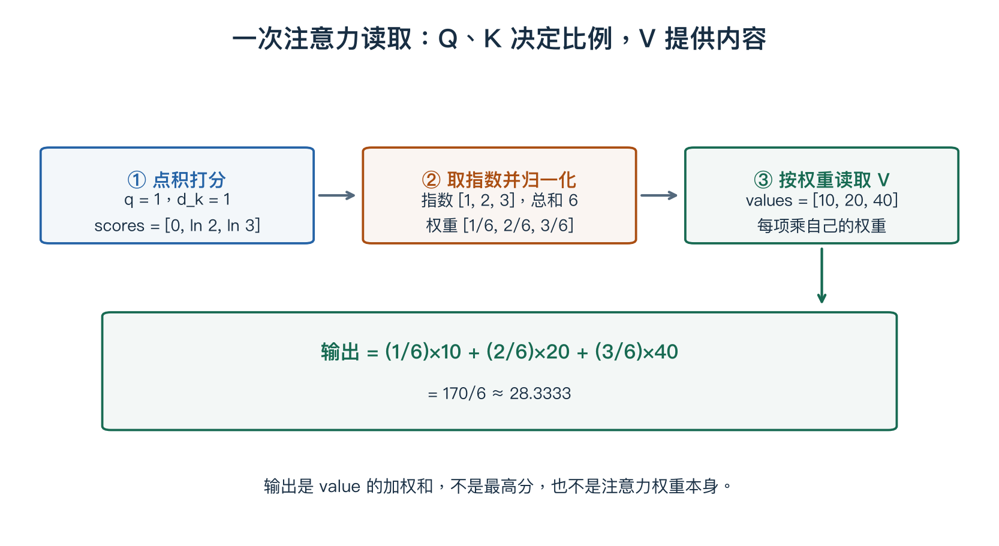
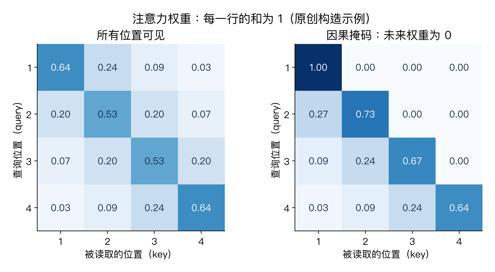

# 第八章：注意力机制与 Transformer

> CS231n 2025 Lecture 8，2025-04-24，Justin Johnson。以官方课件为主，原创算例逐项定义形状。前置：[RNN](07-recurrent-networks.md)、[矩阵反传](04-neural-networks-backprop.md)。

> **从零入口**：[先完整计算两个 token 的注意力](../beginner/07-attention.md)。

> **相关专题**：[QKV、手算、掩码与反向传播](08-attention-qkv-deep-review.md)、[多头、位置与完整 Transformer / ViT](08-transformer-vit-deep-review.md)。

## 本章概览

> **核心问题：当前位置能否直接从其他位置读取自己需要的信息？**

| 阅读安排 | 内容 |
|---|---|
| **基础内容** | 第 1–5 节把 QKV 与加权求和算一遍；第 7、9、10 节连接掩码、block 和 ViT。 |
| **推导与扩展** | 第 6、8、11、12 节看多头、位置、现代组件与成本；缩放因子推导可后看。 |
| 需要的基础 | [第二章](02-image-classification.md)的 Softmax、[矩阵乘法](00-math-and-numpy.md)、[第七章](07-recurrent-networks.md)的序列动机。 |

> **本章重点**：Q 与 K 决定读取权重，V 提供被读取的内容。每个查询的权重在 key 轴上相加为 1。

**术语**

| 术语 | English | 在本章中的含义 |
|---|---|---|
| **投影** | Projection | 用一个学到的矩阵把特征换到另一个表示空间 |
| **嵌入** | Embedding | 把输入单位表示成一组可计算的数 |
| **掩码** | Mask | 规定哪些位置可以参与某次计算 |

阅读标记说明见[初学者指南](../READING_GUIDE.md)。

## 1. 从 RNN 的固定摘要走到按需读取

翻译或图像描述时，不同输出位置需要的信息不同。生成一个物体名称时，模型应查看相关区域；生成描述位置关系的词时，可能需要结合多个区域。

注意力的基本操作是：**用查询计算相关程度，再把信息按相关程度加权汇总。** 它不是给每个输入永久分配一个固定的重要性分数；权重随着查询、输入和网络层而变。

## 2. Query、Key、Value 分别干什么？

| 名称 | 作用 | 简化类比 |
|---|---|---|
| Query，Q | 当前想查询什么 | 检索条件 |
| Key，K | 每个位置用于匹配的特征 | 索引信息 |
| Value，V | 匹配后实际汇总的内容 | 读取内容 |

这个类比只解释职责。真实 Q、K、V 是学习得到的向量，不是人写下的自然语言问题与答案。

先看一个查询 q∈Rᵈᵏ，有 M 个 key k_j 与 value v_j：

$$e_j=\frac{q^Tk_j}{\sqrt{d_k}},\qquad
\alpha_j=\frac{e^{e_j}}{\sum_{r=1}^{M}e^{e_r}},\qquad
z=\sum_{j=1}^{M}\alpha_jv_j.$$

三步对应“打分、归一化、加权读取”。α 非负且和为 1，因此这个基础注意力输出是 value 的加权平均。

## 3. 一个能手算的注意力例子

取 d_k=1，q=1，keys=[0,ln2,ln3]，values=[10,20,40]。此时缩放因子 √d_k=1。

打分为 [0,ln2,ln3]，指数为 [1,2,3]，所以：

$$\alpha=[1/6,2/6,3/6].$$

输出：

$$z=10/6+40/6+120/6=170/6\approx28.3333.$$

这说明 key 影响权重，value 提供被汇总的内容。不能把 score 本身误当作最终输出。

## 4. 多个查询的矩阵公式

设 Q 是 N_q×d_k，K 是 N_k×d_k，V 是 N_k×d_v：

$$\boxed{\operatorname{Attention}(Q,K,V)
=\operatorname{softmax}\left(\frac{QK^T}{\sqrt{d_k}}\right)V.}$$

| 中间量 | 形状 | 读法 |
|---|---|---|
| QKᵀ | N_q×N_k | 第 i 行是查询 i 对各 key 的得分 |
| A=softmax(...) | N_q×N_k | 沿每行的 key 维度归一化 |
| AV | N_q×d_v | 每个查询得到一个输出向量 |

这里 softmax 应沿 key 维度执行，使每个查询自己的权重和为 1。若方向弄反，即使形状没报错，含义也错了。

为什么除以 √d_k？若各分量近似独立、零均值且方差为 1，点积方差约为 d_k。缩放用于控制随维度增长的分数尺度，减少 softmax 过度集中。这是常用分析假设，不是现实向量始终独立的声明。

### 把整套注意力拆成三个可检查的数组

从左往右读：蓝框计算查询与各 key 的分数，橙框把分数转成归一化权重，绿框按这些权重读取 value，下方给出总和。**基础 Softmax 注意力会把允许位置的 value 按权重共同汇总，不只是选中一个最高分位置。**

例如有 2 个查询、3 个 key，每个查询/key 向量长 4，每个 value 长 5：Q 为 2×4，K 为 3×4，V 为 3×5。QKᵀ 得到 2×3 的分数表，每一行变成三个权重；再乘 V 得到 2×5。**查询数量决定输出有几行，value 维度决定输出有几列。**

这样再看大公式，就能分别检查“我在给谁打分、沿哪个轴归一化、最后汇总哪组内容”。

## 5. 自注意力与交叉注意力

**Self-attention：** Q、K、V 均从同一输入 X 投影：

$$Q=XW_Q,\qquad K=XW_K,\qquad V=XW_V.$$

X 为 N×D；例如 W_Q、W_K 为 D×d_k，W_V 为 D×d_v。同一序列中的每个位置都可以查询其他位置。

**Cross-attention：** Q 来自一组表示，K、V 来自另一组表示。例如文本生成位置查询图像 patch，或解码器查询编码器输出。

“自”表示信息来源相同，不表示每个位置只能看自己。

## 6. 多头注意力：多组独立投影

对第 h 个头，计算不同投影下的 Attention(Q_h,K_h,V_h)，再拼接结果并线性变换：

$$\operatorname{MultiHead}(X)=\operatorname{Concat}(Z_1,\ldots,Z_H)W_O.$$

H 表示头数，常见每头维度 D/H，但不是数学必须。不同头可学习不同关系，不过不能保证某个头固定代表“语法”或“颜色”。

多个头并不是简单把相同计算复制 H 次；投影参数不同，学习到的相似性度量和读取内容也可以不同。

## 7. Mask：哪些位置允许被看见？

生成下一个 token 时，训练不能偷看未来 token。可以在 softmax 前，把不允许的位置分数置为 −∞，使其权重为 0。

图中行表示查询位置，列表示被读取的位置。右图屏蔽未来，只保留当前及更早位置；颜色是教学构造出的权重，不是训练模型结果。

采用输入右移的语言建模约定时，当前位置包含的是预测所需的前缀 token，允许对角线是合理的。不要把“看当前输入”与“偷看当前预测目标”混淆。

Padding mask 则处理补齐长度的无效位置。全被屏蔽的一行会带来数值问题，实现时要避免这种情形或明确处理。

## 8. 为什么需要位置编码？

没有位置相关信息时，自注意力对输入重排具有置换等变性：把输入顺序打乱，输出也相应打乱。它无法仅凭这一运算知道哪个词在前、哪个 patch 在左。

位置编码给模型加入顺序或空间信息，可使用学习的位置向量、固定函数或相对位置机制。它不是词语内容本身，而是与内容一起参与计算的位置线索。

同一对象出现在两个位置时，其内容特征可以相近，但位置线索不同。

## 9. 一个 Transformer block 有哪些部分？

使用方便理解的 Pre-Norm 写法：

$$U=X+\operatorname{MHA}(\operatorname{LN}(X)),$$
$$Y=U+\operatorname{MLP}(\operatorname{LN}(U)).$$

- 注意力让不同 token 交换信息。
- MLP 通常独立处理每个 token，并在所有位置共享参数。
- 残差保留直接路径。
- LayerNorm 沿每个 token 的特征维度做归一化。

经典 MLP 可写为 σ(XW₁+b₁)W₂+b₂，常见 D→4D→D。注意力负责跨位置交互，MLP 负责位置内部的非线性特征变换，两者不能互相混为一谈。

原始 Post-Norm 在相加后做归一化，位置与这里不同。课件对两种结构都作了介绍，读实现时需要看实际顺序。

## 10. ViT：把图片变成 token

输入为 224×224×3，切成互不重叠的 16×16 patch：

$$N=(224/16)^2=196.$$

每块有 16×16×3=768 个数，展平后线性映射到 D 维，加位置表示，得到 196×D 的序列。

经过 Transformer 后，可对 patch 表示平均池化，也可以使用特定分类 token 的输出，再接分类头。若添加一个分类 token，序列长度变成 197。

patch 投影也可以通过核大小和步长均为 16 的卷积实现。ViT 并不是“不处理空间”，而是把空间布局编码到 token 及位置关系中。

## 11. 本版课件还讲了哪些现代组件？

**RMSNorm：** 用均方根尺度归一化，常见形式为 γ⊙x/√(mean(x²)+ε)，与 LayerNorm 相比不减均值。名称与 RMSProp 相似，但一个是网络层，一个是优化器。

**SwiGLU：** 通过两个投影分支做门控，再投影回模型维度，例如：

$$\operatorname{SwiGLU}(X)=[\operatorname{SiLU}(XW_1)\odot(XW_2)]W_3.$$

**MoE：** 保存多个专家 MLP，路由器为各 token 选择部分专家。总参数量可以很大，但每个 token 只激活其中一部分。路由、负载均衡与通信也有成本，不能把“总参数多”直接当作“每次计算同样多”。

这些组件是理解课件后部的概念补充，第一遍先掌握 QKV 与 block 主体即可。

## 12. 计算复杂度与常见误解

标准全注意力显式构造 N×N 权重，每头该部分计算约 O(N²d)，存储约 O(N²)。序列长度加倍，这部分开销约变四倍，不是只变两倍。

这不代表整个 Transformer 的所有成本都只由 N² 决定：投影和 MLP 还受模型宽度影响。不同实现也会减少中间存储，不能简单等同于物理显存必然完整保存所有矩阵。

训练阶段已知所有前缀输入，可以并行计算多个位置；自回归生成仍需逐 token 产生新结果，二者并不矛盾。

注意力图能展示某一层的信息加权，不自动构成因果解释，也不是模型理解正确的证据。

## 要点回顾

| 关键词 | 要连起来理解的关系 |
|---|---|
| **打分** | QKᵀ 得到查询与 key 的两两分数。 |
| **读取** | 沿 key 轴归一化，再对 V 加权求和。 |
| **组合** | 注意力交换位置间信息，MLP 变换各位置内部特征，位置表示提供顺序线索。 |

遇到符号问题可回到[工具箱](00-math-and-numpy.md)，遇到章节衔接可查[复习地图](../REVIEW_MAP.md)。

## 来源与定位

- [官方第八讲课件](https://cs231n.stanford.edu/slides/2025/lecture_8.pdf)：前部从 RNN 注意力走到 QKV，约 31–78 页为注意力与多头，84–110 页为 Transformer 与 ViT，111–119 页为现代变体。
- [对应视频 P8](https://www.bilibili.com/video/BV1aXhJ64EmW/?p=8)。本章以官方课件核对，并非视频逐字转写。

下一章：[检测、分割与可视化](09-detection-segmentation.md)。

配套复习：[数值例子脚本](../experiments/remaining_examples.py) · [全课程复习索引](../REVIEW_MAP.md)。脚本仅复现教学算例，不代表真实模型训练。
