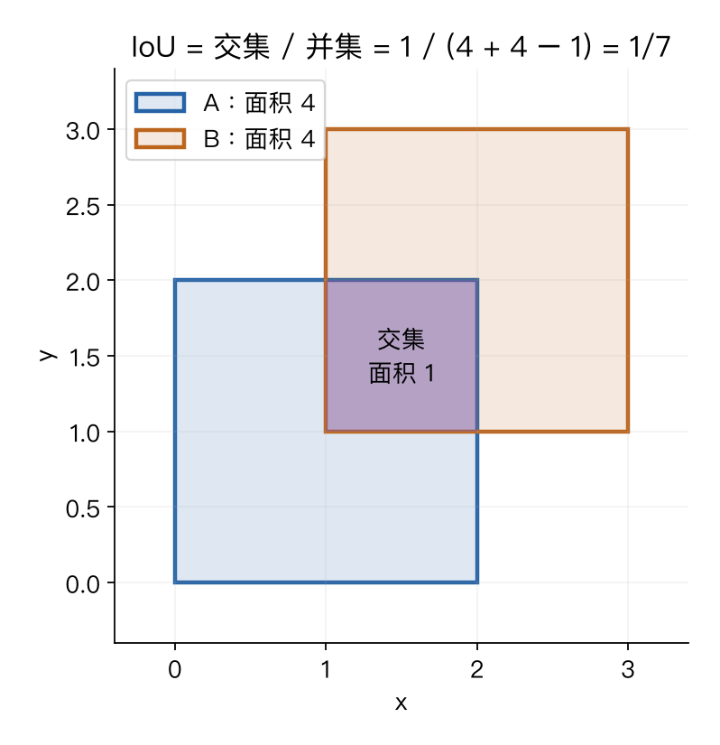

# 第九章：目标检测、图像分割与模型可视化

> CS231n 2025 Lecture 9，2025-04-29，Ehsan Adeli。课件先回顾 ViT，再讲密集预测、检测与模型理解。以下公式和算例用于补充理解，不是讲师逐字稿。

> **从零入口**：[先区分类别、边界框、像素标签和对象掩码](../beginner/08-visual-tasks.md)。

> **相关专题**：[框、IoU、检测损失、NMS 与评估](09-detection-deep-review.md)、[像素分割、上采样与 CAM](09-segmentation-cam-deep-review.md)。

## 本章概览

> **核心问题：除了说“有猫”，怎样指出猫在哪里、占哪些像素？**

| 阅读安排 | 内容 |
|---|---|
| **基础内容** | 第 1–5 节分清输出与 IoU；第 6–9 节看检测和分割的基本流程。 |
| **推导与扩展** | 第 10、11 节看模型可视化；第 12 节为扩展，不必与正文同时记忆。 |
| 需要的基础 | [第五章](05-convolutional-networks.md)的特征图与下采样；[第四章](04-neural-networks-backprop.md)的梯度。 |

> **本章重点**：分类、检测和分割的答案形式不同，所以训练目标与评估指标也不同。

**术语**

| 术语 | English | 在本章中的含义 |
|---|---|---|
| **边界框** | Bounding box | 用矩形近似对象的位置和范围 |
| **掩码** | Mask | 标记某些像素是否属于对象或区域 |
| **RoI** | Region of interest | 需要进一步提取特征的候选区域 |

阅读标记说明见[初学者指南](../READING_GUIDE.md)。

## 1. 几种视觉任务的输出差在哪？

| 任务 | 要输出什么 | 两只猫如何表示 |
|---|---|---|
| 图像分类 | 整张图的类别 | “有猫” |
| 目标检测 | 类别、位置框，通常还有置信度 | 两个猫框 |
| 语义分割 | 每个像素的类别 | 猫像素同属一个语义类别 |
| 实例分割 | 每个对象的像素区域 | 猫 1 与猫 2 分别有掩码 |
| 全景分割 | 覆盖场景的语义与实例分配 | 区分可数对象实例，也标出天空等区域 |

全景分割在这里作为与其他任务对照的补充。全景分割里的 stuff 指天空、路面等通常不逐个计数的区域；thing 指人、车等可区分实例的对象。这是任务约定，不是对物体物理本性的严格分类。

## 2. 语义分割：让分类发生在每个像素

若有 C 类，模型可以输出 N×C×H×W 分数，每个像素对 C 类做 softmax，再计算像素交叉熵。

$$L=-\frac1{|\Omega|}\sum_{u\in\Omega}\log p_{u,y_u}.$$

Ω 是有效标注像素集合；忽略区域不能当作普通类别参与平均。训练在原分辨率还是下采样分辨率计算，要与标签对齐。

逐个裁剪窗口再分类会重复计算，Fully Convolutional Network 将整张图统一送入卷积网络，共享特征。难点是：下采样有助于扩大感受野和降低成本，却丢失细节，因此需要恢复空间分辨率。

## 3. 上采样与 U-Net

插值上采样没有可学习参数，例如最近邻和双线性插值。转置卷积则通过可学习的线性运算扩大输出尺寸。

**转置卷积不是普通卷积的数学逆。** 它对应卷积线性算子的转置结构，不保证恢复之前丢掉的信息。步长、填充与核配置还会影响输出尺寸和伪影。

U-Net 将编码器中的高分辨率特征，通过跳跃连接送到解码器，帮助恢复局部细节。常见形式是沿通道拼接，与 ResNet 的逐元素相加不同；拼接时空间尺寸必须对齐。

因此可以把分割理解为：既要“看得广”确定语义，又要“定位细”找准边界。

## 4. 检测：为什么不仅是分类？

一张图中的对象数量不固定，尺寸、位置各异。检测器需要同时处理“有多少个、是什么、在哪里”。

框常写为 [x₁,y₁,x₂,y₂]，或中心加宽高 [c_x,c_y,w,h]。归一化坐标与像素坐标、边界是否包含端点，都必须保持一致。

常见训练目标包含分类损失和定位损失：

$$L=L_{cls}+\lambda L_{box}.$$

定位项通常只作用于匹配到真实对象的正样本。不是让所有背景候选框都向同一个真实框回归。

## 5. IoU：怎样衡量框的重合？

$$\operatorname{IoU}(A,B)=\frac{|A\cap B|}{|A\cup B|}.$$

本章采用连续坐标面积 w×h，不使用旧代码里某些整数像素框的“+1”约定。

A=[0,0,2,2]，B=[1,1,3,3]：两个框面积均为 4，交集面积为 1，并集为 4+4−1=7，所以 IoU=1/7≈0.1429。

图中重叠越多，IoU 一般越大；但它不比较类别。因此判断正确检测时，通常还需要类别正确及满足匹配规则。

## 6. 两阶段检测器的演进

**R-CNN：** 先产生候选区域，再分别裁剪并计算 CNN 特征，重复计算较多。

**Fast R-CNN：** 整张图先计算一次特征图，再从候选区域提取特征，分类与框回归共享骨干。

**Faster R-CNN：** 增加 Region Proposal Network，在共享特征上学习生成候选区域。

不要把“候选区域”和“最终检测”混为一谈：候选阶段追求覆盖可能的对象，后续还需要分类与位置修正。

RoI Pooling 把不同大小区域转成固定大小特征；RoI Align 使用更精细的采样来减少量化误差，这对像素级实例分割尤其有帮助。

## 7. 单阶段检测、NMS 与 DETR

单阶段检测器直接在密集位置或多尺度特征上预测类别与框，YOLO 是课件中的代表。不同 YOLO 版本的具体结构差异很大，不能把早期网格设计当作所有版本的定义。

一个对象可能产生多个高分框。常见 NMS 流程为：

1. 选择剩余框中分数最高的框并保留。
2. 删除与它 IoU 超过阈值的重复候选框。
3. 在剩余框上重复。

NMS 是一种抑制重复预测的后处理，不是训练损失；阈值太低可能误删相邻对象，太高可能保留重复框。

**DETR** 用对象查询产生一组预测，再使用二分图匹配把预测与真实对象一一对应。未匹配的预测学习“无对象”。这让集合预测可以直接训练，原始 DETR 不依赖传统 NMS。

对象查询数量是最大预测槽位的设计选择，不意味着图片中恰好有这么多个对象，也不等于每个槽位固定对应某个类别。

## 8. 检测怎样评价？

给定类别与 IoU 阈值，按置信度排序预测，与真实框匹配，得到 precision 和 recall：

$$\operatorname{Precision}=\frac{TP}{TP+FP},\qquad
\operatorname{Recall}=\frac{TP}{TP+FN}.$$

AP 概括 precision-recall 曲线，mAP 再对类别等维度平均。不同数据集对 IoU 阈值、插值、最大检测数有不同约定。

因此 AP50 和跨多个 IoU 阈值平均的 COCO AP 不是同一指标，不能直接比较数字大小来断言模型更好。

### 把 TP、FP、FN 换成实际检测结果

假设图里真实有 3 只猫，模型输出了 4 个猫框；按当前类别与 IoU 匹配规则，其中 2 个框各自正确匹配一只猫，其余 2 个是错误或重复预测。于是 TP=2、FP=2、FN=1。

- **Precision=2/4=50%**：报出来的结果里，有多少是真的。
- **Recall=2/3≈66.7%**：真实存在的对象里，有多少被找到了。

一个真实对象通常不能反复给多个预测贡献 TP；具体以数据集匹配规则为准。**同一个框的置信度是在说模型有多相信它，IoU 是在说它与真实位置重合多少**，两者不能相互替代。

## 9. 实例分割与全景分割

Mask R-CNN 在检测分支之外为 RoI 预测掩码。框提供对象位置，掩码提供像素形状；两个分支互补。

语义分割关心类别一致性，实例分割关心同类对象之间的区分，全景分割还需要把各对象与背景区域整合为一致的场景输出。

一个常见错误是把“掩码看起来不错”当作全部指标都好。小物体、边界、遮挡、类别混淆都需要单独观察。

## 10. 模型到底学到了什么？

本讲正文后部重点讨论滤波器、显著性图、CAM、Grad-CAM 与 ViT 特征。下表同时加入特征近邻、激活最大化与反演作为配套扩展；这些扩展不代表本版正文逐项讲授。不同方法回答的问题各不相同：

| 方法 | 观察对象 | 局限 |
|---|---|---|
| 第一层滤波器可视化 | 直接查看权重模式 | 深层权重难直接解释 |
| 特征空间近邻 | 哪些输入得到相似表示 | 相似不等于同一语义原因 |
| 显著性图 | 输出对输入的局部敏感性 | 不是因果解释，可能噪声大 |
| 激活最大化 | 哪类输入会提高某个激活 | 优化结果受先验与正则化影响 |
| 特征反演 | 哪些输入可产生相近特征 | 特征可能丢失信息，解不唯一 |

显著性图可从 ∂s_c/∂x 得到，目标是某类分数对像素的梯度。此时求导对象是输入图像，而非训练参数。

激活最大化是固定网络、优化输入，这和固定输入、优化网络权重的普通训练不同。

## 11. CAM 与 Grad-CAM：把类别分数映射回空间

设最后一层卷积特征为 A_k(u,v)，k 是通道编号。若后面是全局平均池化，再接线性分类器，对类别 c 的分数可写为：

$$s_c=\sum_k w_{ck}\frac1Z\sum_{u,v}A_k(u,v)+b_c,$$

其中 Z 是空间位置数量。把求和顺序交换，可以看到各位置对分数的贡献来自：

$$M_c(u,v)=\sum_k w_{ck}A_k(u,v).$$

这就是 CAM 的关键思路：用类别对应的线性权重重新组合特征图。它依赖特定的池化与分类头结构，不能不加修改地用在所有网络上。

Grad-CAM 用目标分数对所选特征图的梯度估计通道重要性：

$$\alpha_k^c=\frac1Z\sum_{u,v}\frac{\partial s_c}{\partial A_k(u,v)},\qquad
M_c=\operatorname{ReLU}\left(\sum_k\alpha_k^c A_k\right).$$

它更灵活：先固定模型，选类别和特征层，算梯度，空间平均得到通道权重，再加权合成热图。最后通常上采样叠加到输入图上。

热图分辨率受所选层限制，上采样不能凭空补回精确边界。高响应区域也不自动证明因果关系或保证分类正确。

## 12. 延伸补充：对抗扰动、DeepDream 与风格迁移

这些主题出现在课程日程的预告中，但本版已核对课件正文的展开重点是上面的 CAM 与 Grad-CAM。本节保留简要背景，作为扩展阅读，不冒充本讲完整授课内容。

对抗样本表明：某些很小的输入变化也能显著改变模型输出。这说明模型的局部决策结构可能与人类感知差异很大，不是“任何轻微噪声都一定攻击成功”。

DeepDream 增强选定层的激活，得到突出模型内部模式的图像。风格迁移通常同时匹配内容特征与风格统计。

若 F∈Rᶜˣᴹ 表示某层的通道特征，Gram 矩阵 G=FFᵀ 汇总通道之间的相关关系。它不保留全部空间布局，所以可以用于风格统计而不能完整代替内容表示。

这些方法是探查或利用网络表示的工具，漂亮可视化不等于模型已经具备人类式理解。

## 要点回顾

| 关键词 | 要连起来理解的关系 |
|---|---|
| **输出** | 分类给类别；检测给类别与框；分割给像素区域。 |
| **评价** | 类别、位置与匹配规则共同决定 TP，IoU 与置信度不是同一个量。 |
| **可视化** | CAM/Grad-CAM 提供空间响应线索，不能自动证明因果解释。 |

遇到符号问题可回到[工具箱](00-math-and-numpy.md)，遇到章节衔接可查[复习地图](../REVIEW_MAP.md)。

## 来源与定位

- [官方第九讲课件](https://cs231n.stanford.edu/slides/2025/lecture_9.pdf)：前部回顾 ViT；31 页后区分任务，随后依次讨论分割、检测、实例分割与网络理解。
- [对应视频 P9](https://www.bilibili.com/video/BV1aXhJ64EmW/?p=9)。本章依据课件，所有数值框与图为原创补充。

下一章：[视频理解](10-video-understanding.md)。

配套复习：[数值例子脚本](../experiments/remaining_examples.py) · [全课程复习索引](../REVIEW_MAP.md)。脚本仅复现教学算例，不代表真实模型训练。
