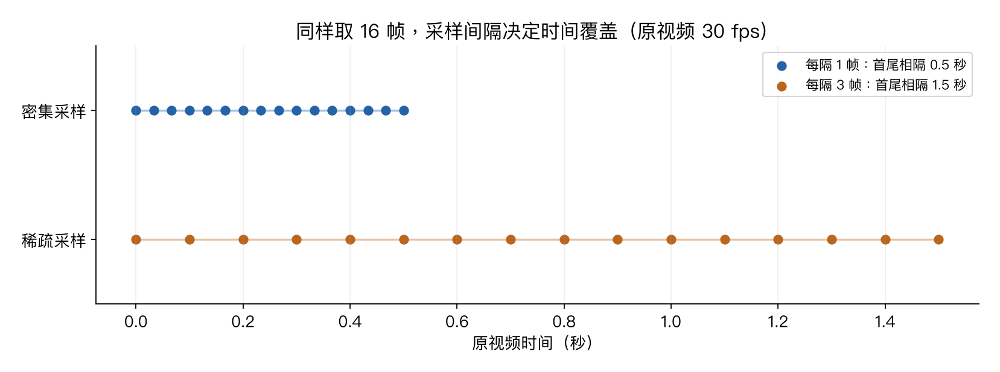

# 第十章：视频理解

> CS231n 2025 Lecture 10，2025-05-01，Ruohan Gao。以对应官方课件为依据，覆盖短片段分类、时空建模、长时间结构及音视频信息。以下小例子和图为学习补充。

> **从零入口**：[视频为什么比图像多一条时间轴](../beginner/10-bigger-picture.md)。

> **相关专题**：[时间采样、倒放与时空卷积](10-video-deep-review.md)。

## 本章概览

> **核心问题：看过多张图片，怎样进一步理解动作顺序和变化？**

| 阅读安排 | 内容 |
|---|---|
| **基础内容** | 第 1–5 节看采样、逐帧融合、时空卷积和光流。 |
| **推导与扩展** | 第 6–10 节看长时间结构、SlowFast、定位与评估。 |
| 需要的基础 | [第五章](05-convolutional-networks.md)卷积；[第七、八章](07-recurrent-networks.md)序列与注意力。 |

> **本章重点**：帧数决定处理多少张图；采样间隔决定这些图覆盖多长时间，两者要一起看。

**术语**

| 术语 | English | 在本章中的含义 |
|---|---|---|
| **帧** | Frame | 视频里的一个时刻的图像 |
| **片段** | Clip | 从较长视频中取出的一小段 |
| **fps** | Frames per second | 每秒钟的帧数，不是模型每秒的预测次数 |

阅读标记说明见[初学者指南](../READING_GUIDE.md)。

## 1. 视频多了一条时间轴，也多了一类信息

单帧能够告诉我们“有人、杯子、桌子”，但“拿起杯子”还是“放下杯子”往往需要观察顺序。反转帧顺序后，图像集合几乎没变，动作语义却可能改变。

使用 NCTHW 约定，批量视频形状为 N×C×T×H×W；T 是帧数，C 常为 3。若资料使用 NTHWC 等布局，运算前必须检查轴顺序。

视频不是三维几何的完整记录。“3D 卷积”的第三个滑动轴在这里是时间，不是场景深度。

## 2. 帧率、采样间隔与时间覆盖

假设原视频为 30 fps，从中每隔 3 帧取一次样本，则采样率相当于 10 fps。取 T=16 帧时，首尾采样时刻间隔为：

$$\frac{(16-1)\times3}{30}=1.5\text{ 秒}.$$

也有人用 16/10=1.6 秒描述采样窗口长度，这取决于是否把最后一个采样间隔算进去。讨论时间范围时要说清约定。

同样 16 帧，稀疏采样能覆盖更长事件，却可能漏掉快速动作；密集采样捕捉局部变化较好，但覆盖范围更短。帧数和真实时间长度不是同一个量。

一段未压缩的 10 秒、30 fps、224×224 RGB uint8 视频约含 300×224×224×3=45158400 字节，约 45.2 MB。转成 float32 后输入本身约变四倍，还未计算模型激活。

## 3. 最简单的基线：逐帧 CNN，再融合

可以对每帧使用同一个 2D CNN，得到 f_t∈Rᴰ，再平均：

$$\bar f=\frac1T\sum_t f_t.$$

用 f̄ 分类很方便，但它忽略帧顺序。因此它可能适合依赖场景或外观的类别，却难区分某些相反动作。

**Late fusion** 先独立计算各帧或片段表示，再融合；**early fusion** 则在较早阶段把时间信息组合，例如把 T 帧堆到 3T 个通道。

早期融合可以看到多个时刻，但把时间直接当通道与真正沿时间滑动的卷积不同；输入长度变化时也不一定自然适配。

### 平均为什么看不见顺序？

假设两帧提取出的标量特征依次为 [1,3]，平均值是 2。把顺序反过来变成 [3,1]，平均值仍为 2。**对独立逐帧特征取平均，操作本身不记录先后**。

对应真实动作，“先看到杯子在桌上，再看到它在手里”与反向过程可能代表拿起和放下。因此需要能对时间邻域、先后关系或跨帧对应进行建模的结构。这个算例说明平均操作的局限，不表示单个数字就能完整描述动作。

## 4. 3D CNN：同时在时间和空间滑动

权重形状为：

$$C_{out}\times C_{in}\times K_t\times K_h\times K_w.$$

每个输出元素汇总一个时空小块。含偏置参数量为：

$$C_{out}(C_{in}K_tK_hK_w+1).$$

例如输入通道 3、输出通道 16、核 3×3×3，参数量为 16(3×27+1)=1312；相应 2D 3×3 卷积是 448。

如果时间轴输入 T=16，K_t=3、P_t=1、S_t=2，则：

$$T_{out}=\left\lfloor\frac{16+2-3}{2}\right\rfloor+1=8.$$

时间与空间各用各的输出尺寸公式。某层只做空间池化，例如核 1×2×2，就保留时间长度。

C3D 展示了把常见 2D CNN 思路扩展为 3D CNN 的路线。I3D 等方法讨论如何利用图像预训练权重，例如把一个 2D 核沿时间复制并适当缩放，以保留静态输入下的响应尺度。

## 5. 光流与双流网络

光流 F_t(u,v)=[Δu,Δv] 描述相邻帧间的二维像素位移。它与物体真实三维速度不同，会受到相机运动、遮挡和成像投影等影响。

双流网络分开处理：

- RGB 流：外观、对象与场景。
- 光流流：运动变化。

再融合两者的特征或预测。光流不是人工动作标签，但其计算本身也有成本和误差。不能把双流理解成“把两帧简单拼在一起”。

## 6. 为什么还需要长时间建模？

几秒钟的局部运动不一定足以理解整个活动。比如“做饭”可能由取食材、切菜、加热等多个阶段组成。

课件讨论的路线包括：

| 方法 | 怎样结合时间 | 主要限制 |
|---|---|---|
| 时间池化 | 汇总各片段 | 常丢失顺序 |
| RNN / LSTM | 递归更新历史摘要 | 顺序计算、长依赖困难 |
| 时空卷积 | 逐层扩大局部时间感受野 | 直接覆盖很长时间成本高 |
| 时空注意力 / Non-local | 让远距离位置直接交换信息 | 全连接注意力成本高 |

若时空特征网格为 T×H'×W'，展平成 N=TH'W' 个 token，全注意力会产生 N² 个位置对。因此要权衡分辨率、帧数与注意力范围。

## 7. SlowFast：不同速度的两条路径

Slow 路径以较低帧率捕捉较稳定的空间语义，Fast 路径以较高帧率捕捉快速变化，并使用较少通道降低成本，再在网络中交换信息。

这和 RGB/光流双流不是同一概念：SlowFast 的关键区分是采样速度与通道配置，而不是必须使用两种输入模态。

## 8. 分类、定位与时空检测

视频分类回答整段视频是什么活动；时间动作定位还要输出开始与结束时刻；时空动作检测进一步定位哪些人或对象在何时何地执行动作。

区间 IoU 可写为：

$$\operatorname{tIoU}([a,b],[c,d])=
\frac{\max(0,\min(b,d)-\max(a,c))}{(b-a)+(d-c)-\text{交集长度}}.$$

例：真实区间 [2,6]、预测区间 [4,8]，交集长度 2，并集长度 6，tIoU=1/3。分类标签正确，并不代表起止位置也准确。

## 9. 音视频一起理解

声音与画面可提供互补信息，例如打击动作与碰撞声、说话嘴形与语音。网络可以在特征层、注意力层或决策层融合。

“同一视频文件”不保证模态天然对齐：声画可能不同步，声音可能来自镜头外，剪辑与背景音乐也可能误导模型。缺失音轨时还需定义处理方式。

课件通过音视频感知现象及相关研究说明多模态信息的价值；这些现象不是“视觉总比听觉可靠”的普遍结论。

## 10. 实际评估最容易出错的地方

视频相邻片段高度相关。若把同一原视频切成片段后随机分到训练集和测试集，可能造成泄漏。应按照任务按视频、主体、场景或时间划分，再检查重复内容。

对长视频多个 clip 取平均预测时，要说明采样与聚合策略；否则同一个模型可以因为测试预算不同出现明显分数差异。

## 要点回顾

| 关键词 | 要连起来理解的关系 |
|---|---|
| **采样** | 相同帧数，采样间隔越大，通常覆盖时间越长。 |
| **结构** | 纯平均丢失顺序，时空卷积与序列/注意力结构可以建模变化。 |
| **评价** | 分类、时间定位和时空检测要求不同输出，数据划分应防止相邻片段泄漏。 |

遇到符号问题可回到[工具箱](00-math-and-numpy.md)，遇到章节衔接可查[复习地图](../REVIEW_MAP.md)。

## 复习摘要与来源

先明确时间采样，再决定怎样建模局部运动与长程关系，最后选择与任务对应的输出和指标。视频理解的难点并不是简单给图片模型多输入几张图。

- [官方第十讲课件](https://cs231n.stanford.edu/slides/2025/lecture_10.pdf)：7 页后为视频与采样，14 页后为融合和 3D CNN，43 页后为运动与长时结构，后部为 SlowFast、定位及音视频。
- [对应视频 P10](https://www.bilibili.com/video/BV1aXhJ64EmW/?p=10)。本章按课件核对。

下一章：[大规模分布式训练](11-distributed-training.md)。

配套复习：[数值例子脚本](../experiments/remaining_examples.py) · [全课程复习索引](../REVIEW_MAP.md)。脚本仅复现教学算例，不代表真实模型训练。
