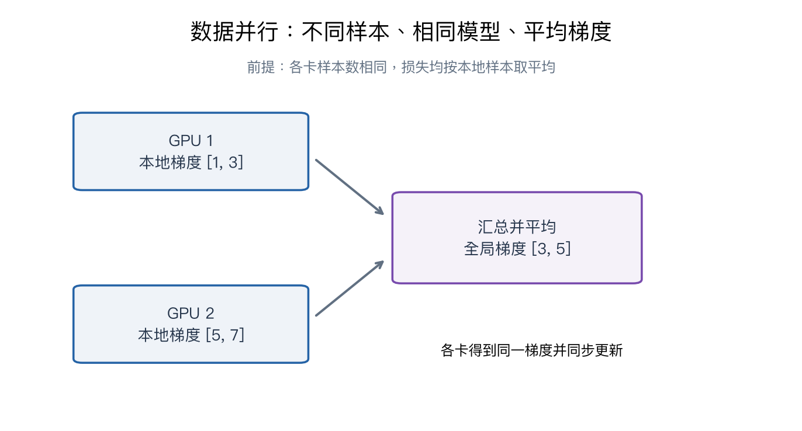

# 第十一章：大规模分布式训练

> CS231n 2025 Lecture 11，2025-05-06，Justin Johnson。依据官方课件，重点是计算、内存和通信的权衡。课件中的硬件数字属于授课时的实例，本笔记不把它们当作当前硬件购买建议。

> **从零入口**：[先看两块 GPU 怎样汇总一个批次的梯度](../beginner/10-bigger-picture.md)。

> **相关专题**：[梯度同步、显存与并行切分](11-distributed-deep-review.md)。

## 本章概览

> **核心问题：一张 GPU 的存储或速度不够时，怎样把训练分给多张卡？**

| 阅读安排 | 内容 |
|---|---|
| **基础内容** | 第 1–5 节：计算与存储、数据并行、模型分片、激活重算。 |
| **推导与扩展** | 第 6–8 节：不同切分方式、利用率与多卡训练的一致性。 |
| 需要的基础 | [第三、四章](04-neural-networks-backprop.md)的参数、梯度和激活；不要求先配置多卡机器。 |

> **本章重点**：先确认限制来自模型状态、激活、计算还是通信，再选择复制、切分或重算。

**术语**

| 术语 | English | 在本章中的含义 |
|---|---|---|
| **模型状态** | Model states | 训练需要保存的参数、梯度和优化器状态等 |
| **通信** | Communication | 设备之间交换数据与计算结果 |
| **吞吐量** | Throughput | 单位时间处理的样本数或 token 数 |

阅读标记说明见[初学者指南](../READING_GUIDE.md)。

## 1. 为什么一张 GPU 不够？

训练可能同时遇到三个瓶颈：模型状态放不下、激活放不下、在预算时间内算不完。增加 GPU 后又引入通信和协调开销，因此并非卡数翻倍，速度就必然翻倍。

先把常见名词分开：

| 名词 | 含义 |
|---|---|
| FLOPs | 完成计算所需的浮点运算数量 |
| FLOP/s | 每秒能执行多少浮点运算 |
| 显存容量 | 能同时存储多少数据 |
| 显存带宽 | GPU 内存与计算单元之间搬运数据的速度 |
| 互联带宽 | 不同 GPU 或机器之间传输数据的速度 |
| 通信延迟 | 发起一次传输需要的固定开销 |

矩阵乘法规模大、复用充分时容易发挥并行硬件；大量小运算、等待数据或频繁通信时，理论峰值可能用不上。

## 2. 训练显存里究竟放了什么？

除了模型参数，还有参数梯度、优化器状态、激活、临时工作区与通信缓存。

以简化的全 FP32 Adam 为例：每个参数有参数本身、梯度、一阶矩、二阶矩，共 4 个 float32，即约 16 字节。

10 亿个参数，仅这四项就约 16 GB，**还没算激活**。若使用混合精度与 master weights，具体账目可能改变，不能机械沿用一个常数。

这也解释了“推理能装下”为什么不代表“训练能装下”。

## 3. 数据并行：模型复制，数据分开

每张 GPU 保留同样的模型，读取不同样本，计算本地梯度，然后同步梯度并执行相同更新。

若有 M 张 GPU，每张 B 个样本，本地平均损失为 L_m，则全局平均目标：

$$L=\frac1M\sum_{m=1}^M L_m,\qquad
\nabla L=\frac1M\sum_m\nabla L_m.$$

两个本地梯度为 [1,3] 与 [5,7] 时，全局平均梯度为 [3,5]。这源于求导与求和的线性关系。

如果每张卡实际样本数不同，应按样本数加权；简单平均各卡平均值会改变目标。代码中的同步是 sum 还是 mean，也必须和损失缩放约定一致。

**All-reduce** 让各设备都得到汇总结果。它不等于把所有样本送回一张卡重新计算。

### 全局 batch 与梯度累积

若每卡 microbatch 为 B，卡数 M，累积 A 次才更新一次，则有效全局 batch 常写为 MBA。

例如 4 卡、每卡 8 个样本、累积 2 次，相当于每次更新聚合 64 个样本。需要正确平均梯度，而且 BN 等依赖微批统计的行为未必与一次处理 64 个样本完全相同。

累积期间不应每次都执行参数更新，否则已经不是同一次大批量更新。

## 4. 数据并行的局限：每张卡仍有完整模型

普通数据并行主要分担数据计算，不能解决完整参数与优化器状态在单卡放不下的问题。

**FSDP / Fully Sharded Data Parallelism** 把模型状态切分到不同设备，按层在需要时获取参数，完成计算后再释放部分副本，并在反向阶段汇总和切分梯度。

可以把它理解为“按需临时拼出要算的层”，而不是“每张卡永远只执行自己那一层”。后者更接近流水线并行。

课件部分幻灯片标题把缩写写成 FSPD；本笔记采用通常的 FSDP 拼法。

分片节省常驻显存，但增加通信。实际峰值还取决于同时聚合多少层、预取策略、最大单层规模及激活，不一定严格等于原显存除以卡数。

## 5. 激活检查点：用重算换内存

反向传播需要部分前向中间量。普通做法把它们保存下来；activation checkpointing 只保留部分边界状态，反向到某一段时重新执行该段前向，恢复所需中间量。

它减少激活存储，增加计算量。不是恢复磁盘训练进度的 checkpoint 文件，而是计算图内的重计算策略。

如果段内有 Dropout 等随机操作，需要处理随机状态，使重算与原前向一致。分段大小决定保存多少和重算多少，没有一个比例适合所有模型。

课件给出多种示意策略的复杂度；具体框架的重计算调度不必遵循同一种简化算法，因此不要把某张示意图的开销当成所有实现的固定公式。

### 用“放不下的东西是什么”区分三种办法

| 当前主要问题 | 先理解哪种思路 | 为什么 |
|---|---|---|
| 单卡能放完整模型，但训练太慢 | 数据并行 | 不同卡同时计算不同样本 |
| 参数、梯度、Adam 状态占太多显存 | 模型状态分片 | 每张卡只长期保存其中一部分 |
| 长序列或深网络的中间激活太多 | 激活检查点 | 少存一些中间结果，需要时重算 |

这张表是理解动机的起点，不是硬件配置建议。实际训练可能同时遇到多种限制。**把样本分给两张卡，并不自动把单卡必须保存的模型状态减半**；这是数据并行与分片最容易混淆的地方。

## 6. 其余三种并行分别切哪一维？

把激活想成 batch×sequence×hidden，并把网络看成多层堆叠：

| 方法 | 切分对象 | 主要通信 |
|---|---|---|
| 数据并行 DP | batch | 参数梯度 |
| 上下文并行 CP | sequence | 注意力所需的跨位置信息等 |
| 张量并行 TP | hidden / 某个矩阵维度 | 层内部分结果 |
| 流水线并行 PP | layers | 层间激活与反向梯度 |

这些方法可以组合，不是只能四选一。组合方式需要考虑哪些 GPU 之间连接更快。

### 张量并行的矩阵例子

若 W 按列拆为 [W₁,W₂]：

$$XW=[XW_1,XW_2].$$

两卡分别计算不同输出通道，之后拼接。如果下一层按行拆 U=[U₁;U₂]，则：

$$YU=Y_1U_1+Y_2U_2,$$

两卡的部分结果需要相加。拼接与求和是不同通信语义，取决于矩阵怎样分块。

### 流水线为什么有气泡？

网络前几层在卡 1、后几层在卡 2，卡 2 必须等卡 1 的激活。把一个 batch 切成 microbatch，可以让不同卡同时处理不同 microbatch，但启动与收尾阶段仍可能闲置。

增加 microbatch 数量可降低某些气泡比例，却可能增加调度开销、影响单次矩阵乘法效率，还需避免梯度和参数版本不一致。

### 上下文并行为什么难在注意力？

MLP 与 LayerNorm 可在不同 token 上独立算；注意力的一个查询可能需要读取其他设备上的 K、V，因此必须跨设备交换信息或采用合适的分块算法。

## 7. 如何判断 GPU 是否被有效利用？

HFU 衡量硬件实际执行了多少运算，可能包含重计算。MFU 更关注模型一次正常训练所需的有效运算，相对于理论峰值的比例。

粗略写作：

$$\operatorname{MFU}=\frac{\text{模型有效 FLOPs / 实际耗时}}{\text{所用设备总理论 FLOP/s}}.$$

假设有效计算量 10¹⁵ FLOPs，设备总峰值 10¹⁴ FLOP/s，实际用时 20 秒，则 MFU=0.5。

这里假设精度和运算口径一致。不能拿 FP32 计算量、低精度峰值和包含数据加载的耗时随意混在一起比较。

高硬件忙碌率也不保证训练目标进展快：设备可能在做很多重算，或者吞吐增加却使模型需要更多 step 才达到目标质量。

## 8. 从单卡迁到多卡时怎样保持含义一致？

要检查数据是否重复、梯度是求和还是平均、累积步数、学习率调度按什么单位推进、训练状态能否正确恢复，以及随机种子与采样器。

增大全局 batch 会改变优化统计，因此“学习率按卡数线性放大”是特定条件下的经验策略，不是普遍定理。

## 要点回顾

| 关键词 | 要连起来理解的关系 |
|---|---|
| **算力** | FLOPs 是工作量，FLOP/s 是速度，两者单位不同。 |
| **显存** | 训练除权重外还要保存梯度、优化器状态和激活。 |
| **并行** | 明确切的是样本、序列、层内矩阵还是网络层，再看通信代价。 |

遇到符号问题可回到[工具箱](00-math-and-numpy.md)，遇到章节衔接可查[复习地图](../REVIEW_MAP.md)。

## 复习与来源

本章核心不是背各种缩写，而是：**找出模型状态、激活、计算与通信分别在哪里，再决定切分什么、复制什么、重算什么。**

- [官方第十一讲课件](https://cs231n.stanford.edu/slides/2025/lecture_11.pdf)：前部介绍硬件；31 页后为并行，46 页后为分片，68 页后为激活重算，103 页后为利用率，116 页后为 CP、PP、TP。
- [对应视频 P11](https://www.bilibili.com/video/BV1aXhJ64EmW/?p=11)。本章按课件整理，算例为原创。

下一章：[自监督学习](12-self-supervised-learning.md)。

配套复习：[数值例子脚本](../experiments/remaining_examples.py) · [全课程复习索引](../REVIEW_MAP.md)。脚本仅复现教学算例，不代表真实模型训练。
