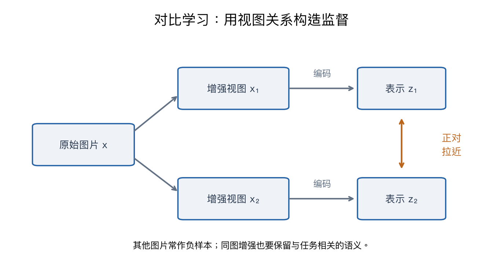

# 第十二章：自监督学习

> CS231n 2025 Lecture 12，2025-05-08，Ehsan Adeli。按课件的预文本任务、重建、对比学习、自蒸馏与多感官监督主线整理。数字与图为示例。

> **从零入口**：[没有人工标签，训练目标从哪里来](../beginner/09-self-supervision-and-generation.md)。

> **相关专题**：[两视图、InfoNCE 与坍塌](12-contrastive-deep-review.md)、[MAE 与 DINO](12-mae-dino-deep-review.md)。

## 本章概览

> **核心问题：没有人为写好的类别标签，模型还能从什么信号中学习？**

| 阅读安排 | 内容 |
|---|---|
| **基础内容** | 第 1–6 节：从数据构造目标，理解遮挡重建与对比学习。 |
| **推导与扩展** | 第 7–10 节比较具体方法、坍塌与增强；不用先背所有缩写。 |
| 需要的基础 | [第二章](02-image-classification.md)的交叉熵、[第八章](08-attention-transformers.md)的 patch。 |

> **本章重点**：自监督从数据关系中构造答案，再用损失训练；没有人工类别标签也有监督信号。

**术语**

| 术语 | English | 在本章中的含义 |
|---|---|---|
| **表示 / 编码器** | Representation / Encoder | 表示是提取出的特征，编码器是提取特征的模型 |
| **视图** | View | 同一数据经过一次裁剪、颜色变换等处理后的版本 |
| **下游任务** | Downstream task | 预训练之后真正希望完成的分类、检测等任务 |

阅读标记说明见[初学者指南](../READING_GUIDE.md)。

## 1. 没有人工标签，损失从哪里来？

监督分类需要图片与类别标签，而大量图片只有像素。自监督学习从数据自身构造预测目标，例如隐藏一部分图片，让模型恢复；或者为同一图片生成两种视图，让模型建立联系。

**没有人工类别标签，不等于没有监督信号、损失函数或设计假设。** 目标怎样构造，会决定表示倾向保留哪些信息。

通常先预训练编码器 f_θ，得到表示 h=f_θ(x)，再用于分类、检索、检测等下游任务。预训练任务分数与下游表示质量不是同一个指标。

## 2. 怎样判断表示有没有用？

| 评估方式 | 固定什么、训练什么 | 能说明什么 |
|---|---|---|
| 线性探测 | 冻结编码器，只训练线性头 | 信息能否被简单读出 |
| 微调 | 在下游数据上更新部分或全部参数 | 迁移后的整体表现 |
| 特征 k-NN | 用特征距离进行近邻分类 | 表示空间的局部组织 |
| 检索 | 用相似度找相关样本 | 排序与匹配质量 |

公平比较要保持下游数据、预处理、训练预算和评估设置相近。高质量特征能够让第二章的 k-NN 比直接像素距离更有意义，但也不保证所有任务都能良好迁移。

## 3. 预文本任务：人为构造一个“练习目标”

课件列举旋转预测、拼图、相对位置、补全、上色、视频传播等任务。

例如随机旋转 0°、90°、180°、270°，旋转角度由处理程序自动产生，就可以训练四分类模型。希望模型为了判断方向学到物体与场景结构。

但模型也可能找到捷径：边界伪影、图像统计或拍摄痕迹。这说明预文本任务做得好，不一定真正学到了所希望的语义。

上色也不是唯一确定的问题：同样灰度的衣服可以有不同颜色。若只用像素均方误差，可能偏向平均的颜色。损失设计要与任务多解性匹配。

## 4. MAE：遮住很多 patch，再重建

Masked Autoencoder 把图像切成 patch，随机遮掉部分。编码器通常只处理可见 patch，解码器结合可见表示与 mask token 重建缺失内容。

设 M 为被遮挡位置集合，一个简化目标是：

$$L_{rec}=\frac1{|M|}\sum_{i\in M}\|\hat x_i-x_i\|_2^2.$$

这里 x_i 是一个 patch 的目标向量，实际还可按 patch 内像素归一化等约定处理。

例如 196 个 patch，遮住 75% 即 147 个，编码器只处理 49 个可见 patch。这降低编码器计算量，也迫使模型利用上下文。

不能把它理解成“遮住的 patch 不参与训练”：它们正是被预测的目标，只是不直接作为编码器输入。

## 5. 对比学习：什么应该相似，什么应该不同？

对同一原始图片做两次随机增强，得到 x 和 x⁺，作为正对；其他图片的视图常用作负样本。

图表示训练目标的意图，不是真实模型的二维降维结果。把不同图片都作为负样本时，可能出现“语义相同但被当作负样本”的情况，称为假负样本问题。

定义编码器 h=f(x)，投影头 z=g(h)，常将 z 做 L2 归一化。余弦相似度为：

$$\operatorname{sim}(z_i,z_j)=\frac{z_i^Tz_j}{\|z_i\|\|z_j\|}.$$

如果已归一化，直接点积即可。

## 6. InfoNCE：其实像一次“找正确搭档”的分类

对 anchor i，正样本为 i⁺，候选集合包含正样本和负样本：

$$L_i=-\log\frac{\exp(\operatorname{sim}(z_i,z_{i^+})/\tau)}
{\sum_{j\in\mathcal C_i}\exp(\operatorname{sim}(z_i,z_j)/\tau)}.$$

τ>0 是温度。分母通常排除 anchor 自己，但必须包含正样本。

**手算：** 假设经过温度缩放后的三个分数为 [ln4,ln2,0]，第一个是正样本。指数为 [4,2,1]，正样本概率 4/7，损失为 −ln(4/7)≈0.5596。

降低温度会使分布更尖锐，对高相似度候选更敏感，但不意味着越低越好。数学形式类似交叉熵，监督对象却从人工类别变成“哪个视图与我配对”。

### 和第二章的交叉熵相比，到底换了什么？

第二章在“猫、狗、车”等类别里找正确答案；这里在“哪个候选视图来自同一张原图”里找正确答案。两者都可以先 Softmax 再取正确项的负对数，**变化的是候选和目标的含义**。

例如两张原图 A、B 各增强两次，得到 A₁、A₂、B₁、B₂。以 A₁ 为 anchor 时：正样本是 A₂，负样本候选是 B₁、B₂，A₁ 自己不进入这次比较的分母。目标索引来自数据处理流程，不需要人先给 A 写“猫”标签。

若 A 和 B 恰好都是同一种猫，B 仍可能被这个构造当作负样本。这也解释了**预训练目标与人类语义不是天然一致**，要通过下游评价判断所学表示是否有用。

## 7. SimCLR 与 MoCo 的差异

**SimCLR：** 一个 batch 有 B 张原图，每张生成两个视图，共 2B 个表示。对每个 anchor，有一个正样本和 2B−2 个其他候选负样本，分母总共 2B−1 项。

增强策略、投影头与 batch 设置都很重要。下游任务通常使用编码器输出 h，而不一定使用投影空间 z，因为投影头可能帮助把预训练目标特有的信息变化留在投影空间。

**MoCo：** 用队列保存更多 key 表示，减少负样本数量对当前 batch 的直接依赖；key encoder 用动量更新：

$$\theta_k\leftarrow m\theta_k+(1-m)\theta_q.$$

它让 key 表示缓慢变化。这里平均的是**网络参数**，不是第三章 Momentum 中的梯度速度，两者不要混淆。

队列中的旧表示不需要都保留完整计算图，但也带来表示随时间变化的一致性问题，这正是动量编码器需要考虑的原因之一。

## 8. 不显式使用负样本：DINO 与自蒸馏

如果目标只是“让两种视图表示相同”，最简单的作弊解是所有图片输出同一个常量，叫表示坍塌。

非对比方法必须有相应机制避免这种退化。例如学生/教师不对称结构、停止梯度、动量教师、预测头、分布中心化与锐化等。

DINO 让学生预测教师的输出分布，不要求教师由人工标签训练。教师通常由学生参数的指数移动平均更新；训练中使用多视图与分布处理来维持有信息的输出。

“自蒸馏”不是让模型凭空创造正确知识：它通过数据视图和训练结构约束表示。注意力可视化中出现对象区域是有趣现象，但不代表每个头都保证完成可靠分割。

## 9. 多感官和时间也能提供监督

同一事件中的音频与画面、相邻帧中的对应区域、不同视角中的同一物体，都可用来构造关系。

例如让声音表示与同步画面表示匹配，希望学到“可见动作与声音的联系”。不过同步不等于因果：背景音乐可能与画面无关，镜头外的声音也可能占主导。

CPC 则用上下文预测未来表示，通过对比目标区分真正未来与负样本。它预测的通常是表示层面的关系，不一定直接恢复每个未来像素。

## 10. 增强定义了哪些变化应该被忽略

对比学习常希望同一图片在裁剪、颜色变化后仍相似，但任务未必总支持这种不变性。

如果目标是识别颜色，强烈颜色增强可能破坏有用信息；如果裁剪只剩背景，两个“同图视图”可能根本没共享目标对象。

因此自监督的核心设计不只是挑一个损失，而是一起选择数据、视图、架构、目标与评估。

## 要点回顾

| 关键词 | 要连起来理解的关系 |
|---|---|
| **监督** | 从遮挡内容、相关视图或教师输出自动构造目标。 |
| **对比** | 将正对视为正确搭档，损失形式可与交叉熵相连。 |
| **表示** | 预训练损失低不保证下游一定好，还要防止捷径与坍塌。 |

遇到符号问题可回到[工具箱](00-math-and-numpy.md)，遇到章节衔接可查[复习地图](../REVIEW_MAP.md)。

## 复习与来源

第一遍把握三种监督来源：预测被隐藏的内容、匹配相关视图、利用教师或其他模态提供目标。第二遍再对照它们怎样避免捷径和坍塌。

- [官方第十二讲课件](https://cs231n.stanford.edu/slides/2025/lecture_12.pdf)：前部为表示评价与预文本任务，中部为 MAE，约 64 页后为对比学习，后部为 MoCo、CPC 与 DINO；111 页后为补充材料。
- [对应视频 P12](https://www.bilibili.com/video/BV1aXhJ64EmW/?p=12)。本章按课件核对；算例与图为原创。

下一章：[生成模型一](13-generative-models-1.md)。

配套复习：[数值例子脚本](../experiments/remaining_examples.py) · [全课程复习索引](../REVIEW_MAP.md)。脚本仅复现教学算例，不代表真实模型训练。
