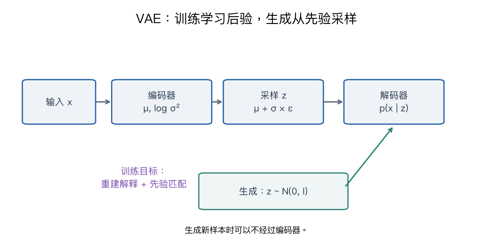

# 第十三章：生成模型（一）——自回归与 VAE

> CS231n 2025 Lecture 13，2025-05-15，Justin Johnson。**本版正文重点是概率建模、自回归、Autoencoder 与 VAE；GAN 的系统讲解放在第十四讲。** 官方日程中的主题预告与最终课件分配不完全相同，本笔记以课件为准。

> **从零入口**：[先区分自回归与 VAE 的训练和生成](../beginner/09-self-supervision-and-generation.md)。

> **相关专题**：[概率、自回归与潜变量](13-probability-autoregressive-deep-review.md)、[ELBO、重参数化与完整标量 VAE](13-vae-elbo-deep-review.md)。

## 本章概览

> **核心问题：怎样学到数据的分布，并生成一个新的可能样本？**

| 阅读安排 | 内容 |
|---|---|
| **基础内容** | 第 1–5 节区分概率建模、自回归和潜变量；第 7–9 节看 VAE 的可计算流程。 |
| **推导与扩展** | 第 6 节的 ELBO 完整推导；第 10 节的限制。先会读目标，再追证明。 |
| 需要的基础 | [概率与期望](00-math-and-numpy.md#7-explog概率与期望)、[第七章](07-recurrent-networks.md)的下一个 token 预测。 |

> **本章重点**：训练时需要能评价样本，生成时需要能抽样；VAE 的编码器主要帮助训练时推断潜变量。

**术语**

| 术语 | English | 在本章中的含义 |
|---|---|---|
| **先验** | Prior | 还没看见当前 x 时，对潜变量 z 的分布假设 |
| **后验** | Posterior | 看见 x 后，对可能产生它的 z 的分布 |
| **ELBO** | Evidence lower bound | 对数似然的一个可优化下界，训练通常最小化其负值 |

阅读标记说明见[初学者指南](../READING_GUIDE.md)。

## 1. 分类与生成的目标不同

分类模型常学习 p(y|x)：给定图像，哪个标签更可能？生成模型则可以学习 p(x)，或在条件 y 下学习 p(x|y)：什么样的图像是合理的？

例如“给一张狗的图片判断品种”是判别任务；“根据‘草地上的狗’生成一张可能的图片”是条件生成。一个描述可以对应很多合理图片，所以输出通常具有不确定性。

“生成模型”不意味着一定完全没有标签。文字、类别、姿态等都可以作为条件，训练数据可以有配对关系。

## 2. 概率密度、似然与采样

| 概念 | 本章含义 |
|---|---|
| 概率分布 p(x) | 描述哪些样本更可能出现 |
| 似然 | 固定观测数据，考察参数对这些数据赋予的概率或密度 |
| 最大似然 | 选择参数，使观测数据的对数概率之和尽可能大 |
| 采样 | 按模型分布产生一个新样本 |
| 潜变量 z | 描述未直接观测到的变化因素 |

连续数据的 p(x) 是密度，不是“精确取到这个点的概率”，密度可以大于 1。把图像看作离散像素还是连续数值，会影响似然定义与比较。

若训练样本按独立同分布建模：

$$\max_\theta\prod_i p_\theta(x_i)
\quad\Longleftrightarrow\quad
\min_\theta-\sum_i\log p_\theta(x_i).$$

取对数把乘法变加法，既方便优化，也避免许多小概率相乘导致的数值问题。

## 3. 自回归：把一个复杂分布拆成很多条件分布

对 x=(x₁,…,x_T)，概率链式法则给出：

$$\boxed{p_\theta(x)=\prod_{t=1}^{T}p_\theta(x_t\mid x_{<t}).}$$

这是精确的概率分解，不依赖“相邻像素独立”的假设。模型能力的限制在于如何参数化这些条件分布。

若一段三元素序列的条件概率分别为 0.8、0.5、0.25，则联合概率为 0.1，负对数似然为 −ln0.1≈2.3026，也等于三个负对数概率之和。

### 图像怎样变成序列？

可以规定像素扫描顺序，逐个预测像素或通道。PixelRNN 使用循环结构，PixelCNN 通过掩码卷积避免读取当前预测目标之后的像素。

掩码不是随便遮图片，而是使模型遵守所选概率分解的条件依赖。训练时知道整张图，也仍然不能把未来像素泄漏给相应预测位置。

### 训练与采样为什么速度不同？

训练时所有真实前缀都已知，某些结构可以并行计算多个位置的损失；采样时后面的元素依赖刚生成的前缀，通常需要按顺序生成。

因此“模型可以并行训练”不等于“能一次并行采样全部像素”。缓存等技术可以减小重复计算，但不自动去掉条件依赖。

## 4. 普通 Autoencoder：压缩后重建

一个确定性自编码器：

$$z=f_\phi(x),\qquad\hat x=g_\theta(z),\qquad
L=\|\hat x-x\|^2.$$

编码器将输入映射到表示，解码器尝试重建。瓶颈或其他约束可以迫使它保留有用结构，而不是简单复制。

但重建好不代表可以从任意 z 生成合理图片。训练只约束编码器实际产生的那些 z，潜空间的其他区域可能没有学好，也未必知道应该从哪个分布抽样。

VAE 在此基础上引入明确的概率模型与先验，解决“怎样系统地生成”这个问题。

## 5. 潜变量生成模型

先抽取潜变量 z，再根据 z 生成 x：

$$z\sim p(z),\qquad x\sim p_\theta(x\mid z).$$

常设 p(z)=N(0,I)。边缘分布为：

$$p_\theta(x)=\int p_\theta(x\mid z)p(z)\,dz.$$

直觉是：很多不同 z 都可能生成与当前 x 相近的数据，所以要把所有可能性积分起来。高维、非线性的解码器通常让这个积分难以直接计算。

训练时还希望知道“给定 x，什么 z 可能产生它”，即后验 p_θ(z|x)。它同样涉及难算的归一化，因此引入可学习的近似后验 q_φ(z|x)。

图中训练经过编码器，生成则可直接从先验采样送入解码器。两条路径不要混为一谈。

### 先把三个概率模型的职责分开

| 记号 | 已知什么、描述什么 | 通常由谁提供 |
|---|---|---|
| p(z) | 尚未给定图片时，潜变量可能是什么 | 人为选择的先验，如标准正态 |
| q_φ(z∣x) | 已经看到图片 x，估计哪些潜变量可能解释它 | 编码器 |
| p_θ(x∣z) | 给定潜变量，哪些图片可能由它生成 | 解码器 |

训练图片 x 已知，因此编码器能根据 x 选择更有用的 z；真正生成时 x 尚不存在，便从先验 p(z) 抽 z，再交给解码器。**生成新图并不需要先有一张新图供编码器输入。**

第一遍先把负 ELBO 读成：

$$\text{训练损失}=\underbrace{-\mathbb E_q\log p_\theta(x\mid z)}_{\text{让 z 能解释原图}}
+\underbrace{D_{KL}(q_\phi(z\mid x)\|p(z))}_{\text{让编码分布与先验保持接近}}.$$

前者要求“保留足够信息”，后者要求“潜空间具有便于从先验采样的组织”。两者需要权衡，不能只优化其中一项。下面推导解释这两项为何能一起成为对数似然的下界；**初读时可先跳到第 7–9 节，跟着一次训练与生成流程算**。

## 6. ELBO：为什么出现重建项与 KL 项？

将 q_φ(z|x) 乘进去再除出去：

$$\log p_\theta(x)
=\log\mathbb E_{q_\phi(z|x)}\left[
\frac{p_\theta(x,z)}{q_\phi(z|x)}\right].$$

利用 log 是凹函数，Jensen 不等式得到：

$$\log p_\theta(x)\ge
\mathbb E_q[\log p_\theta(x,z)-\log q_\phi(z|x)].$$

再用 p_θ(x,z)=p_θ(x|z)p(z)：

$$\boxed{\operatorname{ELBO}(x)=
\mathbb E_q[\log p_\theta(x|z)]-
D_{KL}(q_\phi(z|x)\|p(z)).}$$

第一项希望从编码得到的 z 能解释原图；第二项让近似后验与所选先验保持适当接近，使潜空间可以用于采样。

更精确地：

$$\log p_\theta(x)=\operatorname{ELBO}(x)
+D_{KL}(q_\phi(z|x)\|p_\theta(z|x)).$$

由于 KL≥0，ELBO 确实是下界。只有当近似后验等于真实后验时，此差距才为 0。

训练最大化 ELBO，等价于最小化负 ELBO。不要把正负号混淆成“同时最小化重建误差和负 KL”。

## 7. Gaussian VAE 的可计算形式

编码器输出 μ(x) 和 logσ²(x)，定义对角高斯：

$$q_\phi(z|x)=\mathcal N(\mu,\operatorname{diag}(\sigma^2)).$$

与标准正态先验的 KL 有闭式：

$$\boxed{D_{KL}(q\|p)=\frac12\sum_j
(\mu_j^2+\sigma_j^2-1-\log\sigma_j^2).}$$

一维例子 μ=1、σ=2，则 KL=(1+4−1−ln4)/2≈1.3069。若 μ=0、σ=1，则 KL=0。

编码器通常输出 log variance，而不是直接输出标准差，以避免方差变成负数。采样时标准差应为 exp(0.5×logvar)，不能少掉 0.5。

### “重建损失等于 MSE”有什么条件？

如果 p_θ(x|z) 是固定方差的高斯，负对数似然与平方误差成比例，再加常数。若选择 Bernoulli 观测模型，则会出现另一种形式。

所以“VAE 的重建项必须是 MSE”不正确；它取决于观测分布及其参数化。

## 8. 重参数化：怎样让梯度穿过随机采样？

直接写 z∼N(μ,σ²) 不方便沿采样操作求梯度。可以改写为：

$$\varepsilon\sim\mathcal N(0,I),\qquad z=\mu+\sigma\odot\varepsilon.$$

随机性来自与参数无关的 ε，μ、σ 到 z 的路径则是普通可微运算：∂z/∂μ=1，∂z/∂σ=ε。

例如 μ=1、σ=2，一次 ε=0.5，得到 z=2。这是一次样本，不是 posterior 的均值，也不代表以后每次都得到 2。

重参数化没有消除随机性，而是把它移动到便于求导的位置。

## 9. 训练与生成流程

**训练：** 输入 x → 编码器输出 μ、logσ² → 重参数化采样 z → 解码器给出 x 的分布参数 → 计算负重建对数似然和 KL → 反向更新。

**生成：** 从先验 p(z) 抽 z → 解码器 → 根据观测模型取样或使用输出均值展示。

若只输出解码器均值，展示方式与从观测分布再采样有所不同，评估时应明确。

## 10. 优势、限制与容易误解的地方

VAE 具有明确概率目标和可采样潜空间，训练通常比对抗博弈更直接。但重建项、潜变量瓶颈和先验匹配之间存在权衡；简单像素损失可能得到平滑结果。

潜变量并不天然一维对应一个人类可解释概念。平滑插值可以是有用现象，但不保证方向分别代表姿态、颜色或身份。

后验坍塌是某些设置下潜变量被解码器忽略的现象，不能与对比学习的“所有表示相同”简单等同。

## 要点回顾

| 关键词 | 要连起来理解的关系 |
|---|---|
| **自回归** | 把联合概率拆成一串条件概率，生成时依次采样。 |
| **VAE 训练** | 编码、重参数化、解码，再计算负重建对数似然加 KL。 |
| **VAE 生成** | 直接从先验抽潜变量送入解码器，不需要原图先进入编码器。 |

遇到符号问题可回到[工具箱](00-math-and-numpy.md)，遇到章节衔接可查[复习地图](../REVIEW_MAP.md)。

## 复习与来源

自回归通过条件分解得到可计算的似然；VAE 通过潜变量表达变化，再用近似后验与 ELBO 解决积分困难。二者的训练目标、生成路径和计算成本不同。

- [官方第十三讲课件](https://cs231n.stanford.edu/slides/2025/lecture_13.pdf)：45 页后最大似然，55 页后自回归，61 页后自编码器与 VAE，97 页后 ELBO 与训练。
- [对应视频 P13](https://www.bilibili.com/video/BV1aXhJ64EmW/?p=13)。按实际课件内容整理，推导与数字为原创补充。

下一章：[生成模型二：GAN、Rectified Flow 与扩散](14-generative-models-2.md)。

配套复习：[数值例子脚本](../experiments/remaining_examples.py) · [全课程复习索引](../REVIEW_MAP.md)。脚本仅复现教学算例，不代表真实模型训练。
