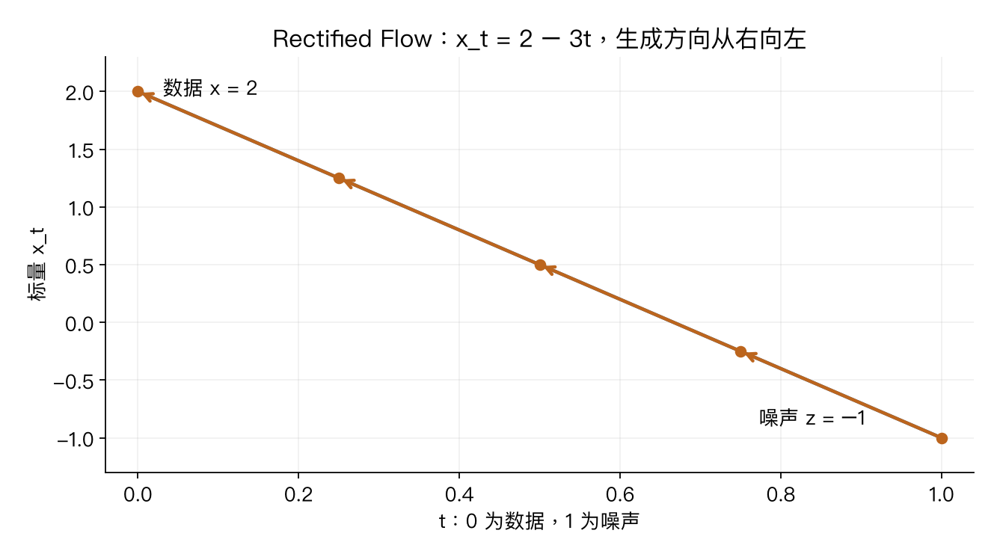

# 第十四讲专题：Rectified Flow、条件引导与扩散衔接

课程以 Rectified Flow 引入扩散类生成，DDPM 公式作为补充。**t=0 是数据，t=1 是噪声，生成时 t 减小。** 相关内容：[GAN](14-gan-deep-review.md)。

## 1. 从“判真假”换成“预测变化速度”

抽数据x、噪声z、时间t，构造x_t=(1−t)x+t*z。两端分别是x与z，训练过程中x/z已知，因此目标速度dx_t/dt=z−x也已知。

```python
mixed = (1-time)*data + time*noise
target_velocity = noise-data
prediction = network(mixed, time)
loss = ((prediction-target_velocity)**2).mean()
```

网络输入是中间样本和时间，输出与样本同形状的速度。不是输出真假概率，也不是直接把速度当最终图片。时间须通过适当表示送入网络，相同样本数值在不同噪声阶段可能需要不同预测。

## 2. 先手算一条直线

x=2、z=−1，则x_t=2−3t，目标速度−3。t=.25时样本1.25。生成从z=−1出发，4步，每步dt=−.25：

```text
next = current + dt * velocity
−1 → −.25 → .5 → 1.25 → 2
```

速度负、时间步也负，所以数值向数据2增加。若资料约定t=0噪声，公式和符号要同步换，不能只改其中一个。



## 3. 一条配对路径不等于真实生成轨迹

训练时很多x/z配对产生中间点与目标速度。平方损失在固定x_t,t下的最优输出为条件平均E[z−x∣x_t,t]。当多个配对在附近出现，网络不能知道当前点属于哪一个原始配对。

生成时没有真实终点x，只能靠学到的整体向量场逐步积分。这是分布运输，直线训练插值不保证最终采样轨迹全为直线。有限模型与数值积分均有误差。

## 4. 用可解析分布检查“分布生成”

代码另外设数据x~N(2,.5²)、独立噪声z~N(0,1)。此时中间均值m_t=(1−t)*2，方差V_t=(1−t)²*.5²+t²，条件平均速度可解析：

```text
v(y,t) = −2 + [t−(1−t)*.5²]/V_t * (y−m_t)
```

这不是训练出来的网络，是理论向量场补充。初始[-1,0,1]的精确终点应为[1.5,2,2.5]。20步Euler得到约[1.53575,2,2.46425]；400步约[1.50185,2,2.49815]，展示数值误差收敛。不能把这当图像生成质量或通用步数建议。

## 5. 条件生成与CFG

条件c可以是类别、文字或图像，网络v(mixed,t,c)利用拼接、调制或跨注意力等方式读取。不同噪声仍产生多种可能结果，同一句描述不唯一确定图片。

Classifier-Free Guidance训练时随机丢弃条件，使网络有条件与无条件两种预测；采样时：

```text
guided = uncond + s*(cond-uncond)
s=0 无条件，s=1 普通条件，s>1 外推条件差异
```

uncond=1、cond=2、s=3时得到4。这混合的是当前预测向量，不是最终图片。过强引导可能损害多样性和质量；另一约定(1+w)*cond−w*uncond中w=s−1，数字不能直接照抄。

## 6. 速度、噪声、干净数据的联系

在本插值内、t≠1，若已预测噪声z_hat：

```text
x_hat = (x_t−t*z_hat)/(1−t)
v_hat = z_hat−x_hat = (z_hat−x_t)/(1−t)
```

端点处除数为0，近端也可能放大误差，因此参数化和权重不能任意互换。广义过程x_t=a(t)x+b(t)z的时间导数是a'(t)x+b'(t)z，具体换算要按日程计算。

常见DDPM衔接补充：x_t=sqrt(alpha_bar_t)*x0+sqrt(1−alpha_bar_t)*epsilon，网络常回归epsilon，噪声更大时数据成分更弱。传统反向扩散可包含随机项，Flow常用ODE积分；不能把z−x换成epsilon而保持原公式不变。完整 DDPM 反向采样还需配套的日程与更新公式。

## 7. 为什么在潜空间生成？

先用自编码器压缩图像，得到潜表示h0。训练流/扩散预测带噪潜表示；生成从潜空间噪声开始，得到h_hat0，再用解码器恢复图像。

```text
训练：图片 → 编码器 → 干净潜表示 → 加噪/插值 → 回归目标
生成：潜空间噪声 → 迭代生成潜表示 → 解码器 → 图片
```

潜表示与启动噪声都被某些资料记作z，要区别身份。512×512压到64×64，空间位置少64倍，但通道、网络和步数也变，不能宣称整个计算精确降64倍。压缩质量也限制最终细节。

U-Net与Transformer均能成为预测网络；图像/视频token还需位置、时间与条件信息。视频需要跨帧一致性，不是每帧漂亮就等于动作合理。

## 8. 训练和生成代码的主线

```text
训练：抽x/z/t → 构造中间样本 → 回归已知目标 → 反传更新网络
生成：只抽初始噪声 → 给当前样本/时间/条件 → 预测 → 数值步进 → 重复
```

生成不从数据集读取一个待恢复的原图。模型误差与步进误差是两个来源，增加步数不自动弥补全部模型错误。

[lecture14_flow.py](../experiments/deep_review/lecture14_flow.py)核对已知路径、速度回归梯度（最大绝对差分误差约7.05×10⁻¹¹）、解析高斯场积分、CFG与内点换算。未训练图像流/扩散或条件模型。
