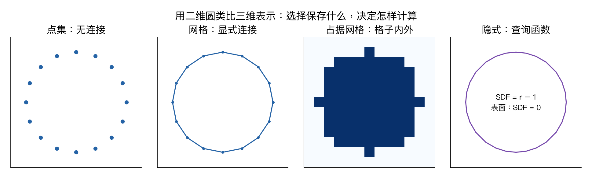

# 第十五章：三维视觉

> **相关专题**：[投影、点集、SDF 与射线合成](15-geometry-deep-review.md)。

> CS231n 2025 Lecture 15，2025-05-22，Jiajun Wu。课件主线是三维表示、不同表示上的学习、重建与神经隐式场，后部还包括物体部件与结构。下面几何例子和体渲染手算为学习补充。

> **从零入口**：[先区分像素、空间点和三维表示](../beginner/10-bigger-picture.md)。

## 本章概览

> **核心问题：怎样用数字表示三维形状，再从图像或三维数据中学习？**

| 阅读安排 | 内容 |
|---|---|
| **基础内容** | 第 1–7 节区分表示，理解 PointNet 与点集距离。 |
| **推导与扩展** | 第 8–10 节看隐式场、NeRF 和高斯表示；体渲染公式可在颜色手算后重读。 |
| 需要的基础 | [第五章](05-convolutional-networks.md)的网格和卷积；[第四章](04-neural-networks-backprop.md)的可微计算。 |

> **本章重点**：点云、网格、体素和隐式场保存的信息不同；表示选择会改变网络、损失和可做的任务。

**术语**

| 术语 | English | 在本章中的含义 |
|---|---|---|
| **坐标** | Coordinate | 相对于某个原点、坐标轴与单位的位置数值 |
| **渲染** | Rendering | 从场景表示与相机条件计算一张图像 |
| **重建** | Reconstruction | 根据观测推断场景或形状的表示 |

阅读标记说明见[初学者指南](../READING_GUIDE.md)。

## 1. 三维为什么比图片难？

图片天然有规则的二维像素网格，三维世界却没有唯一的表示方式。一张照片还会丢失深度、遮挡部分的几何，以及相机之外的场景。

因此开始建模前就要决定：保存表面还是整个空间？需要拓扑和连接关系吗？主要做分类、重建、渲染还是操作？不同任务对表示的要求不同。

二维图像中的相似外观，可能来自不同形状、材质、光照与视角。单视图重建依赖几何线索和学到的先验，不是把所有真实深度直接从像素中读出来。

## 2. 四类常见表示

| 表示 | 保存什么 | 优点 | 局限 |
|---|---|---|---|
| 点云 | 一组坐标，可带颜色和法线 | 灵活、接近深度传感器输出 | 没有显式表面连接，密度可不均匀 |
| 网格 Mesh | 顶点和面片连接 | 明确表面，适合渲染与编辑 | 拓扑处理复杂，合法性需维护 |
| 体素 Voxel | 三维网格内的占据或特征 | 可用规则网格运算 | 分辨率提高后存储迅速增长 |
| 隐式场 | 坐标到占据、距离或密度的函数 | 连续查询、表示灵活 | 需要采样或提取表面，查询也有成本 |

图用二维圆作类比：点集只保存若干点，网格给点连边，占据网格记录哪些格子在内部，隐式形式给出函数。它用于解释表示差异，不是三维重建结果。

## 3. 显式与隐式：圆和球的例子

显式参数表示可写为圆周：

$$x(u)=\cos u,\qquad y(u)=\sin u.$$

给一个参数 u，就得到一个表面点。网格、参数曲面等都可以从显式几何角度理解。

隐式形式写为：

$$f(x,y)=x^2+y^2-1=0.$$

给一个空间位置，函数值帮助判断它和表面的关系。单位球的有符号距离函数可写为：

$$\operatorname{SDF}(x,y,z)=\sqrt{x^2+y^2+z^2}-1.$$

本笔记约定内部为负、表面为 0、外部为正。点 (0,0,0) 的 SDF=−1，点 (2,0,0) 的 SDF=1。

不是任何零水平集函数都是严格的距离函数：x²+y²+z²−1 与上式零集相同，但数值不等于到表面的距离。这个区别在训练 SDF 时很重要。

## 4. 体素的立方增长

若每个轴分辨率为 R，体素总数为 R³。32³=32768，64³=262144，128³=2097152。

每个轴翻倍，单通道元素数量变成 8 倍，不是 2 倍。若每格还存多通道特征，显存增长更明显。

稀疏体素、八叉树等方式把资源集中在有意义区域，但引入更复杂的数据结构与算子。数据稀疏不等于实际实现必然线性节省所有开销。

## 5. 多视图 CNN：把三维转成多个二维视角

可以从若干视角渲染同一物体，用共享的 2D CNN 提取特征，再做视图聚合，用于分类或检索。

它能够复用成熟的图像模型，但结果受视角、渲染和遮挡影响。多视图聚合也不自动给出明确三维表面；任务输出仍需设计。

课件通过 Multi-View CNN 与体素方法比较不同表示的学习方式，历史实验数字需要结合当时数据和配置理解。

## 6. PointNet：点没有顺序，网络怎样处理？

点云 X={x₁,…,x_N} 的排列顺序通常没有语义。若把点列表打乱，分类结果应保持不变。

PointNet 的核心形式为：

$$h=\operatorname{MAX}_{i=1}^N \phi(x_i),\qquad y=\rho(h).$$

φ 是每点共享的网络；MAX 对每个特征维度在所有点上取最大值，是对称聚合，因此不依赖点的排列。

例如三点的二维特征为 [1,4]、[3,2]、[0,5]，逐维最大池化得到 [3,5]。两维可以来自不同点，h 不必对应某个真实点。

分类需要排列不变；逐点分割则希望点的输入顺序改变时，输出标签相应改变，即排列等变。可将全局 h 与各点局部表示拼接，再逐点预测。

基本 PointNet 对局部几何关系的建模有限，后续层次化方法会在邻域中学习局部结构。不能仅凭“每点 MLP”断言它显式知道所有点之间的距离。

## 7. 重建点云：为什么不直接按索引算误差？

预测点集与真实点集可能没有一一对应的索引。常用 Chamfer distance 的平方版本为：

$$D_{CD}(P,Q)=\frac1{|P|}\sum_{p\in P}\min_{q\in Q}\|p-q\|^2
+\frac1{|Q|}\sum_{q\in Q}\min_{p\in P}\|q-p\|^2.$$

两个方向都要看，避免只覆盖一部分目标。不同论文可能用和而非均值、距离而非平方，比较数值前先核对定义。

一维例子 P={0,2}、Q={0,3}，两个方向最近邻平方误差平均都为 0.5，因此总值为 1。

Chamfer 不要求一一匹配，可能对点密度和局部覆盖有局限。Earth Mover 等基于匹配或运输的距离表达不同约束，也往往更昂贵。

## 8. 神经隐式表示：让网络成为几何函数

可以用 MLP 输入坐标 x 与形状编码 z，输出占据概率或 SDF：

$$f_\theta(x,z)\rightarrow \text{占据或距离}.$$

训练可能来自三维标注、采样点的占据/距离值，也可以结合可微渲染使用二维监督。不同监督设置不能混为一谈。

“连续函数”不代表无限精度。模型容量、训练采样和优化都会限制可表示细节。要显示网格，往往还需要对场采样并用等值面方法提取表面。

### “给坐标，输出一个数”怎样变成形状？

想判断单位球的形状，可以逐点询问 SDF：(0,0,0) 返回 −1，表示内部；(1,0,0) 返回 0，表示表面；(2,0,0) 返回 1，表示外部。**形状不一定存成一串三角形，也可以存成一个能回答位置查询的函数。**

神经隐式表示用学到的网络来近似这样的查询函数。渲染时还要决定如何沿相机射线读取这些函数值；NeRF 则进一步让函数提供体密度与颜色，并通过前后遮挡关系把它们合成像素。几何查询与像素合成是相连但不同的两步。

## 9. NeRF：表示辐射场，而不只是表面

典型 NeRF 输入三维位置 x 与观察方向 d，输出体密度 σ 与颜色 c。不同实现可以让密度只依赖位置，颜色再依赖方向。

一条相机射线可写为 r(t)=o+td。沿射线取样，在离散体渲染中：

$$\alpha_i=1-e^{-\sigma_i\Delta_i},\qquad
T_i=\exp\left(-\sum_{j<i}\sigma_j\Delta_j\right),$$
$$\boxed{\hat C=\sum_i T_i\alpha_i c_i+T_{\rm end}c_{bg}.}$$

α_i 表示该段吸收比例，T_i 表示到达该段之前剩余的透射比例；前面的不透明区域会遮挡后面的颜色。

### 两段射线手算

假设两段 α 都为 0.5，第一段为红色 (1,0,0)，第二段为蓝色 (0,0,1)，背景黑色。

第一段权重 1×0.5=0.5；第二段权重 (1−0.5)×0.5=0.25；剩余背景权重 0.25。最终颜色为 (0.5,0,0.25)。

这不是简单平均红蓝，因为第二段有一部分被前面遮挡。

原始场景级 NeRF 通常利用多视图图片和相机信息，通过重建图像损失学习场。它擅长新视角合成，但一个可渲染的场不自动等于具有准确物理材质、碰撞与动力学的完整世界模型。

## 10. 3D Gaussian Splatting 与结构化物体

3D Gaussian Splatting 用带空间范围、方向、透明度和外观参数的三维高斯表示场景，再投影和混合到图像。与隐式 MLP 查询不同，它是一种显式、可优化的场景表示路线。

“高斯”不是只给每个三维点画一个固定圆；协方差可以表达不同方向的空间扩展。视觉质量、速度与存储之间仍有权衡。

课件最后强调物体的部件与结构：椅背、椅座、椅腿不仅是一团几何，还具有关系、层次和可能的运动约束。部件集合、关系图、层级结构适合表达这些信息。

这对机器人尤其重要：看出抽屉的外形，和理解抽屉怎样打开，是不同层次的问题。

## 要点回顾

| 关键词 | 要连起来理解的关系 |
|---|---|
| **表示** | 点、连接、网格或函数保存的几何信息不同。 |
| **学习** | 点云模型需考虑无序性，损失不能默认索引一一对应。 |
| **渲染** | NeRF 沿射线结合密度、颜色和遮挡，得到图像像素。 |

遇到符号问题可回到[工具箱](00-math-and-numpy.md)，遇到章节衔接可查[复习地图](../REVIEW_MAP.md)。

## 复习与来源

三维学习首先是表示选择，再是针对该表示设计网络、损失和监督。点云、体素、网格、隐式场不只是文件格式差异，它们改变了能方便表达和学习的结构。

- [官方第十五讲课件](https://cs231n.stanford.edu/slides/2025/lecture_15.pdf)：前 40 页为表示，之后为数据与多视图/体素/点云学习，约 80 页后为隐式场与渲染，末尾为部件结构。
- [对应视频 P15](https://www.bilibili.com/video/BV1aXhJ64EmW/?p=15)。本章依据课件，不是音频逐字稿。

下一章：[视觉与语言](16-vision-language.md)。

配套复习：[数值例子脚本](../experiments/remaining_examples.py) · [全课程复习索引](../REVIEW_MAP.md)。脚本仅复现教学算例，不代表真实模型训练。
