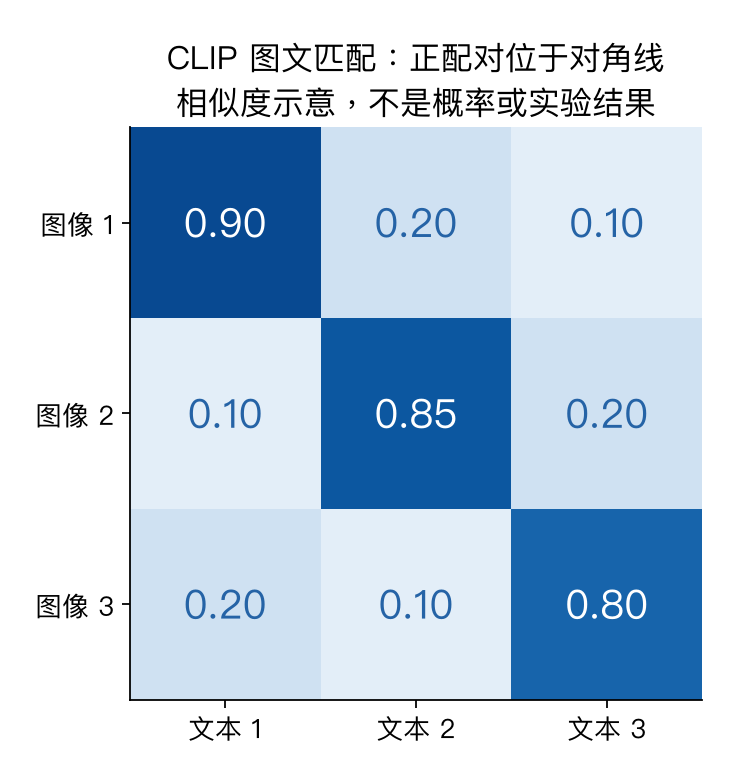

# 第十六讲专题：CLIP、视觉语言生成与模块组合

连接对比学习、注意力与自回归，区分图文匹配、视觉语言生成和模块组合。模型例子按 2025 课程介绍。

## 1. 图文配对提供什么监督？

每张图有对应描述，描述可表达对象、属性、关系与动作，但未必完整准确。配对数据通常仍有人工或自动产生的监督，不把“没有传统类别标签”误认为没有标注工作。

## 2. CLIP的双编码器

图片→视觉编码器→向量v；文字→文本编码器→向量t。归一化后相似度S=v@t.T/tau。B对图文得到B×B矩阵，对角线是配对目标。

```text
图片→文字：每行选择正确文字
文字→图片：每列选择正确图片
最终损失：两个方向交叉熵的平均
```

与上一节同图视图对比不同，CLIP左右是不同模态，不排除对角线；对角线正是正确目标。非对角也可能语义相关，并非语义一定错误。



## 3. 形状、损失与梯度

image/text=(B,D)，S=(B,B)。p_row沿列Softmax，p_col沿行Softmax。若按batch平均、再平均两方向，dS=(p_row+p_col−2I)/(2B)。dV=dS@T/tau，dT=dS.T@V/tau，再通过各自L2归一化反传。

原始系统可以学习温度/缩放；教学例固定tau=.5。代码用小型有限分数，实际极端分数仍应使用稳定log-softmax，不能一般依赖先算概率再log。

## 4. 零样本分类与检索

把猫、狗、车写成候选描述，独立编码，测试图片与候选向量比较，选最大相似度。不为当前类别集重训普通分类头，称对应设置的零样本分类；不意味着预训练从未见过相关概念。

文本表达与候选集合影响结果，Softmax值不是自动校准的真实可信概率。双编码器能提前建立向量索引，但全局向量可能不充分表达细粒度计数与属性绑定。检索匹配不等于逐词生成答案。

## 5. 生成式VLM怎样读取图片？

```text
图片 → 视觉编码器 → 多个视觉token → 连接模块
                                                ↓
问题文字 → 文本token ────────────────────────→ 语言模型
                                                ↓
                                          回答token
```

投影可把视觉维度Dv映射到语言维度Dl，例如(B,5,3)@(3,4)=(B,5,4)，但维度匹配不自动等于语义已对齐。需要图文对齐/指令数据等训练，具体冻结方式取决于方法。

回答以条件语言建模训练：前缀、图片和问题→下一回答token；哪些位置计算损失需明确。生成时继续使用已生成答案。LLaVA是投影连接的课程例子；Flamingo用视觉重采样和门控跨注意力，控制可变视觉内容的接入与成本。

多模态in-context示例是输入上下文的一部分，不等于每次更新参数。

## 6. 数据粒度与SAM

Molmo/PixMo例子强调详细描述、计数与点定位等监督，比笼统标题提供不同信息。对齐输出和空间位置便于检查，但定位能力也需评估。

原始SAM接收图像与点、框等提示，经图像/提示编码器和掩码解码器输出区域掩码，不是任意语言聊天，也不直接给所有区域语义类别。单点可能对应不同合理区域，多掩码处理歧义。

文字找对象再分割通常是组合系统：文字定位模块产框→SAM产掩码。系统能力不能全部归给其中一个模块。

## 7. 视觉程序与可靠性

VisProg等路线用语言生成程序调用检测、裁剪、计数等模块。显式步骤便于检查，但模块误差会传播。三段独立95%成功率示例，整体同时成功约85.74%；真实错误常相关，不能直接套独立乘积。

幻觉是内容不忠实于图像，例如凭语言先验补出不存在的物体；流畅回答不保证正确。评价要分开检索、问答、定位、计数、关系与忠实性，并记录提示、候选和数据划分。

[lecture16_clip.py](../experiments/deep_review/lecture16_clip.py)核对双向损失、两模态归一化梯度（误差约8.12×10⁻¹²、1.33×10⁻¹¹）、方向归一化与投影形状。只用给定向量，没有加载CLIP/VLM/SAM或训练编码器。来源：[第十六讲课件](https://cs231n.stanford.edu/slides/2025/lecture_16.pdf)、[P16视频](https://www.bilibili.com/video/BV1aXhJ64EmW/?p=16)。
