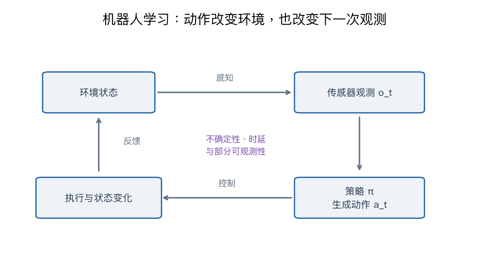

# 第十七讲专题：机器人怎样从看见走到行动

**核心区别：机器人采取的动作会改变下一次看到的数据。** 分类器通常只预测；机器人必须连续观察、决策、执行和纠偏。

课程内容见[第十七讲](17-robot-learning.md)。Bellman 展开与一维控制实验用于补充理解。



## 1. 先分清五个对象

| 对象 | 含义 | 抓杯子例子 |
|---|---|---|
| 状态 s | 描述环境的变量，可能不能完整观测 | 杯子位置、速度、接触状态 |
| 观测 o | 传感器实际得到的信息 | RGB 图、深度、关节角 |
| 动作 a | 控制命令 | 末端位移、关节力矩、夹爪开合 |
| 策略 π | 根据观测或状态决定动作 | 看见杯柄后移动夹爪 |
| 动力学 f | 动作如何改变状态 | 移动后杯子和机械臂的位置 |

奖励 r 则说明哪些结果更符合目标。**策略回答“做什么”，动力学回答“做了会怎样”，奖励回答“结果好不好”。**

观测不等于完整状态。被遮挡的物体、摩擦和接触都可能未知，因此可以使用历史观测或内部状态。主动感知意味着移动相机或物体以取得完成任务所需的信息。

动作的坐标系、单位、执行频率必须明确。两台机器人的相同数字可能代表不同方向、位移或关节，不能直接混合成同一种动作标签。

## 2. 强化学习为什么看累计奖励

```text
G_t = r_t + γ r_(t+1) + γ² r_(t+2) + ...
目标：最大化策略产生轨迹的期望回报
```

γ 是折扣因子。奖励 [0, 0, 10]、γ=0.9，起点回报为 8.1。暂时没有奖励的动作，仍可能是最终成功的必要步骤。

V(s) 表示从状态 s 按某策略继续行动的期望回报。Q(s,a) 表示先执行 a，再继续行动的期望回报。它们不是动作概率。

最优 Q 学习目标（补充）：

```text
y = r + γ × (1-done) × max_a' Q_target(s_next, a')
```

r=1、γ=0.9、下一状态最大 Q=4：非终止目标为 4.6，终止目标为 1。终止后的未来奖励不能继续累计。一般随机环境需要期望，代码只示范单次转移目标，不是完整强化学习训练。

**Model-free 表示不显式学习环境转移模型；它仍然可以使用神经网络作为策略或价值函数。** Model-based 则使用已知或学习的动力学规划；两者也可组合。

## 3. 从模型误差理解闭环

假设真正运动规律是：

```text
s_next = s + 0.7 × a
```

规划者误以为系数是 1，从 0 出发连续执行两次 a=0.5，以为能到 1，实际只到 0.7。这是开环误差：执行后没有重新观察并修正。

反馈策略每步计算 a=0.5×(1-s)，再读取新状态。在本例中十步后位置约 0.9865。这个结果依赖简化、无噪声的一维系统，不是所有控制系统的收敛保证。

模型预测控制 MPC 每轮：预测多个动作序列 → 比较代价 → **只执行最佳序列的第一个动作** → 观察 → 重新规划。

代码使用两步预测、动作集合 {-0.5,0,0.5}，代价为累计位置误差平方与动作惩罚。拟合出动力学系数 0.7 后，状态约为 0→0.35→0.7→1.05，随后保持。0.05 的偏差来自离散动作与短预测范围，不是完美到达。

模型预测越远越容易积累误差，反馈能纠偏但不能自动消除传感器、模型和执行的所有问题。

## 4. 模仿学习为什么也会失败

行为克隆 BC 用专家的观测—动作对训练策略。离散动作可用交叉熵，连续动作可用回归损失。

训练时看到的是专家轨迹；部署时一次偏移会把机器人带入专家很少遇到的状态，后续错误可能继续扩大。这叫状态分布偏移。DAgger 的思路是在当前策略实际到达的状态上补专家动作，再迭代训练；它需要额外专家反馈。

动作还有多解问题：绕障碍可以向左 -1 或向右 +1。平方误差拟合这两个等概率专家动作，最优均值是 0，可能不是任一种有效路径。**平均动作不一定是合理动作。** 代码只核对均值，不模拟真实碰撞。

Implicit BC 用评分表达动作偏好；Diffusion Policy 学习条件动作分布，通过去噪生成动作或动作序列。它的输出是控制动作，不能等同于生成一段机器人视频。

逆强化学习从示范推断奖励；同一种行为可能由不同奖励解释，需要额外假设，不能把专家行为唯一反推出“真实奖励”。

## 5. VLA 如何连接视觉、语言和动作

```text
视觉观测 + 任务指令 + 必要的机器人状态
→ 表示与策略
→ 动作或动作序列
→ 执行并重新观察
```

语言指定任务，视觉定位对象，动作接口决定如何执行。课程中的 RT、OpenVLA、π0 等按 2025 主线理解，不作为当前产品排名。跨机器人训练还需要处理自由度、坐标系和动作尺度差异。

评价应报告完整任务成功率、失败类型、完成时间，并区分见过与未见过的对象、场景。模拟成功不能直接写成真实机器人成功。

## 6. 代码与实验结果

[完整 NumPy 代码](../experiments/deep_review/lecture17_control.py)核对折扣回报、终止目标、最小二乘动力学、开环与反馈及 MPC。本例反馈终点约 0.986537，离散 MPC 终点 1.05。

没有机器人硬件、策略网络训练、真实接触或安全评估。阅读代码时沿着“当前状态 → 动作 → 新状态 → 再决策”追踪，而不是只看终点数字。

[下一讲：以人为中心的评价](18-human-centered-deep-review.md) · [总复习入口](00-deep-review-summary.md)
