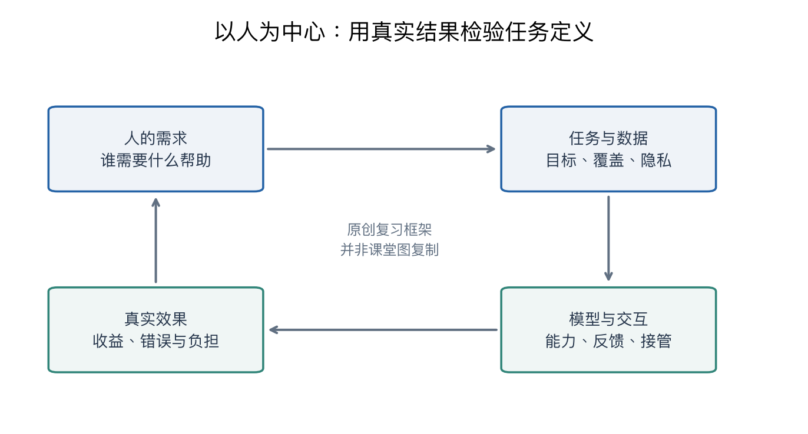

# 第十八章：以人为中心的 AI

> **相关专题**：[分组指标、低基率与人的任务](18-human-centered-deep-review.md)。

> CS231n 2025 Lecture 18，2025-06-03，Fei-Fei Li。本章不是新增一种优化器或网络，而是把视觉技术放回人的需求、能力与社会使用情境。
> 本讲依据视频画面与可见字幕整理，补充例子单独说明。资料范围见[来源记录](../SOURCES.md)。

> **从零入口**：[把指标放回人的需求与真实使用条件](../beginner/10-bigger-picture.md)。

## 本章概览

> **核心问题：模型分数提高，怎样才能转化为对人的实际帮助？**

| 阅读安排 | 内容 |
|---|---|
| **基础内容** | 第 1–5 节理解能力、任务与数据；第 7、8、10 节看真实需求与使用结果。 |
| **推导与扩展** | 第 6、9 节和视频定位表；结合前面各章回看实例。 |
| 需要的基础 | 理解[第二章](02-image-classification.md)的预测与评价即可开始；案例再连接后续章节。 |

> **本章重点**：从人的需求定义任务，再用数据、评价与使用反馈检验，不能只看一个总体准确率。

**术语**

| 术语 | English | 在本章中的含义 |
|---|---|---|
| **基率** | Base rate | 目标事件在真实数据中原本占多大比例 |
| **分组评价** | Group-wise evaluation | 分别查看不同场景或人群的表现 |
| **代理指标** | Proxy metric | 用来近似衡量真实目标的可测量数字 |

阅读标记说明见[初学者指南](../READING_GUIDE.md)。

## 1. 课程的三条主线

视频总结页反复组织了三个方向，可以用中文理解为：

1. 让 AI 理解人能够看见的内容。
2. 让 AI 扩展人难以看见、注意到或处理的内容。
3. 围绕人希望解决的任务来设计视觉与行动系统。

它们不是“技术准确率、伦理和应用”三个互不相关的附录，而是同一个系统从能力、限制到目的的连贯问题。

图为本笔记原创整理：从需求出发，设计数据与模型，用真实使用结果再检验任务定义。它不是课堂幻灯片复制，也不是固定的行业标准流程。

## 2. 人类视觉的启发：迅速识别对象与场景

视频 05:00、07:00 附近展示人类快速视觉识别以及对象、场景感知相关研究；09:00、11:00 附近回顾手工模型与较早的小规模数据集。

课程回顾这些内容，是为了把算法进步放到视觉智能的背景中。人看见场景时不只是给一个分类编号，还能把物体、关系、活动与可能行动联系起来。

第二章的分类任务是一个可测量的切入口，但它不覆盖完整视觉能力。能够识别“杯子”和“桌子”，不等于知道杯子在桌上、里面有水、拿起时不能倾斜。

因此，前面学习的检测、关系、视频和机器人并不是无关分支，而是逐步扩展模型要表达的世界。

## 3. 数据与模型共同改变能力边界

13:00、15:00 附近回顾 ImageNet 与视觉模型的发展。可核对的重点是大规模数据与学习方法的相互作用，而不是只有某个网络结构独自造成进步。

17:00 展示场景图，19:00 展示图像描述，21:00 展示多对象、多参与者的活动理解。这些例子把识别从孤立标签推向关系和时间。

### 补充说明：一个场景有多种监督粒度

同一张“人拿着杯子”的图片，可以标注：

| 粒度 | 目标 |
|---|---|
| 分类 | 人、杯子 |
| 检测 | 人框、杯子框 |
| 分割 | 各自的像素区域 |
| 关系 | 人拿着杯子 |
| 活动 | 端起、喝水、放下 |
| 行动辅助 | 杯子能否抓取、应从哪里拿 |

数据标注决定哪些能力可以被直接学习和评价。一个模型分数高，要先问它回答的是表中的哪一个问题。

## 4. 扩展人类感知：细粒度与大规模分析

25:00、27:00 附近展示细粒度对象分类，以及从大规模视觉数据分析更广泛现象的研究。

普通人能够认出“鸟”，却未必能区分相近物种；人也不可能逐一持续查看极大量街景。机器在某些细粒度或规模化处理任务上可以提供帮助。

需要注意：从图像得到的统计关联，不自动说明因果关系。街景中的某类物体与地区某项指标相关，并不意味着改变物体就会改变该指标。

还要检查采样覆盖：拍摄区域、时间、分辨率和标注方式会影响数据代表什么人群或场景。更多数据不能自动修复系统性的漏采。

## 5. 人的注意力有限，模型也会继承偏差

29:00、31:00 附近讨论“没有看见”的后果以及视觉错觉；33:00 展示算法审计、数据说明及差异表现的研究。

这里至少要区分两类问题：

- 能力限制：注意力、时间与可观察范围有限。
- 系统偏差：不同群体、场景或条件下表现不均衡，或任务与标签本身带有偏向。

AI 可以帮助覆盖人力难以持续观察的区域，也可能复制甚至放大训练数据中的偏差。两种情况可以同时存在，不能用一个总体准确率消除讨论。

### 补充说明：总体准确率怎样掩盖问题？

假设 A 组 900 个样本，准确率 99%；B 组 100 个样本，准确率 60%。总体正确数为 891+60=951，总体准确率为 95.1%。

一个看起来不错的总体数字，掩盖了 B 组明显较差的表现。这只是说明分组评估的重要性，不意味着仅用“所有组准确率相同”就能定义全部公平要求。

不同任务可能更关心漏报、误报、机会、资源分配或用户控制；指标需要结合使用情境解释。

### 把加权平均拆开看

上例中，A 组占 90%，B 组占 10%，所以总体准确率也可写成 **0.9×99%+0.1×60%=95.1%**。样本较多的组对总数字影响更大，小组上的大量错误可能被总体数字掩盖。

这不是说总体准确率毫无用处，而是说它回答的是“按当前样本比例，平均表现如何”。如果要判断模型对不同使用者或场景是否都有效，就需要再看分组结果、错误类型和数据是否代表真实使用。

## 6. 隐私可以从采集端开始设计

35:00、37:00 展示 PrivHAR，利用隐私保护成像思路保留动作识别所需信息，同时减少可辨认个人细节。

这一研究方向提出的问题是：如果任务只需要理解动作，是否有必要采集并长期保存可清晰识别身份的画面？

补充说明：隐私设计可以发生在传感器、数据保留、访问权限、表示与输出等多个环节，而不只是最后把脸打码。

不过，模糊图像或骨架数据不自动提供严格匿名保证。是否仍能推断身份、是否保留原始数据、是否可能与其他来源关联，需要单独分析。本笔记不把研究演示当成已经解决全部隐私问题。

## 7. 增强人的能力：从识别转向真实工作

39:00 附近呈现工作与自动化的讨论；41:00 的总结页突出增强人的能力。43:00–47:00 的画面展示手卫生观察、照护环境与居家养老方向。

本章保留这些内容作为课程研究案例，不把幻灯片中的历史公共卫生统计当作当前事实，也不据此提供临床结论。

这些案例的共同点是：问题不只在于某一帧识别是否正确，还在于系统能否在合适时间提供有用信息，并融入人的工作流程。

### 补充说明：少见事件为什么容易产生很多误报？

用一个不涉及临床的工厂异常报警例子：10000 次事件中，真实异常只有 100 次。系统检出 90% 的异常，并把 1% 的正常事件误报。

- 真阳性：100×90%=90。
- 假阳性：9900×1%=99。
- 所有报警中，真正异常占 90/(90+99)≈47.6%。

即使误报率只有 1%，报警里仍可能超过一半是假警报。原因是正常事件的基数很大。

这里检出率是 P(报警|异常)，报警准确程度是 P(异常|报警)，条件反过来后不能直接相等。

这个例子说明部署评价需要看基率、误报负担和后续处理，而不只是模型单项分数；它是原创分析，未声称老师在本讲给出这些数字。

## 8. 从感知走向行动：人真正想完成什么？

49:00 附近指出许多机器人研究仍集中于有限范围的技能；51:00、53:00 展示结合语言、视觉与三维价值图进行操作的研究；55:00 之后介绍 BEHAVIOR 等日常任务与模拟环境。

把“抓起一个物体”作为标准任务很方便，但人的需求可能是“收拾餐桌”或“整理物品”。后者需要感知、顺序规划、多个子任务、失败恢复与对人偏好的理解。

因此，选什么任务本身就是研究设计。57:00 的画面展示通过人的偏好调查构建家务活动集合；不是仅因为某个动作容易做演示，就把它视为最重要的目标。

## 9. 真实感模拟与评估条件

59:00 展示 OmniGibson 中物理、感知与交互方面的模拟，61:00 展示在不同额外信息条件下的算法表现。

要分清：给模型真实对象状态、完美动作原语等信息，和只提供现实传感器输入，是不同难度的任务。一个方法在更有利条件下成功，不等于在开放现实中已经解决同一任务。

课件示例中的表现属于相应实验设置，本笔记不把某个表格中的低成功率推广成“所有机器人永远无法做这些事”。

63:00 展示把环境用于研究视觉能力变化对日常活动的影响；65:00 回到增强人的能力与福祉的主题。

## 10. 把本讲转成复习时的分析框架

任务分析可以从以下方面展开：

| 层面 | 需要说清的内容 |
|---|---|
| 需求 | 谁在什么情境下需要什么帮助 |
| 任务 | 把需求转成什么可测量目标，遗漏了什么 |
| 数据 | 哪些人、场景与失败状态被覆盖或漏掉 |
| 方法 | 输入是否包含完成任务必需的信息 |
| 评价 | 总体、分组、误报、漏报与泛化条件 |
| 交互 | 用户能否理解、修正、拒绝或接管 |
| 部署反馈 | 系统使用后是否真的改善了目标结果 |

例如一个整理桌面的机器人，不能只统计识别杯子的准确率。它还要找对物品、执行动作、不打翻液体、按人的偏好摆放，并能处理失败。这是把整个课程串起来的一种方式。

## 11. 全课程的收束

前面章节回答了如何表示图像、计算梯度、扩大模型、学习无标签数据、生成内容、理解三维和控制机器人。本讲把这些能力放在同一个问题下：技术最终改善了谁的哪一项能力或处境？

这个问题不替代算法细节，而是帮助决定哪些算法、数据、指标和系统行为值得优化。

## 要点回顾

| 关键词 | 要连起来理解的关系 |
|---|---|
| **需求** | 先说清谁需要什么帮助，再定义算法任务。 |
| **评价** | 总体指标、分组表现与误报漏报各回答不同问题。 |
| **结果** | 模型能力最终还需在真实工作流程与反馈中检验。 |

遇到符号问题可回到[工具箱](00-math-and-numpy.md)，遇到章节衔接可查[复习地图](../REVIEW_MAP.md)。

## 来源与视频定位

- [2025 官方课程安排](https://cs231n.stanford.edu/2025/schedule.html)：确认第十八讲主题、日期与讲师。
- [Stanford Online 官方第十八讲](https://www.youtube.com/watch?v=g8UaBfj6Sh8)：确认对应官方视频元信息。
- [B 站 P18](https://www.bilibili.com/video/BV1aXhJ64EmW/?p=18)：本章画面与可见字幕的实际核对来源。

| 抽查位置 | 当时画面可核对的内容 |
|---|---|
| 05:00–11:00 | 人类视觉、早期识别模型与数据 |
| 13:00–23:00 | ImageNet、场景图、描述、活动理解 |
| 25:00–33:00 | 细粒度、感知限制、偏差研究 |
| 35:00–37:00 | PrivHAR |
| 39:00–47:00 | 工作、增强能力、照护研究 |
| 49:00–53:00 | 机器人技能、语言与价值图 |
| 55:00–63:00 | BEHAVIOR、用户偏好、模拟与评估 |
| 65:00 | 以人的能力与福祉收束 |

表格是抽查定位，不能代替完整时间轴或逐句字幕。分组准确率与工厂报警例子完全为补充说明。

返回：[全课程目录](../README.md)。

配套复习：[数值例子脚本](../experiments/remaining_examples.py) · [全课程复习索引](../REVIEW_MAP.md)。脚本仅复现教学算例，不代表真实模型训练。
